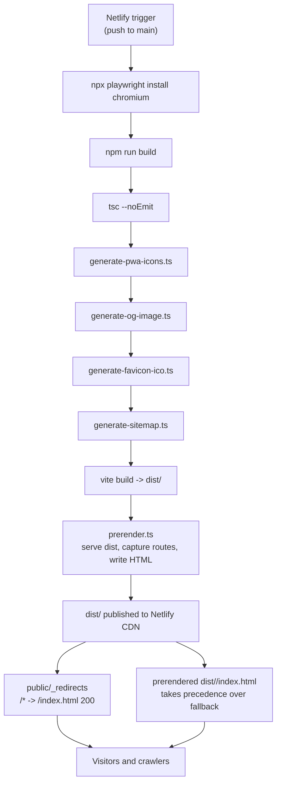

# Deployment

Active contributors: Saksham

360 Flatmates is a client-rendered SPA deployed as static files on Netlify. There is no server runtime in this repo: the build produces a `dist/` folder, Netlify ships it from its CDN, and the SPA fallback route turns every unknown path into a client-side navigation. The only "server" the app talks to at runtime is the FastAPI backend at `/api/v1` (and Supabase for auth). This page covers the build command, the publish directory, the SPA fallback and how prerendered files take precedence, the full build pipeline, the environment variables, and the service worker registration. For the prerender engine itself, see [SEO and prerendering](features/seo-prerendering.md). For the installable shell, see [PWA and install](features/pwa-install.md).

## Netlify configuration

`netlify.toml` is short and authoritative:

```toml
[build]
  command = "npx playwright install chromium && npm run build"
  publish = "dist"

[build.environment]
  VITE_API_BASE_URL = "https://api.360ghar.com/api/v1"
  PRERENDER_CONCURRENCY = "20"
```

- **Build command.** `npx playwright install chromium && npm run build`. The Playwright Chromium install is the build-only prerequisite the prerender step needs. The e2e workflow already installs it; a build-only job must too, so it is prepended to the build command here so a fresh CI runner works without manual setup.
- **Publish directory.** `dist`. Vite writes the production bundle here, and the prerender step writes one `dist/<route>/index.html` per public route on top.
- **Build environment.** One variable is baked into the build. `VITE_API_BASE_URL` is the production backend URL the bundle is compiled against (Vite inlines `VITE_*` vars at build time, so the served bundle already knows its backend). There is no explicit `PRERENDER_FETCH_DATA` env var: build-time listing fetches gate themselves on Netlify's automatic `CONTEXT` variable (see [SEO and prerendering](features/seo-prerendering.md#build-context-gating-local--preview) — only `CONTEXT=production` fetches listing data; previews and local builds skip the backend entirely).

## SPA fallback and prerender precedence

`public/_redirects` is a single line:

```
/*    /index.html   200
```

This is Netlify's SPA fallback: any path that does not match a real file on disk is served from `dist/index.html` with a 200 status, so React Router can take over. The 200 (not 301 or 302) is what keeps deep links shareable without redirect chains.

Real files on disk take precedence over the fallback. That is the whole point of the prerender step: `scripts/prerender.ts` writes a real `dist/discover/index.html`, `dist/cities/bangalore/index.html`, `dist/discover/123/index.html`, and so on, so a crawler that fetches `/discover/123` gets the prerendered HTML (with real meta, JSON-LD, and visible content) instead of the empty SPA shell. Browsers still get the SPA fallback on first paint because the prerendered HTML hydrates into the same React tree. See [SEO and prerendering](features/seo-prerendering.md) for the route inventory and the capture mechanics.

## The build pipeline

`npm run build` expands (in `package.json`) to a seven-step pipeline. Each step feeds the next, and the prerender step depends on every prior step having succeeded.

```bash
tsc --noEmit &&
npx tsx scripts/generate-pwa-icons.ts &&
npx tsx scripts/generate-og-image.ts &&
npx tsx scripts/generate-favicon-ico.ts &&
npx tsx scripts/generate-sitemap.ts &&
vite build &&
npx tsx scripts/prerender.ts
```

| Step | Script | Output |
| --- | --- | --- |
| 1 | `tsc --noEmit` | Type-check the whole project. A failure halts the build before any artifacts are produced. |
| 2 | `scripts/generate-pwa-icons.ts` | `public/favicon-192.webp`, `public/favicon-512.webp`, plus maskable variants, all derived from `public/favicon.svg`. |
| 3 | `scripts/generate-og-image.ts` | `public/og-image.webp` (1200x630 social card) and `public/logo.webp` (512x512). |
| 4 | `scripts/generate-favicon-ico.ts` | `public/favicon.ico` (multi-resolution legacy icon). |
| 5 | `scripts/generate-sitemap.ts` | `public/sitemap.xml`, derived from the same route inventory and city/neighborhood catalog the prerender step uses. |
| 6 | `vite build` | `dist/` with the production bundle, the service worker, and a clean `dist/index.html` shell. |
| 7 | `scripts/prerender.ts` | `dist/<route>/index.html` files, one per public route, captured into memory and flushed to disk at the end. |

Steps 2 through 5 write into `public/` so Vite copies them into `dist/` during step 6. The prerender step runs last because it serves `dist/` with `vite preview`, so the bundle must already exist. A single-route failure inside the prerender step logs a warning and continues; the build never fails because of one flaky route. Infrastructure failures (no `dist/`, the preview server will not start, Chromium cannot launch) do fail the build, because if the step cannot run at all there is nothing to degrade to. See [SEO and prerendering](features/seo-prerendering.md) for the capture internals.



## Vite build configuration

`vite.config.ts` configures the production build:

- **Plugins.** `@vitejs/plugin-react` for JSX and Fast Refresh, and `VitePWA` for the service worker and manifest. `VitePWA` runs with `registerType: "autoUpdate"` (silent background updates) and `injectRegister: "auto"` (the plugin injects the registration, so no manual `navigator.serviceWorker.register` call is needed). The `includeAssets` array precaches the favicon set, the OG image, the logo, `robots.txt`, `sitemap.xml`, and `llms.txt`.
- **Build target.** `es2022`. The app uses ESM, native fetch, and modern syntax; `tsconfig.json` targets ES2022 to match.
- **Sourcemaps.** Enabled (`build.sourcemap: true`) for production debugging.
- **Manual chunks.** `vendor` (React, React DOM, React Router), `query` (TanStack), `supabase`, and `map` (Leaflet and React-Leaflet) are split out so route-level code stays small. The JS bundle gzip target is under 200KB (see [Architecture](overview/architecture.md)).
- **Path alias.** `@/` resolves to `src/` via `vite-tsconfig-paths`.
- **Dev proxy.** In dev, `/api` is proxied to the configured backend with a rewrite to `/app/v1`, so the SPA can call relative paths in dev while hitting the real backend.

## Environment variables

Vite only exposes variables prefixed with `VITE_` to the client bundle, and it inlines them at build time. The production build reads them from the Netlify build environment; a local build reads them from `.env`. `src/lib/env.ts` validates the required set with a Zod schema on startup:

| Variable | Required | Purpose |
| --- | --- | --- |
| `VITE_API_BASE_URL` | Yes | FastAPI backend URL, e.g. `https://api.360ghar.com/api/v1`. Baked into the bundle at build time. |
| `VITE_SUPABASE_URL` | Yes | Supabase project URL. |
| `VITE_SUPABASE_PUBLISHABLE_KEY` | Yes | Supabase anon/publishable key. |
| `VITE_VAPID_PUBLIC_KEY` | Optional | VAPID public key for web push (FCM). |
| `VITE_AUTH_REDIRECT_URL` | Optional | Override for the Google/Apple OAuth callback URL. Defaults to `${window.location.origin}/auth/callback`. |
| `PRERENDER_CONCURRENCY` | Optional | Bounded concurrency for the prerender capture (default 4 in the script, 20 in production via `netlify.toml`). Not a `VITE_` var, so it never reaches the client; it is read by `scripts/prerender.ts` directly. |
| `PRERENDER_LISTINGS` | Optional | Set to `0` to skip per-listing prerender pages (for a fast smoke build). |
| `PRERENDER_PORT` | Optional | Override the preview server port the prerender step uses (default 4178). |

`src/entry.tsx` calls `validateEnv()` before mounting the app. If a required variable is missing or invalid, it renders a configuration-error screen instead of a blank page, so a misconfigured deploy fails loudly rather than silently shipping a broken app. See [Configuration](reference/configuration.md) for the full variable reference and [Security](security.md) for why only `VITE_`-prefixed vars reach the client.

## Service worker registration

The service worker is registered by `VitePWA` via `injectRegister: "auto"`, which injects the registration call into the bundle at build time. There is no manual `navigator.serviceWorker.register` call in app code. The worker precaches the bundle and the `includeAssets` list, so the installed app has the shell and the static assets offline. On a new deploy, `registerType: "autoUpdate"` fetches the new worker in the background and activates on the next navigation, so users always see the latest version without a "new version available" prompt. The push notification path (`src/lib/push/fcm.ts`) waits for `navigator.serviceWorker.ready` before subscribing, so FCM only runs once the worker is active. See [PWA and install](features/pwa-install.md) for the manifest, install banner, and iOS Safari guide.

## Related pages

- [SEO and prerendering](features/seo-prerendering.md) for the prerender engine and route inventory.
- [PWA and install](features/pwa-install.md) for the service worker, manifest, and install flow.
- [Getting started](overview/getting-started.md) for the local build commands and dev server proxy.
- [Configuration](reference/configuration.md) for the full environment variable reference.

## Key source files

| File | Role |
| --- | --- |
| `netlify.toml` | Build command, publish directory, build environment variables |
| `public/_redirects` | SPA fallback: `/* /index.html 200` |
| `vite.config.ts` | Vite + `VitePWA` + `vite-tsconfig-paths` config, manual chunks, dev proxy |
| `package.json` | The `build` script that chains the seven-step pipeline |
| `scripts/prerender.ts` | Post-build prerender step: serve `dist/`, capture routes with Chromium, write `dist/<route>/index.html` |
| `scripts/generate-pwa-icons.ts` | Standard and maskable PWA icons from `public/favicon.svg` |
| `scripts/generate-og-image.ts` | Social preview card and logo |
| `scripts/generate-favicon-ico.ts` | Legacy multi-resolution `.ico` |
| `scripts/generate-sitemap.ts` | `sitemap.xml` from the route inventory and city/neighborhood catalog |
| `src/entry.tsx` | Validates env before mount, renders the configuration-error screen on failure, mounts `<App />` |
| `src/lib/env.ts` | Zod-validated environment variable accessor (`getEnv`, `validateEnv`) |
