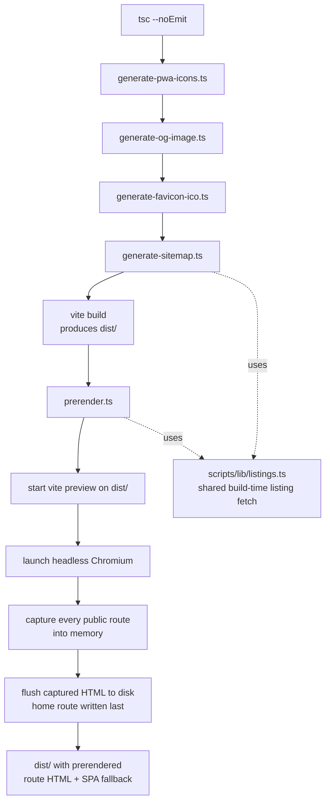

# SEO and prerendering

Active contributors: Saksham

360 Flatmates is a client-rendered React SPA. Browsers see one HTML document and React Router does the rest. That is great for users and painful for crawlers. Classic search-engine bots and the LLM answer-engine bots (GPTBot, ClaudeBot, CCBot, Applebot, Meta-ExternalAgent) generally do not execute JavaScript. If they fetch `https://360ghar.com/discover` and the response is an empty `<div id="root">`, they index nothing useful.

This page documents how the SPA is made crawlable and SEO-optimized at build time. The mechanism is a Playwright-Chromium prerender step that launches a real headless browser against the built bundle, lets React mount and `react-helmet-async` flush its head, and writes the fully-rendered HTML to `dist/<route>/index.html`. The real files on disk take precedence over the SPA fallback, so JS-less bots see real meta tags, real JSON-LD, and real visible content. The system build pipeline and the [Architecture](../overview/architecture.md) build-pipeline section are the broader context.

## Why prerender

A client-rendered SPA has three audiences with three different capabilities:

| Audience | Runs JS? | What it sees from a raw SPA shell |
| --- | --- | --- |
| Real users | Yes | The full app |
| Classic search crawlers (Googlebot, Bingbot) | Partially | The empty shell during first pass, then a delayed second render |
| LLM / answer-engine bots (GPTBot, ClaudeBot, CCBot, Applebot, Meta-ExternalAgent) | Usually no | An empty `<div id="root">` and a generic title |

Google eventually renders SPAs in a second pass, but that pass is slow, rate-limited, and not guaranteed. The LLM bots that power ChatGPT search, Claude, Perplexity, and Apple Intelligence typically do not render at all. The prerender step exists so every public route ships with the same real HTML for every audience.

It also buys three concrete wins:

- Real per-route `<title>`, `<meta name="description">`, canonical `<link>`, Open Graph and Twitter card tags in the HTML response.
- Real `<script type="application/ld+json">` blocks (Organization, WebSite, WebApplication, BreadcrumbList, Residence, BlogPosting, FAQPage) baked into the markup.
- Real visible content (the `<main>`, `<h1>`, listing cards, copy) in the HTML body, so the page has crawlable text instead of an empty root.

## The build pipeline

`npm run build` is a seven-step pipeline. Each step feeds the next, and the prerender step depends on every prior step having succeeded. See the [Architecture build pipeline](../overview/architecture.md#build-pipeline) for the canonical description.

```bash
npm run build
```

The `package.json` `build` script expands to:

```bash
tsc --noEmit &&
npx tsx scripts/generate-pwa-icons.ts &&
npx tsx scripts/generate-og-image.ts &&
npx tsx scripts/generate-favicon-ico.ts &&
npx tsx scripts/generate-sitemap.ts &&
vite build &&
npx tsx scripts/prerender.ts
```

| Step | Script | Output |
| --- | --- | --- |
| 1 | `tsc --noEmit` | Type-check failure halts the build before any artifacts are produced |
| 2 | `scripts/generate-pwa-icons.ts` | `public/favicon-192.webp`, `public/favicon-512.webp`, plus maskable variants |
| 3 | `scripts/generate-og-image.ts` | `public/og-image.webp` (1200x630) and `public/logo.webp` (512x512) |
| 4 | `scripts/generate-favicon-ico.ts` | `public/favicon.ico` (multi-resolution) |
| 5 | `scripts/generate-sitemap.ts` | `public/sitemap.xml` (with image-sitemap entries) |
| 6 | `vite build` | `dist/` with the production bundle, service worker, and a clean `dist/index.html` shell |
| 7 | `scripts/prerender.ts` | `dist/<route>/index.html` files, one per public route |

The first five scripts write into `public/` so Vite copies them into `dist/` during step 6. The prerender step runs last because it serves `dist/` with `vite preview`, so the bundle must already exist.



## Prerender internals

`scripts/prerender.ts` is the engine. It runs after `vite build` produces `dist/` and writes the final crawlable HTML. The whole step is in four phases: start the preview server, capture every route into memory, stop the browser, flush the captured HTML to disk.

### Phase 1, start the preview server

The script spawns `npx vite preview --port 4178 --host 127.0.0.1 --strictPort` against the built `dist/` directory and polls the URL until the server responds. The preview server is what serves the clean Vite-built shell to Chromium on every navigation, so React Router can mount the correct route on each `page.goto`. If the server does not come up within 30 seconds, the build fails loudly (an infrastructure failure, not a per-route failure).

### Phase 2, capture every route into memory

The script launches headless Chromium (imported from `@playwright/test`, which is already a devDependency and whose browser is installed by the Netlify build command and the e2e workflow). For each route it:

1. Opens a new page with a custom user agent (`360FlatmatesPrerender/1.0 (+https://360ghar.com) HeadlessChromium (prerendering for SEO/GEO)`).
2. Navigates to `http://127.0.0.1:4178<route>` with `waitUntil: "domcontentloaded"`.
3. Waits for `networkidle` so lazy-loaded route chunks land.
4. Waits for `react-helmet-async` to flush the route-specific head using a route-aware predicate (`waitForHelmetFlush`).
5. Settles for an extra 500ms so Helmet's effect-flushed DOM mutations land.
6. Captures `page.content()` into memory and closes the page.

The route-aware predicate is the most subtle part. A naive "any meta exists" check returns immediately because the home shell in `dist/index.html` already bakes a home `<title>`, a description meta, and three ld+json blocks. So `waitForHelmetFlush` requires route-specific evidence:

- For the home route `/`: a non-Vite title, a description meta, and at least three ld+json blocks (Organization, WebSite, WebApplication).
- For every other route: a canonical `<link>` whose href contains the route's path segment, a `<title>` that differs from the home fallback title, and a non-empty `<main>` or `<h1>`. The canonical check is the strongest single signal because every public route sets `canonicalUrl` to `SITE_URL` plus its own path.

If the predicate never passes within 20 seconds, the route is flagged `stale`, the best-effort HTML is still captured, and a warning is logged. Stale is not fatal.

### Phase 3, stop the browser

Chromium and the preview server are stopped after the capture loop completes. Disk writes happen next, so the pristine shell is served for the entire capture phase.

### Phase 4, flush captured HTML to disk

This ordering is critical. The captured HTML for every route is held in memory and written to disk only after the capture loop completes. If the home route were written on iteration 0, it would poison the SPA fallback served by `vite preview`, and every subsequent `page.goto` would load the home-rendered shell instead of the clean `<div id="root">` shell. The original "every route renders as a duplicate of the home page" bug was exactly this. `writeCapturedRoutes` sorts the home route `/` to the end so `dist/index.html` is overwritten as the final step.

### Concurrency and failure handling

Listing pages are the volume driver (one page per discoverable listing). Routes are captured with bounded concurrency via `mapWithConcurrency` so hundreds of listing pages do not render strictly serially. There are two knobs:

| Env var | Default | Effect |
| --- | --- | --- |
| `PRERENDER_CONCURRENCY` | `20` | Max simultaneous Chromium tabs while capturing. Netlify sets this to `20` in `netlify.toml`. |
| `PRERENDER_LISTINGS` | unset (on) | Set `PRERENDER_LISTINGS=0` to skip per-listing pages, useful for a fast smoke build. |
| `PRERENDER_PORT` | `4178` | Override the preview server port if it conflicts. |

Failure handling is split into two tiers:

- **Infrastructure failures** (no `dist/`, preview server will not start, Chromium cannot launch) throw and fail the build. A misconfigured CI with no browser binary must not be masked as "0 routes rendered".
- **Per-route failures** (a single page times out, throws, or never proves route-specific render) log a warning and continue. The build never fails because one flaky route is flaky. Captured HTML is still written for stale routes so the route has something, even if it may contain home or placeholder content.

A single run logs a summary like `[prerender] done: 87/88 succeeded, 1 failed, 2 stale.` with the failed and stale routes listed for investigation.

### Environment

Vite inlines `VITE_*` vars from `.env` into the built bundle at `vite build` time, so the served bundle already contains valid Supabase and API config and `validateEnv()` in `src/entry.tsx` passes. No extra env is needed for a local build that has `.env`. In CI, ensure the `VITE_*` vars are present in the build environment, and that `npx playwright install chromium` has run (the e2e workflow already does this; the Netlify build command does it explicitly).

## Route coverage

The prerender step, the sitemap generator, and `robots.txt` all agree on the same route inventory. There are four buckets:

| Bucket | Source | Examples |
| --- | --- | --- |
| Static public routes | Hardcoded in `scripts/prerender.ts` `STATIC_ROUTES` (verified against `<PublicLayout>` in `src/App.tsx`) | `/`, `/discover`, `/blog`, `/about`, `/terms`, `/privacy`, `/stats`, comparison and blog slugs |
| City landing routes | Derived from `SUPPORTED_CITIES` in `src/lib/seo/config.ts` | `/cities/bangalore`, `/cities/gurugram` |
| Neighborhood routes | Derived from `CITY_NEIGHBORHOODS` in `src/lib/seo/neighborhoods.ts` | `/cities/bangalore/koramangala`, `/cities/gurugram/cyber-city` |
| Discoverable listing routes | Fetched at build time from `/properties` via `scripts/lib/listings.ts` | `/discover/:id` per active listing |

Authenticated routes (`/search`, `/search/semantic`, `/app/*`, `/admin/*`, `/auth/*`) are deliberately excluded. They sit under `<AuthGuard>` or `<AdminGuard>` in `src/App.tsx`, they are disallowed in `public/robots.txt`, and they would render a login redirect at build time. Only `<PublicLayout>` routes are eligible.

Adding a new city is a one-line change to `SUPPORTED_CITIES` and a neighborhood list entry, and the prerender step and sitemap pick it up automatically on the next build. Adding a new static public route means adding it to both `scripts/prerender.ts` `STATIC_ROUTES` and the static-route list in `scripts/generate-sitemap.ts`.

## Sitemap generation

`scripts/generate-sitemap.ts` writes `public/sitemap.xml` with every public URL plus image-sitemap entries. It emits the same four buckets as the prerender step, so the two never advertise different sets.

The listing bucket is the part that could drift. Both the sitemap generator and the prerender script call `fetchDiscoverableListings()` from `scripts/lib/listings.ts`, the shared build-time listing fetch. That function paginates the public `/properties` endpoint (page size 100, `sort_by=newest`), with a 10-second per-request timeout and a 200ms delay between pages. On any failure (network error, non-2xx, parse error, timeout) it resolves to `{ listings: [], ok: false }` and logs a warning, so a local or offline build never hard-fails here.

| Env var | Effect |
| --- | --- |
| `SITEMAP_API_BASE_URL` | Override the API base (defaults to `https://api.360ghar.com/api/v1`) |
| `SITEMAP_API_TOKEN` | Send as `Authorization: Bearer` if `/properties` ever requires auth |
| `SITEMAP_STRICT` | Set to `1` to make a failed listing fetch fatal. Use on deploy builds so an API outage surfaces instead of shipping a listings-less sitemap. Local builds stay resilient. |

### Build context gating (local + preview)

Listing fetches (paginated `/properties` plus per-listing `/properties/:id` in the static-HTML step) are gated on `process.env.CONTEXT === "production"`. This is intentional: every local `npm run build` and every Netlify deploy preview or branch deploy would otherwise hammer the FastAPI backend with the same listing calls. Only the production deploy — the one deploy whose output ships to real users and crawlers — pays the fetch cost.

| Build context | `CONTEXT` value | Listing fetches | `sitemap.xml` listing URLs | Per-listing `dist/` HTML |
| --- | --- | --- | --- | --- |
| Local (`npm run build`) | unset | skipped | none | none |
| Netlify deploy preview (PR) | `deploy-preview` | skipped | none | none |
| Netlify branch deploy | `branch-deploy` | skipped | none | none |
| Netlify production (push to `main`) | `production` | enabled | all | all |

The gate lives in `shouldFetchListingData()` in `scripts/lib/listings.ts`. When the helper returns `false`, `fetchDiscoverableListings()` short-circuits with `{ listings: [], ok: true }` (success-with-empty, not a network failure, so `SITEMAP_STRICT=1` does not false-alarm). `scripts/generate-static-html.ts` and `scripts/generate-sitemap.ts` log a clear "CONTEXT is not 'production'" line so the operator can see why listing URLs were dropped.

The SPA fallback (`public/_redirects`: `/* /index.html 200`) handles deep listing links on non-production builds. A request for `/discover/123` on a preview deploy returns the SPA shell, React Router mounts `DiscoverListing`, and TanStack Query fetches the listing client-side. No 404, no broken UX — just one client-side API call instead of one build-time API call.

Each `<url>` entry includes `loc`, `lastmod` (build timestamp, or listing `created_at` for listing pages), `changefreq`, and `priority` as light hints (Google ignores the latter two, but other crawlers and tooling read them). Listing entries and the homepage include `<image:image>` blocks with the listing photo URLs and the OG image respectively.

## JSON-LD structured data

Structured data is built by the schema constructors in `src/lib/seo/schema.ts` and rendered into `<script type="application/ld+json">` blocks by `SeoHelmet` (see next section). Every page gets the organization graph implicitly on the homepage; other pages emit the schemas they pass to `SeoHelmet` via the `jsonLd` prop.

| Builder | Output `@type` | Used on |
| --- | --- | --- |
| `buildOrganizationSchema` | `Organization` | Home (with `knowsAbout` keywords for entity understanding) |
| `buildWebSiteSchema` | `WebSite` (with `SearchAction`) | Home |
| `buildWebApplicationSchema` | `WebApplication` (with free `Offer`) | Home |
| `buildServiceSchema` | `Service` | Optional, service-offering pages |
| `buildBreadcrumbJsonLd` | `BreadcrumbList` | Any page passing `breadcrumb` to `SeoHelmet` |
| `buildArticleSchema` | `BlogPosting` | Blog posts |
| `buildCollectionPageSchema` | `CollectionPage` | City, blog index, discover hubs |
| `buildResidenceSchema` | `Residence` (with rent `Offer`) | Listing detail pages |
| `buildFaqPageSchema` | `FAQPage` | Pages with genuine Q&A (comparison, city) |
| `buildHowToSchema` | `HowTo` | Instructional blog posts |
| `buildSpeakableSchema` | `WebPage` with `SpeakableSpecification` | Pages with important speakable content |

Two correctness rules are baked in:

- **No fabricated ratings.** `buildWebApplicationSchema` and `buildResidenceSchema` deliberately omit `aggregateRating`. Ratings and reviews are only emitted when backed by a real, crawlable review system, which does not exist today.
- **Safe JSON-LD serialization.** `SeoHelmet`'s `safeJsonLd` helper escapes `<`, `>`, U+2028, and U+2029 so a listing title containing the literal `</script>` cannot terminate the script element early. This is a stored-XSS guard, since listing titles and descriptions are user-generated.

The `LOGO_URL` constant points at `${SITE_URL}/logo.webp` (the 512x512 square WebP produced by `scripts/generate-og-image.ts`) because schema.org supports WebP, so a raster logo is used instead of SVG. The OG image (`/og-image.webp`, 1200x630) is used for `og:image`, not for the schema logo.

## Meta and OG tags

`SeoHelmet` (`src/lib/seo/SeoHelmet.tsx`) wraps `react-helmet-async` and is the single component every page uses for head management. It accepts:

- `title`, `description`, `canonicalUrl`, `ogImage`, `ogType`, `noindex`
- `jsonLd` (one schema object or an array)
- `breadcrumb` (auto-builds a `BreadcrumbList`, prepending Home if missing)
- `children` (escape hatch)

It composes the page title as `${title} | 360 Flatmates` (or the tagline default), sets the canonical link, emits Open Graph (`og:title`, `og:description`, `og:image`, `og:url`, `og:type`, `og:site_name`, `og:locale` set to `en_IN`), and the Twitter card (`summary_large_image`, `twitter:site` and `twitter:creator` set to `@360ghar`). On the homepage it auto-emits the Organization, WebSite, and WebApplication schemas. `noindex` flips the page to `noindex, nofollow`.

The shell in `index.html` carries fallback meta tags. These are the SPA-shell fallback: `SeoHelmet` overrides them per-route at runtime, and the prerender step bakes the overrides into each `dist/<route>/index.html`. They exist so routes that are not prerendered (and crawlers or unfurlers that read the raw shell) still get a sensible title, description, OG, and Twitter card instead of nothing. The shell also carries the theme-color, font preloads, favicon links, and the flash-prevention theme script that reads the persisted theme from `localStorage` before paint.

### OG image and logo

`scripts/generate-og-image.ts` renders a 1200x630 social preview WebP and a 512x512 brand logo WebP from inline SVG. The brand fonts (Fraunces, Inter, JetBrains Mono) are self-hosted as variable TTFs in `public/fonts/` and embedded into the SVG as base64 `@font-face` blocks, so `sharp`'s librsvg renderer paints the real brand typography deterministically. No reliance on system-installed fonts. Colors are pulled from the DESIGN.md tokens.

### llms.txt for LLM crawlers

`public/llms.txt` follows the llms.txt convention from llmstxt.org. It is a plain-text brief about the product (what it is, features, how it works, key pages with absolute URLs, FAQ, notes for LLMs) that LLM crawlers can ingest directly. The "Notes for LLMs" section flags the marketing-reported numbers as the product's claims rather than audited statistics, documents the public-vs-authenticated route split, and points out that listing IDs are dynamic.

## robots.txt rules

`public/robots.txt` defines two groups with identical rules.

| Group | User-agents | Access |
| --- | --- | --- |
| Default | `*` | Allow public paths, disallow app/admin/auth/private/UGC routes |
| AI / LLM | GPTBot, ChatGPT-User, OAI-SearchBot, Google-Extended, Anthropic-AI, ClaudeBot, Claude-Web, PerplexityBot, Perplexity-User, CCBot, Applebot, Applebot-Extended, Meta-ExternalAgent, Meta-ExternalFetcher, FacebookBot, cohere-ai, YouBot, Amazonbot, Diffbot, Bytespider, ImagesiftBot, Omgili, Omgilibot, PiplBot, GoogleOther, BraveBot, DuckAssistBot, MistralAI-User | Same allow list as default, explicitly addressed per bot |

The AI/LLM group is listed explicitly because some bots only honor rules addressed to them by name. The policy is permissive on purpose: public marketing and discovery content is fully crawlable for both classic search and AI training and answer-engine citation. OAI-SearchBot (which powers ChatGPT search citations) is allowed. There is no `Crawl-delay` because Google ignores it and it would only throttle LLM discovery.

Disallowed paths cover every authenticated surface: `/search`, `/explore`, `/listing/`, `/profile/`, `/post`, `/manage`, `/dashboard`, `/swipe`, `/likes`, `/matches`, `/chats`, `/visits`, `/onboarding`, `/choose-role`, `/location`, `/verify`, `/help`, `/alerts`, `/saved-searches`, `/notifications`, `/add-phone`, plus the app, admin, and auth shells (`/app/`, `/admin/`, `/auth/`, `/login`, `/signup`, `/forgot-password`) and the system routes (`/maintenance`, `/error`).

The file ends with `Host: https://360ghar.com` and `Sitemap: https://360ghar.com/sitemap.xml`.

## _redirects and SPA fallback precedence

`public/_redirects` is a single line:

```
/*    /index.html   200
```

This is the SPA fallback for Netlify. Any request that does not match a real file in `dist/` falls through to `dist/index.html` with a 200 status, and React Router handles the route client-side. Real files on disk take precedence over the fallback, so the prerendered `dist/<route>/index.html` files are served directly for their routes. The precedence is what makes the prerendered output win for crawlers while keeping client-side routing intact for users navigating between prerendered and non-prerendered routes.

The `/stats` route demonstrates the split. `src/components/page-clients/StatsClient.tsx` renders a prerenderable page with hardcoded city market statistics and a `useCities()` query for the city chips. The static marketing copy and the stats cards are baked into `dist/stats/index.html` by the prerender step, so crawlers see real numbers and real headings. The city chip selection and the underlying catalog query are interactive and hydrate on the client.

## Key source files

| File | Purpose |
| --- | --- |
| `scripts/prerender.ts` | The prerender engine: preview server, headless Chromium, per-route capture, concurrency, failure handling |
| `scripts/lib/listings.ts` | Shared build-time listing fetch used by both the sitemap and the prerender step |
| `scripts/generate-sitemap.ts` | Emits `public/sitemap.xml` with image-sitemap entries |
| `scripts/generate-og-image.ts` | Renders `public/og-image.webp` (1200x630) and `public/logo.webp` (512x512) from inline SVG with embedded fonts |
| `scripts/generate-pwa-icons.ts` | Renders standard and maskable PWA icons from `public/favicon.svg` |
| `scripts/generate-favicon-ico.ts` | Hand-assembles a multi-resolution `public/favicon.ico` from `public/favicon.svg` |
| `src/lib/seo/SeoHelmet.tsx` | The `SeoHelmet` component: title, meta, canonical, OG, Twitter, JSON-LD with safe serialization |
| `src/lib/seo/schema.ts` | JSON-LD builders: Organization, WebSite, WebApplication, Service, BreadcrumbList, Residence, BlogPosting, CollectionPage, FAQPage, HowTo, Speakable |
| `src/lib/seo/config.ts` | `SITE_URL`, `SITE_NAME`, `SITE_TAGLINE`, `DEFAULT_DESCRIPTION`, `DEFAULT_OG_IMAGE`, `TWITTER_HANDLE`, `SUPPORT_EMAIL`, `SUPPORTED_CITIES` |
| `src/lib/seo/neighborhoods.ts` | `CITY_NEIGHBORHOODS` source of truth for `/cities/:slug/:neighborhood` routes |
| `src/lib/seo/index.ts` | Barrel re-exporting the SEO module |
| `src/components/page-clients/StatsClient.tsx` | Example prerenderable page mixing static crawlable content with client hydration |
| `public/robots.txt` | Default and AI/LLM crawler groups, allow and disallow rules, sitemap pointer |
| `public/llms.txt` | LLM-facing product brief following the llms.txt convention |
| `public/_redirects` | Netlify SPA fallback `/* /index.html 200` |
| `vite.config.ts` | `VitePWA` config and `includeAssets` list (favicon, robots, sitemap, OG image, logo, llms.txt) |
| `index.html` | SPA shell: fallback meta tags, font links, favicon links, theme flash-prevention script, `<noscript>` fallback |
| `netlify.toml` | Build command installs Chromium, sets `PRERENDER_CONCURRENCY=20` |

## See also

- [Architecture](../overview/architecture.md), build pipeline section for the canonical seven-step build sequence and the broader system diagram.
- [Deployment](../deployment.md) for the Netlify build command and publish configuration.
- [Patterns and conventions](../how-to-contribute/patterns-and-conventions.md) for the async-state, routing, and accessibility rules every new page must follow.
