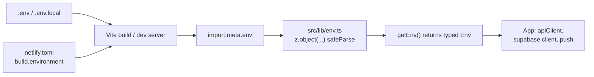

# Configuration

Active contributors: Saksham

Configuration in 360 Flatmates is split into two layers: environment variables (runtime keys the app needs to talk to its backend and auth provider) and config files (build, type-check, lint, test, and deploy settings that live at the repo root). The env layer is validated at runtime by Zod, so a missing or malformed variable fails loudly the first time the app reads it, not silently halfway through a request. The config files are conventional Vite, TypeScript, ESLint, Vitest, Playwright, PostCSS, and Netlify setups, each documented below.

## How environment variables flow

Vite only exposes variables prefixed with `VITE_` to the client bundle. Everything else (Supabase service-role keys, secrets) is server-side only and never reaches this repo. The flow from `.env` to the running app is fixed:

The key detail is the Zod gate at `src/lib/env.ts`: nothing reads `import.meta.env` directly except `getEnv()`. Every consumer (the API client, the Supabase client, the push manager) calls `getEnv()`, which parses once, caches the result, and throws a readable error listing every missing or invalid variable if the parse fails. `validateEnv()` is a fire-and-forget wrapper called early in app bootstrap to fail fast.

## Environment variables

| Variable | Purpose | Required | Example |
| --- | --- | --- | --- |
| `VITE_API_BASE_URL` | Base URL for the FastAPI backend. Consumed by `apiClient` via `buildApiUrl`. | Required | `https://api.360ghar.com/api/v1` |
| `VITE_SUPABASE_URL` | Supabase project URL. Consumed by the Supabase client in `src/lib/supabase.ts`. | Required | `https://your-project.supabase.co` |
| `VITE_SUPABASE_PUBLISHABLE_KEY` | Supabase anon/publishable key. The public client key, never the service-role key. | Required | `your-publishable-key` |
| `VITE_VAPID_PUBLIC_KEY` | VAPID public key for web push (FCM). Used by the push subscription flow. | Optional | `replace-me` |
| `VITE_AUTH_REDIRECT_URL` | Overrides the Google/Apple OAuth callback URL. Defaults to `window.location.origin + "/auth/callback"`. Set for Docker or reverse-proxy setups where the browser origin differs from the intended callback. | Optional | `http://localhost:5173` |

Build-time listing fetches (sitemap + per-listing prerender) gate themselves on Netlify's automatic `CONTEXT` variable: `production` fetches, every other context (`deploy-preview`, `branch-deploy`, or unset on local builds) skips. No `PRERENDER_*` env var is required. See [SEO and prerendering](../features/seo-prerendering.md#build-context-gating-local--preview).

`VITE_AUTH_REDIRECT_URL` is not in the Zod schema in `src/lib/env.ts` because it is read inline by the auth code only when set; the four schema-validated variables are the ones that must parse or the app refuses to boot.

## Config files

| File | Purpose | Key settings |
| --- | --- | --- |
| `vite.config.ts` | Vite build and dev config. Wires React, PWA, path aliases, the dev proxy, and manual chunking. | `server.port` 5173; `server.proxy` rewrites `/api` to `/app/v1` on the backend host; `build.target` `es2022`, `sourcemap` true; `rollupOptions.output.manualChunks` splits `vendor`, `query`, `supabase`, and `map` chunks; `VitePWA` registers `autoUpdate` with manifest theme color `#F4F3EE`. |
| `vitest.config.ts` | Vitest unit and integration test config. Separate from `vite.config.ts` so test-only aliasing (the `framer-motion` mock) does not leak into the production build. | `environment` `jsdom`; `globals` true; `setupFiles` `["./vitest.setup.ts"]`; `include` covers `src/**/__tests__/**`, `src/**/*.test.{ts,tsx}`, and `tests/integration/**`; `resolve.alias` maps `@` to `src` and stubs `framer-motion` to `src/__mocks__/framer-motion.tsx`. |
| `vitest.setup.ts` | Vitest global setup. Single line that registers `@testing-library/jest-dom/vitest` matchers (`toBeInTheDocument`, `toHaveTextContent`, etc.) for every test. | Imports `@testing-library/jest-dom/vitest`. |
| `tsconfig.json` | TypeScript compiler config for type-checking and editor support. Strict mode is non-negotiable. | `target`/`lib` `ES2022`; `strict` true; `noEmit` true; `moduleResolution` `bundler`; `jsx` `react-jsx`; `paths` `@/*` to `./src/*`; `exclude` drops `node_modules`, `dist`, and all test files from the type-check program. |
| `eslint.config.mjs` | ESLint flat config. TypeScript-eslint recommended plus React and React Hooks plugins. | `react-hooks/exhaustive-deps` error; `react/react-in-jsx-scope` off; `@typescript-eslint/no-explicit-any` error; `no-unused-vars` warn with `_` prefix ignore; ignores `dist`, `node_modules`, `playwright-report`, `src/lib/api/openapi-types.ts` (generated), and tooling directories. |
| `playwright.config.ts` | Playwright E2E config. Runs against the Vite dev server. | `testDir` `./e2e`; `baseURL` `http://127.0.0.1:5173`; `webServer` runs `npm run dev` and reuses an existing server outside CI; four projects: `auth-setup` (saves storage state), `chromium`, `mobile` (Pixel 5), and `authenticated` (uses `.auth/user.json`); trace on first retry, screenshots only on failure. |
| `postcss.config.mjs` | PostCSS config. The only plugin is Tailwind v4's PostCSS integration. | `@tailwindcss/postcss` with no options (Tailwind v4 reads its config from CSS `@theme`, not a JS file). |
| `netlify.toml` | Netlify deploy config. Runs `npm run build` and publishes `dist/`. | `build.command` `npm run build`; `build.publish` `dist`; `build.environment` sets `VITE_API_BASE_URL`. Build-time listing fetches gate on the auto-set `CONTEXT` variable, so no `PRERENDER_*` env var is needed. |
| `src/lib/env.ts` | The runtime env validator. The single source of truth for what env vars exist and which are required. | `envSchema` is a Zod object; `getEnv()` parses `import.meta.env` once, caches, and throws a readable error on failure; `validateEnv()` is the bootstrap-friendly wrapper. |
| `src/lib/config.ts` | Derived runtime config. A single exported constant for the public base URL. | `BASE_URL` resolves to `window.location.origin` in the browser, or `https://360ghar.com` as a fallback (used during prerender). |
| `.env.example` | The template for local `.env`. Documents the four `VITE_` vars plus the commented-out `VITE_AUTH_REDIRECT_URL`. | Copy to `.env` (or `.env.local`) and fill in real keys. |

### Build pipeline order

`npm run build` is a chain, not a single step. The order matters because each stage feeds the next:

1. `tsc --noEmit` (type-check, fails the build on any error).
2. `scripts/generate-pwa-icons.ts` (PNG icons from `public/favicon.svg`).
3. `scripts/generate-og-image.ts` (social preview image).
4. `scripts/generate-favicon-ico.ts` (legacy `.ico`).
5. `scripts/generate-sitemap.ts` (`public/sitemap.xml`).
6. `vite build` (the production bundle into `dist`).
7. `scripts/generate-static-html.ts` (pure string-template HTML for every public route + one per-listing page). Listing fetches are gated on `CONTEXT=production`; local builds and Netlify deploy previews skip them and the SPA fallback handles deep listing links at runtime.

See [SEO and prerendering](../features/seo-prerendering.md) for the full prerender mechanism and the CONTEXT gating table.

## Related pages

- [Getting started](../overview/getting-started.md) for the install and first-run flow.
- [Deployment](../deployment.md) for how the Netlify pipeline and prerender step run in production.
- [PWA install](../features/pwa-install.md) for what the PWA manifest fields mean for users.
- [SEO and prerendering](../features/seo-prerendering.md) for why each route gets its own `dist/<route>/index.html`, the CONTEXT gating, and the SPA fallback.

## Key source files

| File | Role |
| --- | --- |
| `vite.config.ts` | Build, dev server, PWA, proxy, manual chunking |
| `vitest.config.ts` | Unit and integration test environment, aliases, framer-motion mock |
| `vitest.setup.ts` | Registers jest-dom matchers globally |
| `tsconfig.json` | Strict TypeScript, `@/` path alias, test-file exclusion |
| `eslint.config.mjs` | Flat lint config, React hooks, no-`any` rule |
| `playwright.config.ts` | E2E projects, web server, trace and screenshot policy |
| `postcss.config.mjs` | Tailwind v4 PostCSS plugin |
| `netlify.toml` | Netlify build command and environment |
| `src/lib/env.ts` | Zod env schema, `getEnv()`, `validateEnv()` |
| `src/lib/config.ts` | Derived `BASE_URL` constant |
| `.env.example` | Documented env var template |
