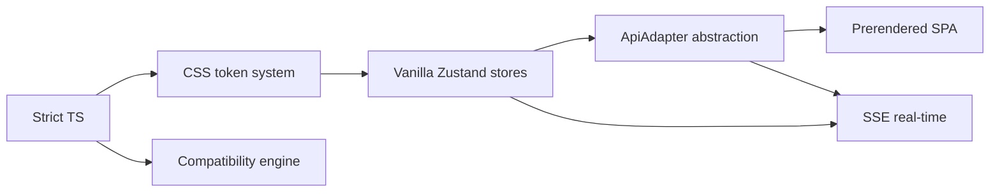
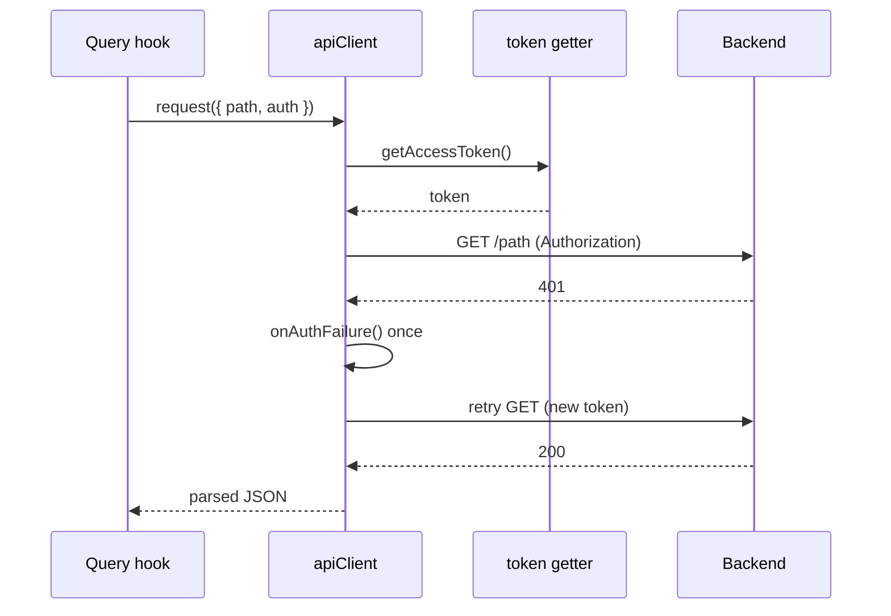

# Design decisions

Active contributors: Saksham

The load-bearing choices in the 360 Flatmates web app, each with the alternatives that were considered and rejected. These decisions were made on purpose and survive because they earned their place. Where a later commit changed the approach, the rationale for the change is noted.

## Vanilla Zustand stores, not the `create()` hook wrapper

**Decision.** Every client-only store in `src/lib/stores/` is built with `createStore()` from `zustand/vanilla` and exported as a module-level singleton (for example `src/lib/stores/ui-store.ts`, `src/lib/stores/auth-store.ts`, `src/lib/stores/search-store.ts`). React components subscribe with the `useStore` hook from the `zustand` package.

**Alternatives considered.** The more common Zustand pattern is `create()(config)`, which returns a React hook directly. That is the pattern in most tutorials and starter templates.

**Rationale.** The vanilla store can be read and written from non-React code. Three concrete consumers need this: the SSE connection manager in `src/lib/sse/connection.ts` pushes connection state into `uiStore` without any React context; the providers in `src/providers.tsx` read `authStore.getState()` inside a `useEffect` to gate the backend auth-state fetch; and tests assert against `store.getState()` directly without mounting a component tree. The `create()` hook wrapper would have forced each of these to thread a React context, or to duplicate the state. This decision landed on 2026-05-20 (commits d487579 and d069942) and was standardized across the codebase the same day. The trade-off is a tiny ergonomic cost: components must call `useStore(uiStore, selector)` instead of `useUiStore()`. See [state management](../systems/state-management.md).

## No SSR. Prerender the public surface instead

**Decision.** The app is a client-rendered SPA. There is no server-side runtime that renders React. Instead, a build-time step in `scripts/prerender.ts` launches headless Chromium, navigates to every public route, waits for `react-helmet-async` to flush the `<head>`, and writes the fully-rendered HTML into `dist/<route>/index.html`.

**Alternatives considered.** Full SSR (Next.js, Remix) would give crawlers HTML at request time and support authenticated SSR. A static site generator would build all pages at compile time. A purely client-rendered SPA with no prerender would ship an empty `
` to every crawler.

**Rationale.** The backend is a shared FastAPI service that the SPA consumes, not a Node server the team controls. Running a React SSR layer would mean standing up and operating a second runtime, which is a large cost for a single-contributor repo. The only audience that genuinely needs server-rendered HTML is crawlers that do not run JavaScript (GPTBot, ClaudeBot, CCBot, and so on), and those crawlers hit a known, enumerable set of public routes. Prerendering those routes at build time gives crawlers real HTML with real meta, JSON-LD, and visible content, without any per-request server cost and without coupling the frontend to a Node host. Authenticated routes are never prerendered (they would render a login redirect at build time), so the prerenderer only covers the `PublicLayout` surface. See [SEO and prerendering](../features/seo-prerendering.md).

## SSE over WebSockets for real-time updates

**Decision.** Real-time events (notifications, messages, visit updates, swipes) arrive over Server-Sent Events via the `EventSource`-based manager in `src/lib/sse/connection.ts`. There is no WebSocket client in the web app.

**Alternatives considered.** WebSockets give bidirectional communication and a richer framing model. Long polling is the simplest fallback.

**Rationale.** The traffic is unidirectional, server-to-client. Notifications, chat messages, and status updates flow one way; the client already has the REST API for any upstream action. SSE is cheaper on the server (one HTTP connection per client, no frame protocol, no upgrade handshake), degrades gracefully over flaky connections with built-in browser reconnection, and works through proxies that block WebSockets. The `EventSource` API is also simpler to reason about than a raw WebSocket. The trade-off is documented in the source: `EventSource` does not support custom headers, so the auth token travels as a URL query parameter, which is a deliberate security trade-off (see [pitfalls](pitfalls.md#sse-token-in-the-url)). See [real-time](../features/real-time.md).

## The `ApiAdapter` abstraction

**Decision.** All HTTP calls go through a single `ApiAdapter` interface (`src/lib/api/client.ts`), implemented by `HttpApiClient` and instantiated once as `apiClient` in `src/lib/api/index.ts`. Every TanStack Query hook calls `apiClient.request(...)`.

**Alternatives considered.** Call `fetch` directly inside each query hook, or generate a per-endpoint client from the OpenAPI spec.

**Rationale.** A single chokepoint makes it possible to apply cross-cutting concerns consistently: the `Authorization` header is attached when `auth` is not `false`, the access token is injected from a module-level getter (so the client never imports Supabase), `401` responses trigger exactly one refresh attempt and one retry, error bodies are parsed into a normalized `ApiClientError` with field-level validation details, and the base URL is resolved once from the environment. The adapter is also injectable: the constructor accepts a custom `fetcher`, which is what makes the Playwright prerenderer and tests able to swap behavior without monkey-patching global `fetch`. The `fetch.bind(window)` default is itself a recorded fix (see [pitfalls](pitfalls.md#fetch-illegal-invocation)). See [API client](../systems/api-client.md).

## A weighted, six-dimension compatibility engine

**Decision.** The core product differentiator, compatibility scoring, lives in `src/lib/compatibility/engine.ts` and scores two peers across six lifestyle dimensions: `sleep_schedule`, `cleanliness`, `food_habits`, `smoking_drinking`, `guests_policy`, and `work_style`. Each dimension has its own scoring function and a fixed weight; the overall score is the weighted sum.

**Alternatives considered.** A single "compatibility score" returned by the backend and displayed as-is. A pure tag-matching model (count overlapping preferences). A collaborative-filtering model trained on past matches.

**Rationale.** Budget-only filtering is what every property portal already does, and it does not predict whether two people can actually live together. The six dimensions are the lifestyle factors that matter for cohabitation, and weighting them (rather than treating them equally) lets the score reflect that, for example, sleep schedule and cleanliness gaps are harder to live with than a guests-policy difference. Keeping the engine in the frontend, with per-dimension scoring functions that return 0 to 100, makes the breakdown explainable to the user: the `ProgressRing` and the per-dimension summaries are generated from the same result object as the headline percentage. This is also why the engine lives in its own module and is treated as load-bearing, it survived an unauthorized deletion on 2026-05-20 (see [lore](../lore.md)). See [compatibility matching](../features/compatibility-matching/index.md).

## Strict TypeScript, ES2022 target, bundler module resolution

**Decision.** `tsconfig.json` sets `"strict": true`, `"target": "ES2022"`, `"moduleResolution": "bundler"`, and `"noEmit": true` (Vite emits). ESLint in `eslint.config.mjs` raises `@typescript-eslint/no-explicit-any` to an error and runs with `--max-warnings=0`, so the build fails on any `any` and on any warning.

**Alternatives considered.** A looser config with `any` permitted for rapid prototyping. A `NodeNext` or `node` module resolution. An older ES target for maximum browser compatibility.

**Rationale.** Strict typing catches the class of bugs (typos in field names, missing null checks, wrong union arms) that are expensive to find at runtime in a client-rendered SPA with no server logs to grep. `no-explicit-any` as an error, rather than a warning, forces contributors to model data properly, which compounds: every hook and component that consumes a typed API response is itself type-safe for free. ES2022 is the right target because the app uses native `fetch`, `URL`, `EventSource`, `BroadcastChannel`, and `crypto`, all of which are baseline in evergreen browsers, and the PWA install audience is modern. `bundler` module resolution matches how Vite actually resolves modules (including the `@/*` path alias) and avoids false errors on modern import patterns. Zero warnings as a hard gate means the codebase never accumulates lint debt; combined with the zero-TODO state (see [cleanup opportunities](../cleanup-opportunities.md)), this keeps the codebase auditable for a single contributor.

## A CSS custom property token system, not a JS theme

**Decision.** All design tokens (color, typography, spacing, radius, shadow, motion, z-index) are CSS custom properties defined in `src/styles/globals.css`. Tailwind v4's `@theme` block turns each `--color-*` into `bg-* / text-* / border-*` utilities. Semantic role aliases (`--color-content`, `--color-surface-raised`, `--color-interactive`) hold `var()` references to the primitive tokens.

**Alternatives considered.** A JavaScript theme object consumed by a CSS-in-JS library. Tailwind theme extension in `tailwind.config.js`. Hardcoded values per component.

**Rationale.** CSS custom properties re-resolve at runtime, which means dark mode and palette swaps work by toggling `[data-theme="dark"]` or `[data-palette]` on `<html>` with no JavaScript recalculation and no re-render. The semantic role layer (`text-content`, `bg-surface-raised`) is the key: a component written against `bg-surface` gets the correct light and dark values for free, because the alias resolves to a different primitive under each theme. A JS theme object would require a provider, a re-render on theme change, and a parallel set of dark-mode values. The trade-off is that tokens are not visible in the component source as JavaScript, which is why [DESIGN.md](../../DESIGN.md) is maintained as the single source of truth and kept in lockstep with `globals.css`. See [design system](../systems/design-system.md).

## Key source files

| File | Role |
| --- | --- |
| `src/lib/stores/ui-store.ts` | Vanilla `createStore()` example: theme, toasts, modals, SSE state |
| `src/lib/stores/auth-store.ts` | Vanilla store consumed by guards and providers without React context |
| `src/providers.tsx` | Token getter + refresh handler injection that keeps the API client Supabase-agnostic |
| `scripts/prerender.ts` | Build-time Chromium prerender of every public route |
| `src/lib/sse/connection.ts` | `EventSource`-based SSE manager, pure TypeScript, no React |
| `src/lib/api/client.ts` | `ApiAdapter` interface and `HttpApiClient` with single-refresh retry |
| `src/lib/api/index.ts` | Module-level `apiClient` singleton and token getter wiring |
| `src/lib/compatibility/engine.ts` | Weighted six-dimension compatibility scoring |
| `vite.config.ts` | Vite + `vite-plugin-pwa` (`autoUpdate`) config and dev proxy |
| `tsconfig.json` | Strict mode, ES2022, bundler resolution, `@/*` alias |
| `eslint.config.mjs` | `no-explicit-any: error`, `--max-warnings=0` enforcement |
| `src/styles/globals.css` | All design tokens as CSS custom properties and `@theme` utilities |

## Related pages

- [State management](../systems/state-management.md) for the store consumption patterns these decisions enable.
- [API client](../systems/api-client.md) for the full adapter contract.
- [Real-time](../features/real-time.md) for the SSE manager in action.
- [SEO and prerendering](../features/seo-prerendering.md) for the prerender pipeline.
- [Design system](../systems/design-system.md) for the token system in practice.
- [Compatibility matching](../features/compatibility-matching/index.md) for the engine's inputs and outputs.
- [DESIGN.md](../../DESIGN.md) for the canonical token and component reference.
- [Pitfalls](pitfalls.md) for the traps these decisions introduce.
