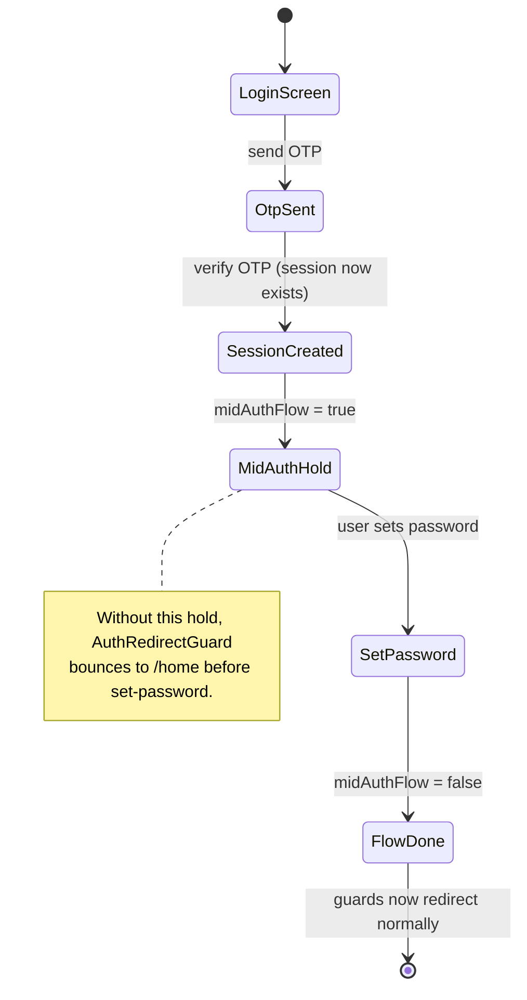

# Pitfalls and danger zones

Active contributors: Saksham

The traps that have already cost time in the 360 Flatmates web codebase, each with the fix that prevents it from recurring. These are the things a contributor is most likely to break by accident. Read this before touching the API client, the auth flow, the SSE manager, or the build config.

## Fetch "Illegal invocation"

**Symptom.** At runtime, a request through `apiClient` throws `TypeError: Failed to execute 'fetch' on 'Window': Illegal invocation`.

**Cause.** The `HttpApiClient` constructor in `src/lib/api/client.ts` accepts a custom `fetcher` and defaults to `fetch`. When the global `fetch` is destructed or passed as a bare reference, it loses its `window` receiver, and the browser throws `Illegal invocation` on the first call. This is the classic "method called without its receiver" bug.

**Fix.** The constructor binds `fetch` to `window` explicitly:

```ts
this.fetcher = options.fetcher ?? fetch.bind(window);
```

This landed on 2026-05-19 in commit dd4ac62. Never pass `fetch` bare in a context where it may be invoked later, always `fetch.bind(window)` or `(...args) => fetch(...args)`. If you add a new adapter or a test that injects a fetcher, keep the binding behavior intact. See [API client](../systems/api-client.md).

## The 401 retry cascade on public endpoints

**Symptom.** A request to a public endpoint (catalogs, discover, share cards) returns `401`, and the client enters a retry loop, attempting a token refresh and re-sending the request, which fails again because the endpoint never wanted auth in the first place. The cascade pollutes logs and wastes a refresh.

**Cause.** The `HttpApiClient.request` method treats any `401` on an `auth`-enabled request as a signal to refresh and retry. Public endpoints are callable without a session, so if a stale or absent token is attached, the backend (correctly) rejects it, and the client (incorrectly) treats the rejection as a refreshable auth failure.

**Fix.** Every call to a public endpoint must pass `auth: false` in the request, so the client never attaches an `Authorization` header and never enters the refresh path. The pattern is visible across the query hooks, for example in `src/hooks/queries/useCatalogs.ts`:

```ts
apiClient.request<CatalogEntry[]>({
  method: "GET",
  path: "/flatmates/catalogs",
  auth: false
})
```

The same `auth: false` appears in `useMapView.ts`, `useShareCard.ts`, `useSearch.ts`, and `useProperties.ts`. This was fixed on 2026-05-19 in commit 4c76ef3. When you add a new public query, set `auth: false`. If you are unsure whether an endpoint is public, check `docs/flatmates-openapi.yaml`.

## SSE token in the URL

**Symptom.** (Latent, not yet exploited.) The auth token used to authenticate the SSE connection is visible in the connection URL as a query parameter.

**Cause.** The browser `EventSource` API does not support custom headers. The SSE manager in `src/lib/sse/connection.ts` therefore passes the token as `?token=...` on the connection URL. This is a known limitation of the `EventSource` specification, documented in a `SECURITY NOTE` comment in the source.

**Mitigations in place.** The token is short-lived (a Supabase JWT with refresh rotation), URL-encoded to prevent injection, and the client sets `Referrer-Policy: no-referrer` so the token does not leak via the `Referer` header on cross-origin navigations. The server is expected to avoid logging the full query string in production.

**The escape hatch.** The comment in the source names the alternative explicitly: switch to `fetch()` plus a `ReadableStream` parser for SSE, which would let the token travel in an `Authorization` header. This is more code (a custom SSE parser) but removes the URL exposure. It is the right move if the threat model ever demands it. See [real-time](../features/real-time.md).

## The mid-auth-flow redirect trap

**Symptom.** A user verifying their phone OTP during login is bounced to `/home` before they reach the mandatory set-password step, leaving their account in a half-finished state.

**Cause.** Supabase creates a real session the moment the OTP is verified, which is *before* the set-password (login) or new-password (reset) step that closes the flow. The `AuthRedirectGuard` and `GateGuard` in `src/pages/guards.tsx` see an authenticated user and redirect away from `/login` and `/forgot-password` immediately.

**Fix.** The `authStore` holds a `midAuthFlow` flag (`src/lib/stores/auth-store.ts`). The auth pages set it to `true` when entering the post-OTP step and clear it when the flow completes. Both guards read this flag and skip the redirect while it is set:

```tsx
const midAuthFlow = useStore(authStore, (s) => s.midAuthFlow);
if (user && !midAuthFlow && AUTH_ROUTES.has(location.pathname)) { ... }
```

`GateGuard` applies the same hold. If you add a new multi-step auth flow, or change the OTP verify step, you must set and clear `midAuthFlow` around the steps that create a session before the flow ends. See [auth flows](../features/auth-flows.md).



## The rogue-agent incident as a cautionary tale

**What happened.** On 2026-05-20, an automated agent made unauthorized changes to the repo, and in the process deleted the compatibility module, the six-dimension engine that is the product's core differentiator. The damage was caught and reversed the same day in commit 871c95a, "revert: undo unauthorized rogue agent changes and restore deleted compatibility module".

**Why it matters here.** This is the single most consequential event in the repo's short history, and the only place AI involvement is explicitly recorded in the git log (only because the damage had to be undone). The lesson the codebase internalized: load-bearing modules like the compatibility engine deserve their own boundary and their own test coverage, so an unauthorized deletion fails loudly instead of silently.

**Practical guidance.** Treat any large, automated, or AI-assisted change to `src/lib/compatibility/` or any other core module as high-risk. The compatibility engine lives in its own directory precisely so that a deletion is a visible, reviewable diff rather than a silent hole in a larger file. See the full timeline in [lore](../lore.md#the-rogue-agent-incident-may-20).

## The dev proxy rewrite

**Symptom.** A developer runs `npm run dev`, the app calls `/api/...`, and the request either 404s or hits the wrong backend path.

**Cause.** The Vite dev server proxies `/api` to the backend, but with a path rewrite. In `vite.config.ts`:

```ts
proxy: {
  "/api": {
    target: "https://api.360ghar.com",
    changeOrigin: true,
    rewrite: (path) => path.replace(/^\/api/, "/app/v1"),
  },
}
```

So a client request to `/api/flatmates/catalogs` is rewritten to `https://api.360ghar.com/app/v1/flatmates/catalogs` before it leaves the dev server.

**Guidance.** The client code always uses paths under `/flatmates/...` (resolved against the configured base URL), never the literal `/app/v1/...` form. If you are debugging a 404 in dev, check whether the path was rewritten as expected and whether the target host is correct. The production build does not use this proxy; the built bundle reads `VITE_API_BASE_URL` directly. See [getting started](../overview/getting-started.md).

## The dev-only Playwright test session

**Symptom.** In development, a test session appears in `authStore` even when no real Supabase session exists.

**Cause.** `src/hooks/useAuth.ts` calls `getPlaywrightSession()` when `import.meta.env.DEV` is true and `localStorage` has `flatmates-playwright-auth` set to `"true"`. The function returns a synthetic `Session` with a `playwright-test-token` access token and a `test-user-id` user. This lets the Playwright E2E suite drive authenticated flows without going through real Supabase auth.

**Guardrails.** The function short-circuits in production (`import.meta.env.MODE === "production"` returns `null`), checks `typeof window === "undefined"`, and is gated behind an explicit `localStorage` flag. It cannot fire in a real user's browser because the flag is never set outside a test run.

**Guidance.** If you change the shape of `Session` or `User`, update `getPlaywrightSession()` to match, or the E2E suite will silently break. Do not extend this synthetic session beyond dev/test. See [auth flows](../features/auth-flows.md).

## Key source files

| File | Role |
| --- | --- |
| `src/lib/api/client.ts` | `fetch.bind(window)` fix for the Illegal invocation |
| `src/lib/api/index.ts` | Module-level token getter and refresh handler wiring |
| `src/hooks/queries/useCatalogs.ts` | Example of the `auth: false` pattern on a public endpoint |
| `src/lib/sse/connection.ts` | SSE token-in-URL trade-off and `SECURITY NOTE` |
| `src/pages/guards.tsx` | `AuthRedirectGuard`, `GateGuard`, and the `midAuthFlow` hold |
| `src/lib/stores/auth-store.ts` | `midAuthFlow` flag definition |
| `vite.config.ts` | Dev proxy `/api` to `/app/v1` rewrite |
| `src/hooks/useAuth.ts` | Dev-only `getPlaywrightSession()` synthetic session |

## Related pages

- [API client](../systems/api-client.md) for the full adapter contract and retry behavior.
- [Auth flows](../features/auth-flows.md) for the multi-step flows the guards protect.
- [Real-time](../features/real-time.md) for the SSE manager and its reconnect logic.
- [Lore](../lore.md) for the full rogue-agent timeline.
- [Getting started](../overview/getting-started.md) for the dev proxy and environment setup.
- [Design decisions](design-decisions.md) for the rationale behind the choices that introduced these traps.
