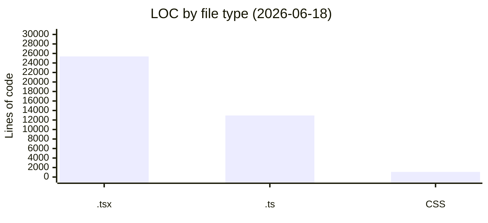

# By the numbers

Data collected on 2026-06-18.

A statistical snapshot of the 360 Flatmates web codebase: how big it is, how active it has been, how much of it is bot-written, and where the complexity concentrates. The single-contributor note at the end is the most important number for anyone planning to work on this repo.

## Size

**TypeScript** is the dominant language: 38,328 lines of code across 289 files (180 `.tsx`, 109 `.ts`). **CSS** is a single file, `src/styles/globals.css`, at 1,087 lines. There are **50 test files**. The CSS-in-one-file decision is deliberate: all design tokens, semantic role aliases, dark-mode overrides, and utility classes live in one source-of-truth stylesheet (see [DESIGN.md](../DESIGN.md) section 2), which keeps token churn auditable.

### Lines of code by file type

| File type | Files | Lines |
| --- | --- | --- |
| `.tsx` | 180 | 25,380 |
| `.ts` | 109 | 12,948 |
| CSS (`src/styles/globals.css`) | 1 | 1,087 |
| **Total TypeScript** | **289** | **38,328** |
| Test files | 50 | (included above) |

The `.tsx` to `.ts` ratio (roughly 5:2 by lines) reflects a component-heavy SPA where most logic lives in page and component files rather than framework-agnostic modules.

## Activity

**23 commits** total, from the initial commit on 2026-05-18 to the most recent on 2026-06-15. The cadence is bursty: a few dense days of setup and refactor in mid-May, a redesign and auth overhaul in early June, and a SEO and prerendering push in mid-June.

### Most changed files (churn)

Ranked by number of commits that touched each file across the 23-commit history:

| File | Commits touching | Notes |
| --- | --- | --- |
| `src/components/organisms/SwipeDeck.tsx` | high | The swipe deck, the product's hero surface, churned the most |
| `src/pages/app/PostPage.tsx` | high | The listing builder entry point |
| `src/pages/auth/LoginPage.tsx` | high | Auth flows were overhauled in early June |
| `src/providers.tsx` | high | Theme, SSE, and query client wiring |
| `src/App.tsx` | high | Router and route guards |

These five files are the natural focal points of the codebase: the main interaction surface (SwipeDeck), the two create-or-enter flows (PostPage, LoginPage), and the two top-level wiring files (providers, App). A change to any of them likely ripples widely.

## Bot-attributed commits

**0 of 23** commits carry a bot co-authorship trailer (no `Co-Authored-By: bot` or `Generated by` markers in the git log). This is a lower bound on AI-assisted work, not an upper bound: inline coding tools that suggest edits leave no git trace, and AI-assisted commits authored under a human identity are indistinguishable from fully-human commits in the log. The [rogue-agent revert](lore.md#the-rogue-agent-incident-may-20) is the one place AI involvement was explicitly recorded, and only because it had to be undone.

## Complexity

The largest files by line count concentrate complexity in three areas: interaction surfaces (SwipeDeck, ChatThread), auth (LoginPage), and the design system (Skeleton, OnboardingStepContent).

### Largest files by lines

| File | Lines |
| --- | --- |
| `src/components/organisms/SwipeDeck.tsx` | 918 |
| `src/pages/app/PostPage.tsx` | 666 |
| `src/pages/auth/LoginPage.tsx` | 639 |
| `src/components/ui/Skeleton.tsx` | 585 |
| `src/components/onboarding/OnboardingStepContent.tsx` | 519 |
| `src/pages/app/ProfileEditPage.tsx` | 507 |
| `src/components/organisms/MapView.tsx` | 498 |
| `src/components/organisms/ChatThread.tsx` | 498 |

The average `.tsx` file is roughly **213 lines**, so the files above are 2 to 4 times the mean. `SwipeDeck.tsx` at 918 lines is the clear outlier and a likely refactor candidate. `Skeleton.tsx` is large because it carries one variant per content layout (see the async-state guidelines in [AGENTS.md](../AGENTS.md)), not because of deep logic.

## Contributors

There is a single contributor: **Saksham Mittal**. No leaderboard is meaningful at this size. The practical implication is a **bus factor of 1**: all institutional knowledge lives with one person. The [getting started](overview/getting-started.md) guide, the [architecture](overview/architecture.md) overview, and the [glossary](overview/glossary.md) exist in part to spread that knowledge beyond a single head.

## Related pages

- [Lore](lore.md) for the timeline behind these numbers.
- [Fun facts](fun-facts.md) for the curiosities the numbers do not show.
- [Architecture](overview/architecture.md) for how the 289 files fit together.
