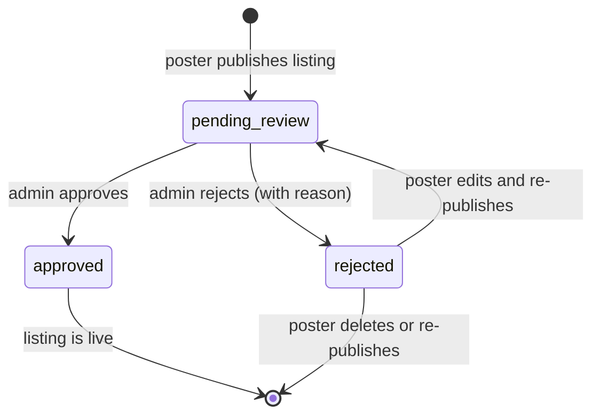
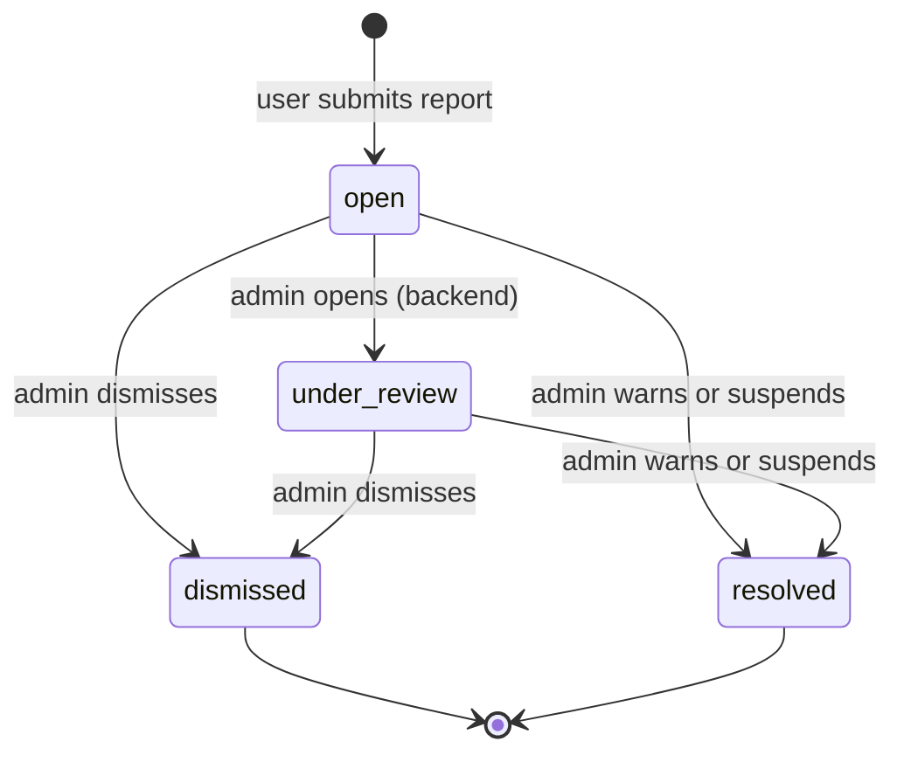

# Admin moderation

Active contributors: Saksham

360 Flatmates is a two-sided marketplace, so every listing sits behind a moderation gate before it reaches seekers, and every user-submitted report lands in a queue for review. The admin surface is a separate layout behind a role guard, with three tools: a platform stats overview, a listing review queue, and a report review queue. The listing queue also has a detailed prescreen view for context-rich review. This page covers the admin role gate, the three queues, the prescreen flow, and the moderation state machine. For the guard implementation, see [Routing and guards](../systems/routing-guards.md). For the listings being moderated, see [Listing management](listing-management.md). For the product context, see [plans/prd.md](../../plans/prd.md).

## The admin role gate

Admin access is gated by `AdminGuard` in `src/pages/guards.tsx`. The guard reads the signed-in user from `useAuth()` and checks `user.app_metadata?.role === "admin"`. The role is set in Supabase `app_metadata`, not in the profile table, so it travels with the JWT and is available synchronously after sign-in.

The guard has three outcomes:

| Condition | Result |
| --- | --- |
| `loading` is true | Render `<PageSpinner />` (wait for auth to resolve) |
| No `user` | `<Navigate to="/login" replace />` |
| `user.app_metadata?.role !== "admin"` | `<Navigate to="/home" replace />` |
| Otherwise | Render `<Outlet />` (the admin layout and its children) |

A non-admin signed-in user is silently bounced to `/home`, not to an error page. There is no "access denied" screen; the admin surface is simply invisible to non-admins. See [Routing and guards](../systems/routing-guards.md) for how `AdminGuard` sits in the route tree alongside `AuthGuard` and `GateGuard`.

## The admin layout

`AdminLayout` (`src/pages/admin/AdminLayout.tsx`) is a fixed-sidebar layout that wraps all admin routes via `<Outlet />`. On `xl` and wider, a 240px left sidebar holds the logo, an "Admin" label, and three nav items. Below `xl`, the sidebar collapses and the three nav items move into a sticky top header as icon-only links (labels appear on `md` and up).

The three nav items:

| Label | Route | Icon | Active when |
| --- | --- | --- | --- |
| Stats | `/admin/stats` | `BarChart3` | pathname matches or starts with `/admin/stats/` |
| Listing Queue | `/admin/moderation/listings` | `Shield` | pathname matches or starts with `/admin/moderation/prescreen` (so the prescreen detail keeps the tab active) |
| Reports | `/admin/moderation/reports` | `Flag` | pathname matches or starts with `/admin/moderation/reports/` |

The `isNavActive` helper special-cases the listing queue so that the prescreen detail page (which lives at `/admin/moderation/prescreen/:id`) keeps the "Listing Queue" tab highlighted. Active items get `bg-accent-soft text-accent`.

## Platform stats

`AdminStatsPage` (`src/pages/admin/AdminStatsPage.tsx`) is the admin landing view. It fetches `AdminStats` via `useAdminStats()` and renders six `StatCard` components in a 3-column grid, each with an icon:

| Card | Field | Icon | Description |
| --- | --- | --- | --- |
| Total Users | `total_users` | `Users` | |
| Total Listings | `total_listings` | `Building2` | |
| Pending Moderation | `pending_moderation` | `ShieldCheck` | "Listings awaiting review" |
| Total Matches | `total_matches` | `Heart` | |
| Total Visits | `total_visits` | `CalendarCheck` | |
| Active Conversations | `active_conversations` | `MessageCircle` | |

Loading renders a header skeleton plus six `statCard` skeletons. Error renders an inline `ErrorState` with retry inside a card. The page title "Platform Stats" is always visible, per the async-state rules.

## Listing moderation queue

`ModerationListingsPage` (`src/pages/admin/ModerationListingsPage.tsx`) fetches pending listings via `useAdminListings({ status: "pending_review" })` and renders them as a searchable list of compact cards. Each row shows the listing thumbnail, title, owner, locality, rent, creation date, a moderation status badge, and three actions: Approve, Reject, Review.

| Action | Effect |
| --- | --- |
| Approve | `useAdminModerate` with `{ action: "approve" }`, optimistic removal from queue |
| Reject | Opens a modal requiring a reason, then `useAdminModerate` with `{ action: "reject", reason }` |
| Review | Navigates to `/admin/moderation/prescreen/{id}` for the full detail view |

The `actingId` state tracks which listing is mid-mutation so only its row shows the loading spinner and all other rows disable their actions (preventing double-submit). Reject is destructive and requires a non-empty reason before the confirm button enables; the reason is shown to the listing owner.

The search bar filters client-side by title, owner name, or locality. The async states use `AsyncView` with a five-row skeleton for loading, an `EmptyState` ("No pending listings") for empty, and an `ErrorState` with retry for errors.

## Reports queue

`ModerationReportsPage` (`src/pages/admin/ModerationReportsPage.tsx`) fetches open reports via `useAdminReports({ status: "open" })` and renders them as a searchable list. Each row shows the report reason, the reporter and reported user names, the creation date, an optional property or conversation reference, a status badge, and three actions.

| Action | Payload action | Effect |
| --- | --- | --- |
| Dismiss | `dismiss` | Closes the report without acting on the reported user |
| Warn | `warn` | Sends a warning to the reported user |
| Suspend | `suspend` | Suspends the reported user |

All three open a confirmation modal with an optional notes field (internal, not shown to the user). The modal's confirm button label changes with the action, and the toast on success reflects the past-tense outcome ("Report dismissed", "Report resolved with a warning", "Report resolved, user suspended"). The same `actingId` pattern prevents double-submit.

The report status values, defined in `src/lib/data/domain.ts`:

| `ReportStatus` | Badge mapping |
| --- | --- |
| `open` | pending |
| `under_review` | pending |
| `resolved` | confirmed |
| `dismissed` | rejected |

## Prescreen review

`PrescreenPage` (`src/pages/admin/PrescreenPage.tsx`, 531 lines) is the detailed review view for a single listing, reached from the listing queue's "Review" action. It fetches the full property via `useProperty(id)` and renders a rich, section-by-section breakdown:

| Section | Content |
| --- | --- |
| Images | Grid of all `image_urls`, or the main image if no gallery |
| Title and Price | Title, full location, rent via `PriceText`, deposit, sharing type badge |
| Description | The full `description` text, whitespace preserved |
| Property Details | Type, purpose, bedrooms, bathrooms, area, available-from date, gender preference |
| Features | All `features` as neutral badges |
| Owner | Avatar, full name, phone |
| Moderation Status | Status badge (approved -> confirmed, rejected -> rejected, else pending) |
| AI Flags | All `tags` as warning badges with a flag icon |

The page has a sticky bottom action bar with Reject and Approve buttons. Approve calls `useAdminModerate` with `{ action: "approve" }` and navigates back to the queue on success. Reject opens a modal requiring a reason, then calls `useAdminModerate` with `{ action: "reject", reason }`. Both toast the outcome and return to the queue.

The AI Flags section surfaces the backend's pre-screen tags (from `property.tags`). These are the same flags referenced on the post-review screen the room poster sees after publishing (see [Listing management](listing-management.md)).

## Moderation state machine

The moderation state machine is driven entirely by admin actions through `useAdminModerate`, which calls `PUT /flatmates/moderation/listings/{id}`. The payload action is one of `approve`, `reject`, or `request_edit` (defined as `ModerationAction` in `src/lib/data/domain.ts`, though the UI only emits `approve` and `reject`).

The report state machine is driven by `useAdminReportAction`, which calls `PUT /flatmates/moderation/reports/{id}` with one of `dismiss`, `warn`, or `suspend`:

## Optimistic updates and cache invalidation

Both moderation mutations use optimistic updates so the actioned item disappears from the queue instantly, before the refetch lands. This avoids the just-actioned row flashing back into view.

`useAdminModerate` (in `src/hooks/queries/useAdmin.ts`):

1. `onMutate`: cancels all `["admin", "listings"]` queries, snapshots their cached data, and removes the moderated listing from each cached response (decrementing `total`).
2. `onError`: rolls back all snapshots.
3. `onSettled`: invalidates `["admin", "listings"]` and `["admin", "stats"]` so the queue refetches and the pending-moderation count on the stats page refreshes.

`useAdminReportAction` follows the identical pattern against `["admin", "reports"]`, also invalidating `["admin", "stats"]` on settle.

The read hooks:

| Hook | Query key | Endpoint |
| --- | --- | --- |
| `useAdminListings(filters)` | `["admin", "listings", filters]` | `GET /flatmates/moderation/listings` |
| `useAdminReports(filters)` | `["admin", "reports", filters]` | `GET /flatmates/moderation/reports` |
| `useAdminStats()` | `["admin", "stats"]` | `GET /flatmates/moderation/stats` |

## Cross-references

- [Routing and guards](../systems/routing-guards.md) for `AdminGuard` and the full guard tree.
- [Listing management](listing-management.md) for the post flow that creates `pending_review` listings and the review screen the poster sees.
- [plans/prd.md](../../plans/prd.md) for the product definition of moderation and the report system.

## Key source files

| File | Purpose |
| --- | --- |
| `src/pages/admin/AdminLayout.tsx` | Fixed sidebar layout, three nav items, active-state logic |
| `src/pages/admin/AdminStatsPage.tsx` | Platform stats overview with six stat cards |
| `src/pages/admin/ModerationListingsPage.tsx` | Pending listings queue, approve, reject, search |
| `src/pages/admin/ModerationReportsPage.tsx` | Open reports queue, dismiss, warn, suspend |
| `src/pages/admin/PrescreenPage.tsx` | Single-listing detailed review with sticky action bar |
| `src/pages/guards.tsx` | `AdminGuard` (checks `app_metadata.role === "admin"`) |
| `src/hooks/queries/useAdmin.ts` | All admin query and mutation hooks with optimistic updates |
| `src/lib/api/admin.types.ts` | `FlatmateListingAdmin`, `ReportAdmin`, `AdminStats`, payload types |
| `src/lib/data/domain.ts` | `ModerationAction`, `ReportAction`, `ReportStatus`, `PropertyModerationStatus` enums |
