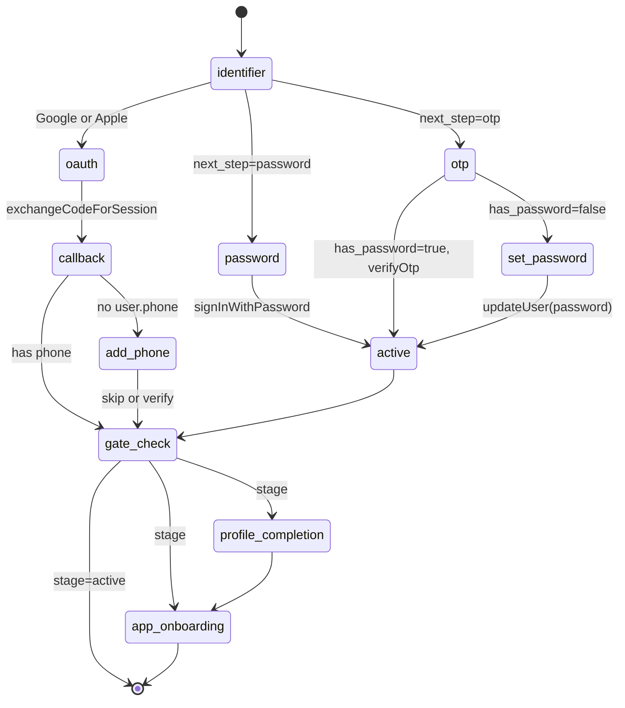

# Authentication flows

Active contributors: Saksham

360 Flatmates signs users in through four methods (password, phone OTP, email OTP, Google, and Apple) against a Supabase auth backend. The web app never decides on its own whether an account should use a password or an OTP. That decision belongs to the backend, which the client consults through a single identifier-status check. Everything else (the OTP verify, the password sign-in, the OAuth callback, the mandatory set-password step, the gate routing) is orchestrated around that one answer. This page walks the full state machine, the multi-step mid-auth hold, the OAuth add-phone interstitial, the last-method memory, and the 401 token-refresh path. For the route guards that consume the resulting auth state, see [Routing guards](../systems/routing-guards.md). For how the access token is injected into every API call and refreshed on a 401, see [API client](../systems/api-client.md). For the onboarding and profile-completion gates that auth flows into, see [Profile and onboarding](profile-onboarding.md).

## The single source of auth state

Auth state lives in a Zustand vanilla store, not in component state. `src/lib/stores/auth-store.ts` exposes `authStore` with the user, session, loading flag, and the gate-related fields:

| Field | Type | Purpose |
| --- | --- | --- |
| `user` | `User \| null` | Supabase user object |
| `session` | `Session \| null` | Supabase session (carries the access token) |
| `loading` | `boolean` | True while the initial `getSession()` is in flight |
| `midAuthFlow` | `boolean` | True between OTP verify and the final set-password step (see below) |
| `authStage` | `AuthStage` | Backend-computed gate stage: `active`, `profile_completion`, `app_onboarding` |
| `missingProfileFields` | `string[]` | Profile fields still required when `authStage` is `profile_completion` |

The store is a vanilla `createStore()` so it can be read from React-free code paths (the SSE manager, the providers effect, tests). The `useAuth` hook (`src/hooks/useAuth.ts`) is the React-facing surface: it subscribes to `user`, `session`, and `loading` from the store and exposes the full action surface (sign-in methods, OTP verify, OAuth, add-phone, sign-out, `recordAuthSuccess`).

## Bootstrap and the singleton subscription

`initAuthSubscription` in `src/hooks/useAuth.ts` runs exactly once on the first `useAuth` mount. It calls `supabase.auth.getSession()`, refreshes the session if the token is within a 5-minute expiry buffer, writes the result into `authStore`, and registers a single `onAuthStateChange` subscription for the whole app. A 5-second safety timeout forces `loading` to `false` even if `getSession()` hangs, so the UI never stalls on a blank screen. In dev, a Playwright test session can be injected via the `flatmates-playwright-auth` localStorage flag so E2E tests can bypass the real OAuth dance.

## The identifier check (backend decides password vs OTP)

The login form (`src/pages/auth/LoginPage.tsx`) starts at an `identifier` step. When the user enters an email or phone and taps Continue, the page calls `checkIdentifierStatus(resolvedIdentifier)` which hits the public, rate-limited `POST /api/v1/auth/identifier-status` endpoint (`src/lib/api/auth.ts`). The backend returns a neutral shape designed not to leak user existence:

```ts
interface IdentifierStatus {
  exists: boolean;
  verified: boolean;
  has_password: boolean;
  channel: "email" | "phone";
  next_step: "password" | "otp";
}
```

`next_step` is `"password"` only when `exists && verified && has_password`. In every other case (unknown identifier, unverified account, passwordless account) it is `"otp"`. The client branches on `next_step` and never second-guesses the backend. The identifier channel (email vs phone) is detected locally by `detectIdentifierChannel` (an `@` means email, otherwise phone) so the input can switch to a `tel` keyboard and normalize to E.164 (`+91XXXXXXXXXX`) before the API call.

### The mandatory set-password step

If `next_step === "otp"`, the page sends an OTP. Crucially, it also records `mustSetPassword = status.has_password === false`. OTP verification creates a Supabase session, so without a guard the `AuthRedirectGuard` would immediately bounce the user to `/home` before the flow finishes. The page instead advances to a `set-password` step that is **mandatory and non-skippable**: there is no Back or Skip button, and navigation only happens once `updateUser(password)` succeeds with a password that matches `PASSWORD_REGEX` (min 8 chars, 1 uppercase, 1 number, 1 special). This guarantees every OTP-only account becomes password-backed on first login. The `recordAuthSuccess` call is deferred to the end of the set-password step, so a method is only recorded once login is truly complete.

## The midAuthFlow hold

Because OTP verify and password reset both create a session before the flow is done, three pages set `authStore.midAuthFlow = true` while on their post-verify steps:

- `LoginPage` sets it during the `otp` and `set-password` steps.
- `ForgotPasswordPage` sets it during the `verify` and `new-password` steps.
- The login page clears it in a `useEffect` cleanup when the step changes or the component unmounts.

`AuthRedirectGuard` reads `midAuthFlow` and refuses to redirect away from `/login` and `/forgot-password` while it is true. `GateGuard` does the same, skipping gate enforcement entirely during a mid-auth flow. This is the single mechanism that keeps a freshly-OTP-verified session from short-circuiting the remaining steps.

## Password reset flow

`ForgotPasswordPage` (`src/pages/auth/ForgotPasswordPage.tsx`) is a three-step wizard: `request` (identifier) to `verify` (OTP) to `new-password`. It uses the same OTP send as login but with `shouldCreateUser: false` hardcoded, so a mistyped or unknown identifier can never silently create an account. The OTP is sent on both channels (phone `sms` or email `email`) and verified the same way. On success it calls `updateUser(newPassword)` and keeps the user signed in (the OTP verify already created the session), then navigates to `/home` with a success toast. There is no magic-link or `resetPasswordForEmail` path; both channels are unified through verify then set-password.

## Google and Apple OAuth

The login page exposes two OAuth buttons. `signInWithGoogle` and `signInWithApple` (both in `useAuth`) call `supabase.auth.signInWithOAuth` with `redirectTo` set to `VITE_AUTH_REDIRECT_URL ?? `${window.location.origin}/auth/callback``. Apple is only rendered when the browser supports it (detected via `-webkit-touch-callout` support or an iOS/Safari user agent), so the button never appears where it cannot work.

The OAuth flow is passwordless by design and **does not** go through the mandatory set-password step that OTP login does. Instead, the OAuth callback handles its own post-sign-in routing.

### The callback page

`AuthCallbackPage` (`src/pages/auth/AuthCallbackPage.tsx`) exchanges the `code` query param for a session via `supabase.auth.exchangeCodeForSession(code)`. On success it:

1. Detects the provider from the user identities (`apple` or `google`) and records the correct `AuthMethod` via `setLastAuthMethod` + `reportLastMethod`.
2. Checks whether the user already has a phone (`user.phone`).
3. Routes to `/add-phone` if there is no phone, otherwise to the validated `next` query param (defaulting to `/home`, with protocol-relative `//host` values blocked).
4. On any error, redirects to `/login?error=auth`, which `LoginPage` surfaces inline as "We couldn't complete that sign-in. Please try again."

### The add-phone interstitial (skippable)

Google (and sometimes Apple) sign-ups land without a phone. `AddPhonePage` (`src/pages/auth/AddPhonePage.tsx`) is the post-OAuth interstitial that lets them add and verify one. It uses `addPhone(phone)` (which calls `supabase.auth.updateUser({ phone })`) to trigger a phone-change OTP, then `verifyPhoneChange(phone, token)` (which calls `supabase.auth.verifyOtp({ type: "phone_change" })`) to confirm it. Unlike the login set-password step, this page is **always skippable**: a "Skip for now" button navigates straight to `/home`. If a user with an existing phone navigates here manually, the page redirects them to `/home` immediately. The midAuthFlow hold is not needed here because the OAuth callback already routed past the auth routes.

## The last-auth-method memory

After every successful sign-in (password, OTP, Google, Apple, reset), the page calls `recordAuthSuccess(method, identifier?)` from `useAuth`. That function does two things:

1. **Local persist:** `setLastAuthMethod(method, identifier)` in `src/lib/lastAuthMethod.ts` writes a small JSON blob to `localStorage` under `360ghar:lastAuthMethod`. The identifier is always **masked** before storage (`j••@gmail.com`, `+91 98•••• 3210`) so the raw email or phone is never persisted.
2. **Backend report:** `reportLastMethod(method)` in `src/lib/api/auth.ts` POSTs to `/api/v1/auth/last-method` (auth required). This call is best-effort and never throws, so a backend hiccup cannot strand a user who has already signed in.

The login page reads this hint on mount via `getLastAuthMethod()` and renders a caption ("Last time you used Google (j••@gmail.com).") plus a `data-method-highlight` attribute on the matching button. The whole module is framework-free so it ports cleanly to the sibling web apps.

## Gate states from the backend

Once authenticated (and outside a mid-auth flow), the app needs to know whether the user still owes profile completion or onboarding. This comes from `GET /api/v1/users/me/auth-state?app=flatmates` (`getAuthState` in `src/lib/api/auth.ts`), which returns:

```ts
interface AuthStateResponse {
  stage: "identifier_verification" | "password_setup" | "profile_completion" | "app_onboarding" | "active";
  next_action: string;
  missing_fields: string[];
}
```

The full backend gate model is: `identifier_verification` then `password_setup` then `profile_completion` then `app_onboarding` then `active`. In practice the web app only acts on the last three, because identifier and password setup are handled by the login and OAuth flows above.

### How the gate is fetched and cached

`ProviderInternals` in `src/providers.tsx` runs a `useEffect` keyed on `isAuthenticated`. When the user is authenticated and not in a mid-auth flow, it calls `getAuthState("flatmates")` and writes the result into `authStore` via `setAuthStage(data.stage, data.missing_fields)`. The fetch is non-fatal: on failure the stage stays at its default `"active"`, so the user proceeds rather than being blocked by a transient backend error.

`GateGuard` in `src/pages/guards.tsx` reads `authStage` and routes accordingly:

- `profile_completion` redirects to `/complete-profile`.
- `app_onboarding` redirects to `/onboarding`.
- `active` (and the unauthenticated or mid-auth cases) render the outlet.

The guard skips enforcement when the user is already on a gate route (`/complete-profile`, `/onboarding`, `/add-phone`, or any `/onboarding/*` deep link) so the user is not bounced in a loop. The onboarding flow's final step advances `authStage` to `"active"` locally before navigating to `/home`, so the guard does not re-bounce the user while the backend state catches up. See [Profile and onboarding](profile-onboarding.md) for the full gate progression.

## The auth state machine

The diagram below collapses the five sign-in paths (password, phone OTP, email OTP, Google, Apple) and the two post-auth gates into a single state machine. The `midAuthFlow` hold is what keeps the OTP and reset paths from short-circuiting through `active` before their final step.



## Token refresh on 401

The API client does not long-lived-poll the Supabase session. Instead it relies on the access token that `ProviderInternals` pushes into the client via `setAccessToken(session.access_token)` whenever the session changes. When a request comes back with a 401, the client calls the refresh handler registered by `setRefreshTokenHandler`. That handler (also in `src/providers.tsx`) calls `supabase.auth.refreshSession()`, pushes the fresh token back into the client, and returns it so the original request can be retried. The handler is deduped through a module-level `refreshPromise`, so a burst of 401s only triggers one refresh. If the refresh itself fails, the handler returns `null` and the request fails, at which point the QueryClient retry policy (which treats `auth`-typed `ApiClientError` specially) backs off. See [API client](../systems/api-client.md) for the full request and retry lifecycle.

## Guards summary

`src/pages/guards.tsx` exports three guards the auth flow depends on:

| Guard | Purpose |
| --- | --- |
| `AuthGuard` | Redirects unauthenticated users to `/login?redirect=...`; renders `<Outlet/>` otherwise |
| `AuthRedirectGuard` | Redirects authenticated users away from `/login` and `/forgot-password` (to the `?redirect=` target or `/home`), but only when `midAuthFlow` is false |
| `GateGuard` | Enforces the `profile_completion` and `app_onboarding` gates using `authStore.authStage`; skips enforcement during mid-auth flows and on gate routes |
| `AdminGuard` | Requires `user.app_metadata.role === "admin"`; otherwise bounces to `/home` |

`AuthGuard` and `AuthRedirectGuard` are the pair that bracket the login experience: one protects app routes, the other stops an already-signed-in user from sitting on the login screen. `GateGuard` sits inside the authenticated area and is the consumer of the gate-state fetch described above. For the full route tree and which guard wraps which routes, see [Routing guards](../systems/routing-guards.md).

## Source-of-truth docs

For the product spec of the login, OTP, OAuth, and add-phone flows, see [plans/ui_ux.md](../../plans/ui_ux.md). For the backend auth-state contract and the identifier-status response shape, see [docs/flatmates-openapi.yaml](../../docs/flatmates-openapi.yaml). For the async-state and error-handling rules that the auth pages follow, see [DESIGN.md](../../DESIGN.md) section 12.

## Key source files

| File | Purpose |
| --- | --- |
| `src/hooks/useAuth.ts` | The `useAuth` hook: bootstrap, sign-in methods, OTP verify, OAuth, add-phone, `recordAuthSuccess` |
| `src/lib/api/auth.ts` | `checkIdentifierStatus`, `getAuthState`, `reportLastMethod`, `IdentifierStatus` and `AuthStage` types |
| `src/lib/lastAuthMethod.ts` | Local last-method persistence with masked identifier hints |
| `src/lib/stores/auth-store.ts` | Zustand auth store: user, session, loading, `midAuthFlow`, `authStage` |
| `src/pages/auth/LoginPage.tsx` | Identifier check, password, OTP, mandatory set-password, Google, Apple |
| `src/pages/auth/ForgotPasswordPage.tsx` | Three-step OTP reset flow (request, verify, new-password) |
| `src/pages/auth/AuthCallbackPage.tsx` | OAuth code exchange, provider detection, add-phone routing |
| `src/pages/auth/AddPhonePage.tsx` | Skippable post-OAuth phone add and verify |
| `src/pages/guards.tsx` | `AuthGuard`, `AuthRedirectGuard`, `GateGuard`, `AdminGuard` |
| `src/providers.tsx` | Token injection, gate-state fetch, 401 refresh handler |
