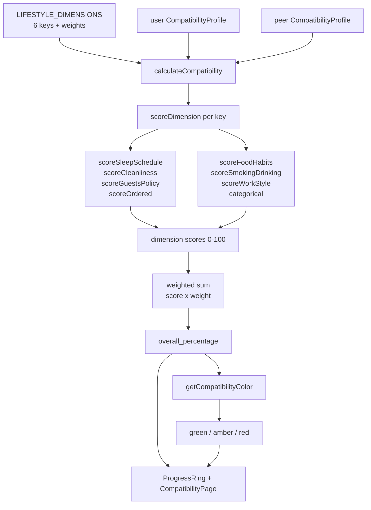

# Compatibility matching

Active contributors: Saksham

The six-dimension lifestyle compatibility engine is the product's core differentiator. Instead of filtering flatmates by budget alone, the engine scores two people on six lifestyle preferences, weights each dimension, and produces a single percentage that ranks every potential flatmate. This page covers how the score is computed, how peers are ranked, and how the result is visualized. For the swipe UX that consumes it, see [Swipe deck](swipe-deck.md).

## The six dimensions

Every flatmate profile carries six optional lifestyle answers, defined as enums in `src/lib/data/domain.ts` and surfaced through the `LIFESTYLE_DIMENSIONS` array. Each dimension has a `key`, a human-readable `label`, a `weight`, and an ordered list of `options`:

| Dimension key | Label | Weight | Options |
| --- | --- | --- | --- |
| `sleep_schedule` | Sleep Schedule | 0.20 | Early Bird, Flexible, Night Owl |
| `cleanliness` | Cleanliness | 0.20 | Minimal, Tidy, Spotless |
| `smoking_drinking` | Smoking/Drinking | 0.20 | Neither, Smoke Outside, Drink Occasionally, Both Fine |
| `food_habits` | Food Habits | 0.15 | Vegetarian, Vegan, Non-Vegetarian, Eggetarian, No Preference |
| `guests_policy` | Guests Policy | 0.15 | No Overnight Guests, Occasional Guests OK, Open House |
| `work_style` | Work Style | 0.10 | WFH, Office, Hybrid |

The three heaviest dimensions (sleep, cleanliness, smoking and drinking, each 0.20) get the most influence on the final score. Food habits and guests policy sit at 0.15, and work style is the lightest at 0.10. Weights live in `COMPATIBILITY_WEIGHTS` in `src/lib/compatibility/dimensions.ts`. The raw option labels and their display strings are documented in [lifestyle dimensions](../../primitives/lifestyle-dimensions.md); the shape each profile exposes for scoring is documented in [compatibility profile](../../primitives/compatibility-profile.md).

## Per-dimension scoring

Each dimension has a dedicated scorer in `src/lib/compatibility/dimensions.ts`, all of type `DimensionScorer<TValue>` (defined in `src/lib/compatibility/types.ts`). A scorer takes the user's value and the peer's value and returns a number from 0 to 100. Missing data on either side returns 0, so incomplete profiles never score artificially high.

### Ordered dimensions (sleep, cleanliness, guests)

Sleep schedule, cleanliness, and guests policy use a shared `scoreOrdered` helper. It ranks the two answers by their index in the canonical value array and applies distance-based scoring:

- **Distance 0** (exact match): full score.
- **Distance 1** (one step apart): partial score.
- **Distance 2+** (further apart): floor score.

Sleep and cleanliness use the strict `(100, 50, 0)` curve, so a one-step gap costs half the score and a two-step gap (early bird vs night owl, minimal vs spotless) scores zero. Guests policy is more forgiving at `(100, 60, 20)`, because an occasional-guests policy is closer to either extreme.

### Categorical dimensions (food, smoking and drinking, work)

Food habits, smoking and drinking, and work style do not sit on a simple ordinal scale, so each has a hand-tuned scorer:

- **`scoreFoodHabits`**: exact match is 100. A `no_preference` partner adapts to anyone for 70. Vegetarian and vegan are mutually compatible at 100, but a strict dieter against a non-strict one scores 0 (a hard incompatibility). Two non-strict eaters (non-vegetarian, eggetarian) land at 80.
- **`scoreSmokingDrinking`**: exact match is 100. A `both_fine` partner tolerates any preference for 70. Two non-smokers (`neither`, `drink_occasionally`) score 80. Any other mismatch (one smokes, the other does not) drops to 30.
- **`scoreWorkStyle`**: exact match is 100, anything else is 70. Work style is the lowest-weight, most forgiving dimension, since a hybrid worker and an office worker can coexist.

The `DIMENSION_SCORERS` object maps each `LifestyleDimensionKey` to its scorer, which is how `scoreDimension` in `src/lib/compatibility/engine.ts` dispatches.

## The weighted overall score

`calculateCompatibility(user, peer)` in `src/lib/compatibility/engine.ts` ties the pieces together:

1. It maps over `LIFESTYLE_DIMENSIONS`, running each dimension's scorer on the two profiles.
2. For each dimension it builds a `CompatibilityDimensionResult` with the raw score, the weighted `weight`, a boolean `match` (true when `score >= COMPATIBILITY_MATCH_THRESHOLD`, which is 60), and a human `summary` like "Sleep Schedule: strong match".
3. It multiplies each dimension's score by its weight and sums the products (`weightedScore`).
4. It rounds to the nearest integer to get `overall_percentage`.
5. It picks a `color` bucket (see below).

The match threshold of 60 (`COMPATIBILITY_MATCH_THRESHOLD`) is what flips a dimension's `match` flag. It is separate from the color thresholds, which describe the overall score.

### Color buckets

`getCompatibilityColor(score)` maps the overall percentage into three semantic buckets. These drive badge tone, ring color, and copy across the app, and they mirror [DESIGN.md](../../../DESIGN.md) section 3.7:

| Score | Color | Tailwind tone | Copy (from `CompatibilityPage`) |
| --- | --- | --- | --- |
| 70 and above | `green` | `success` | Great Match |
| 40 to 69 | `amber` | `warning` | Workable Match |
| below 40 | `red` | `error` | Preference Gap |

Color is never the only signal. Every score is paired with its numeric value, and the dimension breakdown lists the raw user value, peer value, and per-dimension percentage.

## Ranking peers

`rankPeersByCompatibility(user, peers)` takes a compatibility profile and a list of `FlatmatesPeer` objects, computes `overall_percentage` for each, and sorts the list in descending order. The return type annotates each peer with a `match_percentage` field, which is what the swipe deck and search results read to decide display order and ring fill. This runs entirely client-side: the backend may return peers in any order, and the engine re-sorts them by weighted fit before they reach the UI.

## Visualizing the score

The score is rendered two ways, both driven by the same `color` bucket:

- **`ProgressRing`** (`src/components/ui/ProgressRing.tsx`) draws an animated SVG ring with a `stroke-dashoffset` that eases from empty to the percentage on mount (an 800ms spring curve, disabled under reduced motion). The ring's fill color comes from `toneForValue`, which maps the percentage to `text-success`, `text-warning`, or `text-error`. It exposes `role="progressbar"` with `aria-valuenow` for screen readers, and comes in four sizes (`sm`, `md`, `lg`, `xl`).
- **`CompatibilityPage`** (`src/pages/app/CompatibilityPage.tsx`) is the dedicated detail view. It shows the `xl` ring, a badge with the color tone and status, a per-dimension breakdown bar (each bar colored by the same three-way bucket), and the human summary lines. It fetches the breakdown via the `useCompatibility(peerId)` hook, which calls `GET /flatmates/web/compatibility/{peerId}`.

## Source-of-truth docs

This page summarizes the engine. For the product rationale behind the six dimensions and the non-negotiables that can override them, see [plans/prd.md](../../../plans/prd.md). For the page-by-page spec of the compatibility detail view and the swipe card layout, see [plans/ui_ux.md](../../../plans/ui_ux.md). For the color tokens and the "never color alone" accessibility rule, see [DESIGN.md](../../../DESIGN.md) section 3.7.

## Key source files

| File | Purpose |
| --- | --- |
| `src/lib/compatibility/engine.ts` | `calculateCompatibility`, `rankPeersByCompatibility`, `getCompatibilityColor` |
| `src/lib/compatibility/dimensions.ts` | Per-dimension scorers, `COMPATIBILITY_WEIGHTS`, `COMPATIBILITY_MATCH_THRESHOLD` |
| `src/lib/compatibility/types.ts` | `CompatibilityProfile`, `CompatibilityResult`, `DimensionScorer` types |
| `src/lib/data/domain.ts` | `LIFESTYLE_DIMENSIONS`, enum values, option labels |
| `src/hooks/queries/useCompatibility.ts` | `useCompatibility(peerId)` hook calling the breakdown endpoint |
| `src/pages/app/CompatibilityPage.tsx` | Detail page rendering the ring, breakdown bars, and summary |
| `src/components/ui/ProgressRing.tsx` | Animated SVG score ring with semantic color tones |
