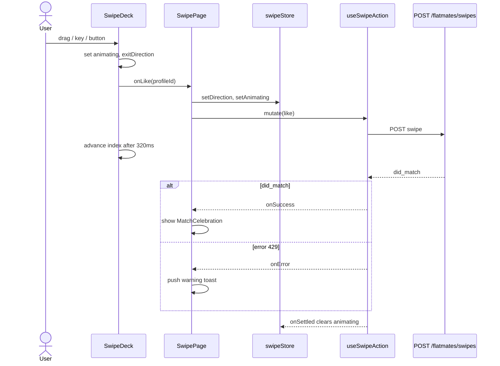

# Swipe deck

Active contributors: Saksham

The swipe deck is where compatibility meets action. It takes a ranked list of potential flatmates (see [Compatibility matching](index.md)), renders them one card at a time, and lets the user pass, like, or super-like with a gesture, a keyboard key, or a tap. This page covers the deck component, the gesture and keyboard handlers, the optimistic mutation flow, and the animation bookkeeping. For what happens after a mutual like, see [Likes and matches](../likes-and-matches.md).

## The deck component

`SwipeDeck` in `src/components/organisms/SwipeDeck.tsx` is the largest component in the app (around 918 lines). It renders a stack of up to three cards: the current top card plus two behind it for depth. Each card shows a profile photo, name, age, location, mode badge, a `ProgressRing` with the match score, and quick metadata chips (gender, profession, budget).

The deck has two layouts:

- **Collapsed view** (mobile default): a full-bleed photo with an overlay. A tap expands it. A `ChevronDown` affordance bounces at the bottom when there is more detail to read.
- **Expanded view** (desktop default, toggled with Space): a side-by-side split. On tablet and desktop the photo sits on the left at 40 to 45 percent width, and a scrollable details column on the right shows About, Budget and Move-in, Lifestyle chips, and Preferences (gender preference, pets, non-negotiables). On mobile it stacks vertically with the photo on top.

The top card is the `SwipeableCard`, which owns the drag gesture. The two behind it are static `SwipeCard` renders, scaled and offset to read as a stack. When the deck is expanded, the background cards hide so the focus stays on the current profile.

The deck accepts a `profiles` array and either an internal or controlled `currentIndex`. `SwipePage` (`src/pages/app/SwipePage.tsx`) lets it manage its own index (uncontrolled) but mirrors the animation state from the shared `swipeStore` via the `isAnimating` prop, which disables gestures during an in-flight mutation.

## Gestures and the keyboard

There are three input paths, all funnelling into the same `performSwipe` handler inside the deck:

- **Touch and mouse drag** (Framer Motion `drag`). The card tracks `x`, `y`, and derived `rotate`, `likeOpacity`, `passOpacity`, and `superLikeOpacity` motion values. Dragging right reveals a green "LIKE" stamp, left reveals a red "PASS" stamp, and up reveals an amber "SUPER LIKE" stamp. The stamps are `aria-hidden` decorative overlays; the real semantics live in the action bar buttons and the keyboard.
- **Keyboard** (the deck's `onKeyDown` on its focusable `<section>`). `ArrowLeft` passes, `ArrowRight` likes, `ArrowUp` super-likes, `Space` expands or collapses, `Escape` collapses. The section advertises these with `aria-keyshortcuts` and a descriptive `aria-label`. Super-like on the keyboard is disabled when expanded, to avoid clashing with scroll-up intent.
- **Action bar** (`src/components/molecules/SwipeActionBar.tsx`). Three circular buttons (X for pass, star for super-like, heart for like) with Framer Motion hover and tap scales, plus a `disabled` state that greys them out while a swipe is in flight.

The thresholds that turn a drag into a swipe live at the top of `SwipeDeck.tsx`:

| Gesture | Threshold | Velocity |
| --- | --- | --- |
| Like (right) | 120px offset | 500px/s |
| Pass (left) | 120px offset | 500px/s |
| Super-like (up) | 80px offset | 400px/s |

When the card is expanded, the horizontal thresholds bump up to 160px and 600px/s to avoid accidental swipes while scrolling the details. Super-like by drag is only honored in collapsed mode, again to avoid conflicting with vertical scroll.

The global `useKeyboardSwipe` hook (`src/hooks/useKeyboardSwipe.ts`) is deliberately **not** wired to the swipe actions from the page level. `SwipePage` explains why in a comment: a window-level listener would double-fire alongside the deck's section handler, and the global path could not advance the uncontrolled deck. The hook is retained only to let `Escape` dismiss the match-celebration overlay from anywhere on the page.

## Action types

Three actions map to three directions and three API payloads:

| Action | Direction | API `action` | Stamp color |
| --- | --- | --- | --- |
| Pass | left | `pass` | error red |
| Like | right | `like` | success green |
| Super-like | up | `super_like` | warning amber |

The action type is the `SwipeAction` enum from `src/lib/data/domain.ts` (`pass | like | super_like`). The `SwipeRequest` sent to the backend carries `target_type: "user"`, the `action`, and the `target_user_id`.

## Optimistic mutation and rollback

`useSwipeAction` in `src/hooks/queries/useSwipes.ts` wraps a `POST /flatmates/swipes` mutation. On success it invalidates the `["swipes", "deck"]` query so the backend can re-filter out the just-swiped profile.

The animation and the network call overlap rather than block each other. Here is the sequence from `SwipePage.handleSwipeAction` and `SwipeDeck.performSwipe`:

1. The user swipes. `performSwipe` sets `exitDirection` and `animating` on the deck, calls the `onPass`/`onLike`/`onSuperLike` callback, and starts a 320ms timeout that advances the index and clears the animation.
2. The callback in `SwipePage` writes the direction and `isAnimating` into `swipeStore` (so other consumers, like the keyboard handler, know to ignore input), then fires `swipeAction.mutate`.
3. The deck advances visually after 320ms regardless of the network. This is what makes the swipe feel instant.
4. On `onSuccess`, if `result.did_match` is true, a `MatchCelebration` overlay appears.
5. On `onError`, a toast appears. A 429 (super-like daily cap) gets a specific "Super-like limit reached" warning; any other error gets a generic "Swipe not saved" error. The deck does not roll back the visual advance, but the invalidated query will refresh the deck on the next refetch.
6. On `onSettled`, the store clears `isAnimating` and `direction`, re-enabling input.

If the mutation fails, the toast tells the user to retry. Because the deck advanced already, the user is not stuck on the failed card.

## Animation direction tracking

`swipeStore` (`src/lib/stores/swipe-store.ts`) is a vanilla Zustand store (the `createStore()` pattern, not the hook wrapper) that holds `currentIndex`, `isAnimating`, `direction`, `cardQueue`, and `isExpanded`. It exists so non-React code and the keyboard hook can read the animation state without prop drilling.

The direction state (`left | right | up | null`) is set when a swipe starts and cleared when it settles. The `cardQueue` is synced from the query data so any consumer can inspect the remaining cards. `SwipePage` pushes the fetched `profiles` into `cardQueue` via an effect, and the deck reads the same profiles directly through props.

Because the deck query is invalidated after every swipe, `profiles` is frequently replaced. The deck distinguishes an append (the leading ids are unchanged, new ids tacked on) from a fresh deck (a new set of ids, e.g. after the backend filters out already-swiped profiles). On an append it keeps the index and resets the near-end notification flag. On a fresh deck it resets the uncontrolled index to 0 so no card is skipped.

## Replenishment and the match celebration

When the index reaches within three cards of the end, the deck calls `onNearEnd`. `SwipePage.handleNearEnd` triggers a refetch once, then debounces for two seconds so it cannot fire again while the request is in flight.

When a like is mutual, the backend returns `did_match: true`. `SwipePage` finds the matched profile, stores it in local state, and renders a full-screen `MatchCelebration`: a confetti burst (24 particles in terracotta and categorical colors), an accent halo glow, the compatibility ring, and two buttons, "Keep Swiping" and "Say Hello" (which navigates to `/chats`). The overlay auto-dismisses after eight seconds or on `Escape` (via the retained `useKeyboardSwipe` dismiss handler).

## Accessibility

The deck is keyboard-first. The `<section>` is focusable with `tabIndex={0}` and exposes `aria-keyshortcuts`, `aria-label`, and `role="region"`. Every action has a keyboard equivalent, and the action bar buttons carry descriptive `aria-label`s ("Pass", "Super Like", "Like"). `ProgressRing` exposes `role="progressbar"` with `aria-valuenow`. Reduced motion is honored throughout: `useReducedMotion()` disables the drag gesture, the hover lift, and the tap scale, and the stamp overlays are decorative only. For the broader motion and focus rules, see [DESIGN.md](../../../DESIGN.md) sections 9 and 14.

## Source-of-truth docs

For the page-by-page spec of the swipe surface, including the expanded card content and the match celebration, see [plans/ui_ux.md](../../../plans/ui_ux.md). For the product rationale behind likes, super-likes, and match limits, see [plans/prd.md](../../../plans/prd.md). For the animation tokens and the reduced-motion rules, see [DESIGN.md](../../../DESIGN.md) section 9.

## Key source files

| File | Purpose |
| --- | --- |
| `src/components/organisms/SwipeDeck.tsx` | Deck, SwipeableCard, static SwipeCard, gesture and keyboard handlers |
| `src/pages/app/SwipePage.tsx` | Page wiring, mutation handling, MatchCelebration overlay |
| `src/hooks/queries/useSwipes.ts` | `useSwipeDeck` query, `useSwipeAction` mutation |
| `src/hooks/useKeyboardSwipe.ts` | Global keyboard hook (used for dismiss only) |
| `src/lib/stores/swipe-store.ts` | Vanilla Zustand store for direction and animation state |
| `src/components/molecules/SwipeActionBar.tsx` | Pass, super-like, like action buttons |
