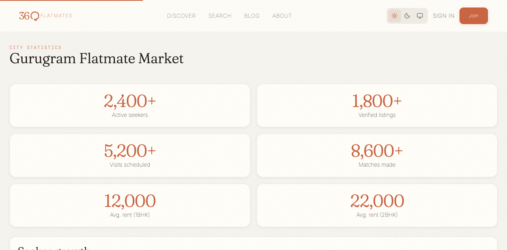
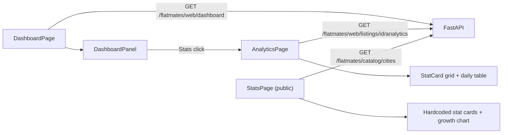

# Dashboard and analytics

Active contributors: Saksham

Once a room poster has listings live, they need to see how those listings are performing. 360 Flatmates gives them two surfaces: a dashboard overview with 30-day rollup metrics and a per-listing analytics page with a selectable time window and a daily breakdown table. There is also a public city-stats page that markets the platform with hardcoded growth numbers. This page covers the dashboard metrics, the analytics period selector, the stat card rendering, and the public stats page. For how listings are created and managed, see [Listing management](listing-management.md). For the room poster mode that unlocks these surfaces, see [Profile and onboarding](profile-onboarding.md). For the property data model that backs the metrics, see [Listing and property model](../primitives/listing-property.md).

## Two surfaces, two endpoints

| Route | File | Endpoint | Purpose |
| --- | --- | --- | --- |
| `/dashboard` | `src/pages/app/DashboardPage.tsx` | `GET /flatmates/web/dashboard` | 30-day rollup across all the user's listings |
| `/dashboard/analytics?propertyId=&period=` | `src/pages/app/AnalyticsPage.tsx` | `GET /flatmates/web/listings/{id}/analytics?period=` | Per-listing metrics for a chosen period |
| `/stats` | `src/pages/public/StatsPage.tsx` | `GET /flatmates/catalog/cities` (chips only) | Public marketing page with hardcoded stats |

The dashboard is the room poster's landing view. The analytics page is reached from the dashboard's per-row "Stats" action, which navigates to `/dashboard/analytics?propertyId={id}`.

## The dashboard

`DashboardPage` fetches `RoomPosterDashboard` via `useDashboardStats()` and maps it into two shapes before handing them to the `DashboardPanel` organism:

- `mapDashboardMetrics` produces four `DashboardMetric` cards.
- `mapListingRows` produces one `ListingPerformanceRow` per listing.

### The four metric cards

| Metric | Source field | Trend | Helper |
| --- | --- | --- | --- |
| Active Listings | `active_listings` | up if > 0, else flat | `${pending_review} pending review` when pending > 0 |
| Views (30d) | `total_views_30d` | up if > 0, else flat | |
| Likes (30d) | `total_likes_30d` | up if > 0, else flat | |
| Visits (30d) | `total_visits_30d` | up if > 0, else flat | |

Numbers are formatted with `Intl.NumberFormat("en-IN")` so they render with Indian digit grouping (for example 1,00,000). The trend is a directional arrow icon: `ArrowUpRight` in success green for up, `ArrowDownRight` in error red for down, nothing for flat. The dashboard only ever sets `up` or `flat` from the API data; the `down` branch exists in `DashboardPanel` for future use.

### The per-listing table

`DashboardPanel` (`src/components/organisms/DashboardPanel.tsx`) renders the per-listing performance as a table on desktop (`lg:block`) and as stacked cards on mobile (`lg:hidden`). Each row shows the listing title, views, likes, chats (conversations), an optional visits column (only if any row carries a `visits` number), a boost status badge, and three actions: Stats, Boost, Edit.

The boost status badge has three tones, mapped from the row's `boostStatus`:

| `boostStatus` | Badge tone | Label |
| --- | --- | --- |
| `active` | success (green) | Active |
| `inactive` | neutral | Inactive |
| `expired` | warning (amber) | Expired |

The three row actions wire back to the parent page's callbacks:

| Action | Navigation |
| --- | --- |
| Stats | `/dashboard/analytics?propertyId={id}` |
| Boost | `/my-listings/{id}` (the detail page's boost flow) |
| Edit | `/my-listings/{id}/edit` |

### Async states

The dashboard follows the project's async-state rules. Loading renders four `statCard` skeletons in a 4-column grid plus a table skeleton with header and three rows. Error renders an inline `ErrorState` with retry inside a card (never a full-page error, because the page title is always visible). Empty (listings exist but `rows.length === 0`) renders an `EmptyState` with a "Post a listing" CTA that navigates to `/post`.

## The analytics page

`AnalyticsPage` (`src/pages/app/AnalyticsPage.tsx`) reads `propertyId` and `period` from the URL search params, fetches `ListingAnalytics` via `useListingAnalytics(propertyId, period)`, and renders a period selector plus a six-card stat grid plus a daily breakdown table.

### The period selector

The period is a `SegmentedControl` with three options, validated by `isAnalyticsPeriod`:

| Value | Label | Meaning |
| --- | --- | --- |
| `7d` | 7 days | Last 7 days |
| `30d` | 30 days | Last 30 days (default) |
| `all` | All time | Since the listing was created |

`AnalyticsPeriod` is exported from `src/hooks/queries/useDashboard.ts` as `"7d" | "30d" | "all"`. Changing the selector updates the `period` search param with `replace: true`, which re-runs the query with the new key `["dashboard", "analytics", propertyId, period]`. If the URL has no `period` or an invalid one, it defaults to `30d`.

### The six stat cards

The analytics page uses the shared `StatCard` molecule (`src/components/molecules/StatCard.tsx`), not the dashboard's inline metric cards. Six cards render in a 3-column grid:

| Card | Source field | Description |
| --- | --- | --- |
| Total Views | `total_views` | `${unique_views} unique` |
| Likes | `likes` | |
| Shares | `shares` | |
| Conversations Started | `conversations_started` | |
| Visits Scheduled | `visits_scheduled` | |
| Boost | `boost_active ? "Active" : "Inactive"` | `Expires {date}` when active and `boost_expires_at` is set |

`StatCard` has two layouts: with an `icon` prop it renders a horizontal card with an accent-soft icon container, without an icon it renders a compact vertical card. The analytics page uses the no-icon variant.

### The daily breakdown table

When `daily_stats` is non-empty, a `DailyStatsTable` renders a four-column table (Date, Views, Likes, Shares) inside a card. Dates are formatted with `formatDate` from `src/lib/utils/format`. Numeric cells use `tabular-nums` for alignment. When `daily_stats` is empty, an `EmptyState` explains that day-by-day data will appear once the listing gets engagement.

### No listing selected

If `propertyId` is missing, zero, or `NaN`, the page short-circuits to an `EmptyState` titled "No listing selected" with a prompt to pick a listing from the dashboard. This is the entry condition when a user navigates to `/dashboard/analytics` without a `propertyId` param.

## The public stats page

`StatsPage` (`src/pages/public/StatsPage.tsx`) is a public marketing route at `/stats`. It wraps `StatsClient` (`src/components/page-clients/StatsClient.tsx`) with a `SeoHelmet` that sets the title, description, canonical URL, and breadcrumb for the city-stats page.

`StatsClient` renders:

- A `PageHeader` with eyebrow "City statistics" and a title that reflects the selected city (defaults to "Gurugram").
- A row of city `Chip` selectors fetched from `useCities()` (`src/hooks/queries/useCatalogs.ts`). The first city is selected by default.
- A grid of six hardcoded stat cards (Active seekers, Verified listings, Visits scheduled, Matches made, Avg. rent 1BHK, Avg. rent 2BHK) rendered in `text-display` accent color.
- A "Seeker growth" bar chart with six hardcoded monthly values (`[32, 48, 55, 61, 72, 86]`) rendered as accent-colored bars.
- A "Browse Listings" tertiary button linking to `/discover`.

The hardcoded stats and growth data are marketing figures, not live API data. The only live data on the page is the city list for the chip selectors.

## Hooks and query keys

Both authenticated hooks live in `src/hooks/queries/useDashboard.ts`:

| Hook | Query key | Endpoint | Enabled |
| --- | --- | --- | --- |
| `useDashboardStats()` | `["dashboard", "stats"]` | `GET /flatmates/web/dashboard` | always |
| `useListingAnalytics(propertyId, period)` | `["dashboard", "analytics", propertyId, period]` | `GET /flatmates/web/listings/{id}/analytics?period=` | `propertyId > 0` |

The `useBoostListing` mutation in `src/hooks/queries/useProperties.ts` invalidates the `dashboard` key prefix on success, which is why a boost from the listing detail page refreshes the dashboard's boost badges on the next visit. See [Listing management](listing-management.md) for the boost and renew flows.

## Cross-references

- [Listing management](listing-management.md) for the post, edit, boost, and renew flows that feed these metrics.
- [Profile and onboarding](profile-onboarding.md) for room poster mode selection.
- [Listing and property model](../primitives/listing-property.md) for the `RoomPosterDashboard` and `ListingAnalytics` types.

## Key source files

| File | Purpose |
| --- | --- |
| `src/pages/app/DashboardPage.tsx` | Dashboard overview, maps API data to metrics and rows |
| `src/pages/app/AnalyticsPage.tsx` | Per-listing analytics with period selector and daily table |
| `src/components/organisms/DashboardPanel.tsx` | Metric cards, desktop table, mobile cards, row actions |
| `src/hooks/queries/useDashboard.ts` | `useDashboardStats`, `useListingAnalytics`, `AnalyticsPeriod` |
| `src/components/molecules/StatCard.tsx` | Reusable stat card (icon and no-icon variants) |
| `src/components/page-clients/StatsClient.tsx` | Public stats page client with city chips and hardcoded stats |
| `src/pages/public/StatsPage.tsx` | Public stats route with SEO helmet |
| `src/lib/api/property.types.ts` | `RoomPosterDashboard`, `ListingAnalytics`, `CityStats` types |
