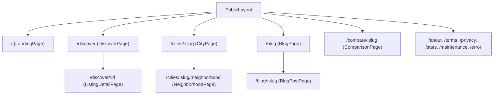
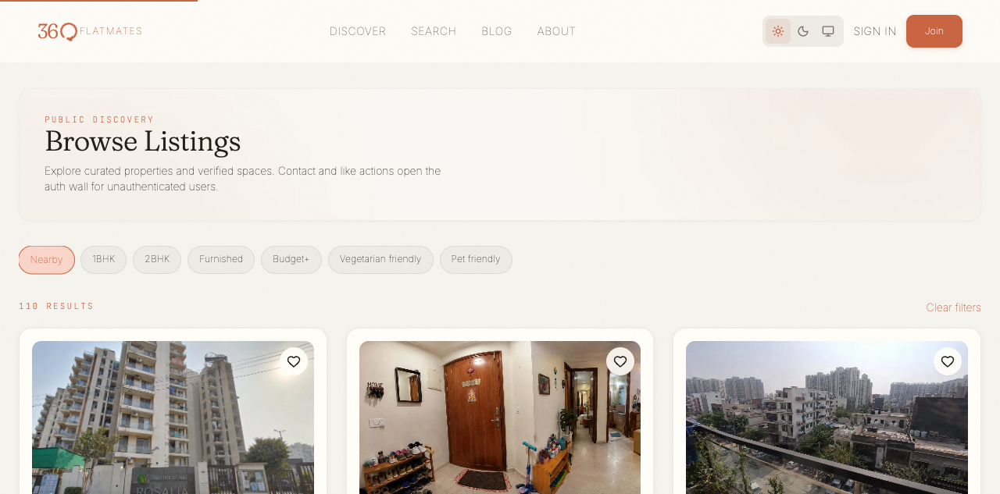
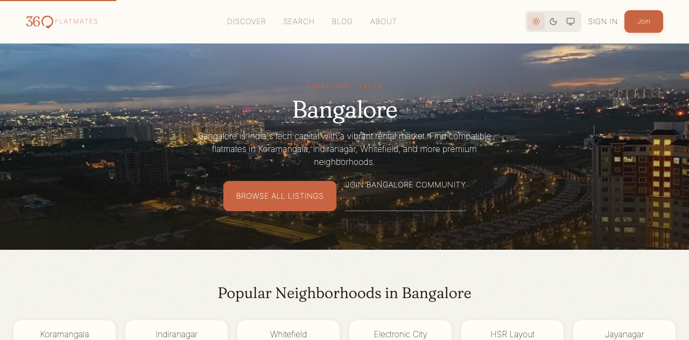
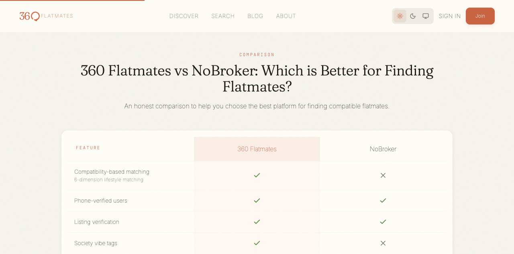

# Public discover

Active contributors: Saksham

Public discover is the unauthenticated, SEO-facing surface of 360 Flatmates. It is what a prospective user sees on Google, in an LLM answer, or on a shared link before they ever sign up. Every page here is prerendered at build time so JS-less crawlers and answer-engine bots see real meta tags, real JSON-LD, and real visible content. This page covers the landing page, the public discover feed, the public listing detail, the programmatic city and neighborhood pages, the comparison pages, and the blog. For the prerendering engine itself, see [SEO and prerendering](seo-prerendering.md). For the authenticated search and map that live behind `AuthGuard`, see [Search and explore](search-explore.md). For how listings are created and managed (and therefore what shows up here), see [Listing management](listing-management.md).

## The public route tree

All public routes are children of `PublicLayout` and rendered without authentication. The full tree lives in `src/App.tsx`:

Every node in this tree is a prerender target. The build step enumerates the static routes (landing, discover, cities, neighborhoods, blog index and posts, comparison pages, about, terms, privacy, stats) and writes a complete `dist/<route>/index.html` for each, so the deployed site serves real HTML instead of an empty SPA shell. See [SEO and prerendering](seo-prerendering.md) for the build pipeline and how route enumeration stays in sync with this tree.

## The landing page

`LandingPage` (`src/pages/public/LandingPage.tsx`) is the front door. It composes several landing sections:

- `LandingClientSections` (which includes `HeroSection` and `CompatibilitySection`).
- `FeatureBento`, the five-cell asymmetric bento of supporting features.
- `HowItWorks`, the three-step explainer.
- `CitiesShowcase`, the supported-cities grid.
- `TestimonialsSection`, lazy-loaded.
- `FAQAccordion`, the eight-question FAQ.
- `BottomCTA`, the closing call to action.

`HeroSection` (`src/components/landing/HeroSection.tsx`) is the editorial hero. The headline pairs Fraunces with an Instrument Serif italic accent, and a layered bento of mock UI cards (a listing card, a compatibility ring, a chat bubble, a verified profile badge) sits to the right on desktop and stacks on mobile. The hero copy leads with "Find your flatmate, not a nightmare" and the supporting sentence names the two differentiators: 6-dimension lifestyle matching and 100% verified rooms. The page also emits FAQ, Service, and Speakable JSON-LD so search engines can pull structured answers.

`CompatibilitySection` (`src/components/landing/CompatibilitySection.tsx`) gives the 6-dimension compatibility story its own section. A `ProgressRing` draws an example 92% score when the section scrolls into view (collapsing to a static value under reduced motion), and a grid of the six dimensions (Sleep, Clean, Food, Guests, Work, Lifestyle) sits beside it. The copy argues the core positioning: budget and pin code do not make a home, lifestyle fit does.

`FeatureBento` (`src/components/landing/FeatureBento.tsx`) renders the supporting features as a five-cell asymmetric grid with mixed treatments (one photo cell, two gradient cells, two plain cells). The feature copy and ordering live in `src/components/landing/landing-data.ts`, alongside the dimensions, steps, stats, testimonials, cities, FAQs, and hero mini-card data. Editing any of this copy means editing that one data file.

## The public discover feed

`DiscoverPage` (`src/pages/public/DiscoverPage.tsx`) is the unauthenticated counterpart to the authenticated search. It uses `nuqs` (`discoverPageParams` from `src/lib/schemas/search-params.ts`) for URL state, so the URL `/discover?city=2&filter=Nearby&page=1` is shareable and deep-linkable. The page renders:

- An editorial header with an ambient accent glow and a city selector.
- A horizontal scroll of seven quick-filter chips (Nearby, 1BHK, 2BHK, Furnished, Budget+, Vegetarian friendly, Pet friendly). Each maps to a `Partial<SearchFilters>` in `QUICK_FILTER_MAP`.
- A responsive `ListingCard` grid fed by `useWebSearch`, with skeletons, error retry, and an empty state.

The key UX difference from authenticated search: contact and like actions hit the auth wall. The `ListingCard` `onContact` callback checks `useAuth().user`; if there is no user, it redirects to `/login?redirect=/discover/:id` so the user lands back on the listing after signing in. The page emits a `CollectionPage` JSON-LD schema so search engines understand it as a browsable set of listings.

## Public listing detail

`ListingDetailPage` (`src/pages/public/ListingDetailPage.tsx`) is served at both `/discover/:id` (public) and `/listing/:id` (authenticated, same component). It is a thin wrapper: it reads the property via `useProperty`, computes SEO metadata and a `Residence` JSON-LD schema from the property fields, and delegates the entire body to `ListingDetailClient` (`src/components/page-clients/ListingDetailClient.tsx`).

The client renders an image gallery (a large primary image plus two smaller images), a two-column layout with details on the left and a sticky host card on the right, and a cost breakdown card (rent, deposit, maintenance). Society and vibe details (society type, society amenities, society vibe tags) render in their own card when present. Contact and favorite actions route to the host profile when authenticated, or to the login redirect flow when not. The whole thing is wrapped in `AsyncView` so loading shows a `listingDetail` skeleton, errors show an inline retry, and a missing listing shows an `EmptyState` with a "Browse listings" fallback.

## City and neighborhood SEO pages

These are the programmatic SEO surfaces. They target high-intent queries like "flatmates in Koramangala" and "rooms in Bangalore" with real, structured content.

`CityPage` (`src/pages/public/CityPage.tsx`) renders a city landing. It looks up the city by slug in `SUPPORTED_CITIES` (`src/lib/seo/config.ts`), renders a full-bleed Unsplash hero, lists the city's neighborhoods as cards (each linking to the neighborhood page), fetches the city's listings via `useWebSearch`, and emits three JSON-LD blocks: a `City` schema, a `CollectionPage` schema, and an `FAQPage` schema with four city-specific Q&A pairs (how to find a flatmate, are listings verified, is it free, popular neighborhoods).

`NeighborhoodPage` (`src/pages/public/NeighborhoodPage.tsx`) renders one level deeper, at `/cities/:slug/:neighborhood`. It looks up the neighborhood by slug in `getNeighborhoodsForCity` from `src/lib/seo/neighborhoods.ts`, filters listings on the `locality` field (not a free-text `q`, so "Verified Listings in Koramangala" returns listings actually tagged with that area), and renders the same listings-plus-CTA layout. It also links out to sibling neighborhoods and emits `CollectionPage` and `FAQPage` JSON-LD.

The source of truth for both is two small data files:

- `src/lib/seo/config.ts` exports `SUPPORTED_CITIES` (currently Bangalore and Gurugram, with name, state, slug, and listing count).
- `src/lib/seo/neighborhoods.ts` exports `CITY_NEIGHBORHOODS` (10 Bangalore areas, 6 Gurugram areas, each with a slug, display name, and a short factual blurb).

Both build-time consumers (the sitemap generator and the prerenderer) read these files, so the sitemap and the prerendered output always cover the same set of URLs. Adding a city or neighborhood means editing one of these files and rebuilding.

## Comparison and blog

`ComparisonPage` (`src/pages/public/ComparisonPage.tsx`) renders head-to-head comparison tables against competing platforms (NoBroker, Facebook Groups, Housing.com, MagicBricks, FlatMate India). The comparison data (features, per-feature notes, per-comparison FAQ overrides) is a static `Record<string, ComparisonData>` in the page file. Each comparison renders a three-column table (feature, us, them) with check and cross icons, plus an `FAQPage` JSON-LD. The 404 path emits `noindex` so unknown comparison slugs do not get indexed.

`BlogPage` (`src/pages/public/BlogPage.tsx`) and `BlogPostPage` (`src/pages/public/BlogPostPage.tsx`) are the content marketing surface. The blog index lists six posts with category filtering, and each post page renders long-form markdown-style content (headings, bullets, bold lead-ins) parsed by a small in-component renderer. Both emit structured data: the index emits a `CollectionPage` schema, and posts emit `Article`, optional `HowTo` (for genuinely instructional posts), and `Speakable` schemas. The post content is a static `Record` in the page file, so adding a post means editing that file.

## Source-of-truth docs

For the page-by-page spec of every public surface (copy, layout, CTAs, SEO intent), see [plans/ui_ux.md](../../plans/ui_ux.md). For the prerendering build pipeline that bakes these routes into crawlable HTML, see [SEO and prerendering](seo-prerendering.md).

## Key source files

| File | Purpose |
| --- | --- |
| `src/pages/public/LandingPage.tsx` | Landing page composition |
| `src/pages/public/DiscoverPage.tsx` | Public discover feed, quick filters, auth-wall contact |
| `src/pages/public/ListingDetailPage.tsx` | Public listing detail, SEO wrapper |
| `src/components/page-clients/ListingDetailClient.tsx` | Listing detail body, gallery, host card, cost breakdown |
| `src/pages/public/CityPage.tsx` | City landing with hero, neighborhoods, listings, FAQ JSON-LD |
| `src/pages/public/NeighborhoodPage.tsx` | Neighborhood page, locality-filtered listings |
| `src/pages/public/ComparisonPage.tsx` | Head-to-head comparison tables |
| `src/pages/public/BlogPage.tsx` | Blog index with category filter |
| `src/pages/public/BlogPostPage.tsx` | Long-form blog post with Article, HowTo, Speakable JSON-LD |
| `src/components/landing/HeroSection.tsx` | Editorial hero with layered bento mock cards |
| `src/components/landing/FeatureBento.tsx` | Five-cell asymmetric feature bento |
| `src/components/landing/CompatibilitySection.tsx` | 6-dimension compatibility section with animated ring |
| `src/components/landing/landing-data.ts` | All landing copy and data (features, dimensions, steps, stats, testimonials, FAQs) |
| `src/lib/seo/config.ts` | `SUPPORTED_CITIES`, site URL, social handles |
| `src/lib/seo/neighborhoods.ts` | `CITY_NEIGHBORHOODS` source of truth, `getNeighborhoodsForCity` |
| `src/lib/schemas/search-params.ts` | `nuqs` parsers for `/discover` URL state |
