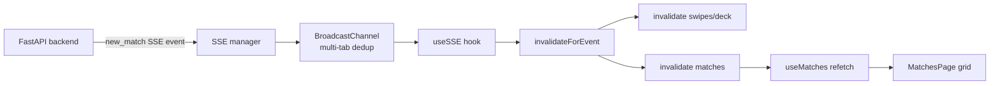

# Likes and matches

Active contributors: Saksham

Likes and matches are the two inboxes that follow the swipe deck. Likes shows the people who liked you and are waiting for your response. Matches shows the mutual connections, where both sides swiped right and a conversation can start. This page covers how the two lists are fetched, how the unmatch flow works, and how real-time events keep both lists fresh. For how a like is created in the first place, see [Compatibility matching and the swipe deck](compatibility-matching/index.md). For the chat that follows a match, see [Messaging](messaging.md).

## Two inboxes, one shared grid

Both pages are thin wrappers around a shared `PeopleGridPage` component:

- **Likes** (`src/pages/app/LikesPage.tsx`) calls `useIncomingLikes()` and passes a "Match" CTA label. The empty state reads "No likes yet, keep exploring to find connections."
- **Matches** (`src/pages/app/MatchesPage.tsx`) calls `useMatches()` and passes a "Chat" CTA label. The empty state reads "No matches yet, keep swiping to find your match."

Each page hands the query and a `getProfileProps` adapter to `PeopleGridPage`, which handles loading skeletons, error retry, empty states, and the responsive grid. Both inboxes map their `peer` through `profileToProfileGridCardProps` so the cards render identically regardless of source. The only differences are the page title, subtitle, CTA label, and empty-state copy.

## Fetching the lists

All three queries live in `src/hooks/queries/useMatches.ts`:

| Hook | Endpoint | Query key | Returns |
| --- | --- | --- | --- |
| `useIncomingLikes(limit, offset)` | `GET /flatmates/likes?limit=&offset=` | `["incoming-likes", limit, offset]` | `IncomingLikeSummary[]` |
| `useMatches()` | `GET /flatmates/matches` | `["matches"]` | `MatchSummary[]` |
| `useUnmatchMutation()` | `PUT /flatmates/matches/{id}/unmatch` | invalidates `matches` + `conversations` | `{ message: string }` |

`useIncomingLikes` defaults to a page of 20 with a 0 offset and supports pagination via its arguments. Both list queries use `isLoading` (not `isFetching`) for skeleton decisions, per the project's async-state rules, so a background refetch does not flash a skeleton over already-rendered cards.

## The unmatch flow

`useUnmatchMutation` sends a `PUT` to `/flatmates/matches/{matchId}/unmatch`. On success it invalidates two query keys: `["matches"]` (so the match disappears from the inbox) and `["conversations"]` (so the linked chat thread is removed from the conversation list). Invalidating conversations is what keeps the two surfaces in sync: a match and its conversation share a lifecycle, so removing one must clean up the other. Because the invalidation is on the `onSuccess` callback, a failed unmatch leaves both lists untouched and the user can retry.

## Match context card

When a match originated from a listing interest (rather than a pure profile match), the match carries context: the property that sparked it. `MatchContextCard` (`src/components/molecules/MatchContextCard.tsx`) renders this context as an expandable row. Collapsed, it shows a thumbnail, title, mode badge, rent via `PriceText`, and locality. Expanded, it reveals an optional `details` block and a "View Listing" secondary button. The whole header is a single `button` with `aria-expanded`, so the expand toggle is keyboard accessible, and the chevron rotates 90 degrees on open to signal state.

## Real-time refresh via SSE

Both inboxes stay current without polling. The `useSSE` hook (`src/hooks/useSSE.ts`) connects to `GET /flatmates/sse`, and its `invalidateForEvent` switch handles a `new_match` event by invalidating two keys:

- `["swipes", "deck"]`, so the deck refilters and does not show a now-matched profile again.
- `["matches"]`, so the new match appears in the matches inbox.

This means the moment the backend records a mutual like, the matches list refetches and the new card slides in. The event itself carries no payload that the UI trusts for rendering; it is purely a cache-invalidation signal, and the query refetch supplies the authoritative data. See [Real-time](real-time.md) for the full SSE lifecycle, including how `BroadcastChannel` dedupes events across tabs and how the primary-tab election avoids duplicate connections.

## Other event types

For completeness, the SSE handler also invalidates the decks and inboxes on related events. A `swipe` event invalidates the swipe deck. A `new_message` or `message` event invalidates conversations and the specific thread's messages (see [Messaging](messaging.md)). None of these touch the likes or matches query keys directly except `new_match`, which is the one event that moves a profile into the matches inbox.

## Source-of-truth docs

For the product definition of likes, super-likes, matches, and unmatch semantics, see [plans/prd.md](../../plans/prd.md). For the page-by-page spec of the likes and matches inboxes, see [plans/ui_ux.md](../../plans/ui_ux.md). For the async-state rules that govern skeleton, error, and empty handling on these pages, see [DESIGN.md](../../DESIGN.md) section 12.1.

## Key source files

| File | Purpose |
| --- | --- |
| `src/pages/app/LikesPage.tsx` | Likes inbox, wraps `PeopleGridPage` with `useIncomingLikes` |
| `src/pages/app/MatchesPage.tsx` | Matches inbox, wraps `PeopleGridPage` with `useMatches` |
| `src/hooks/queries/useMatches.ts` | `useIncomingLikes`, `useMatches`, `useUnmatchMutation` |
| `src/components/molecules/MatchContextCard.tsx` | Expandable listing-context row for listing-originated matches |
| `src/hooks/useSSE.ts` | SSE connection, `new_match` invalidation of the matches query |
