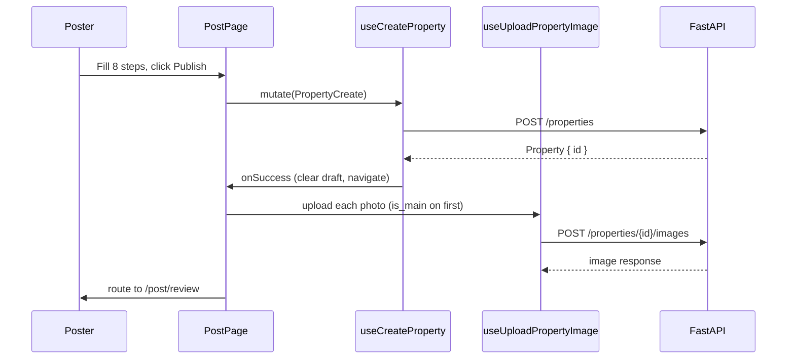
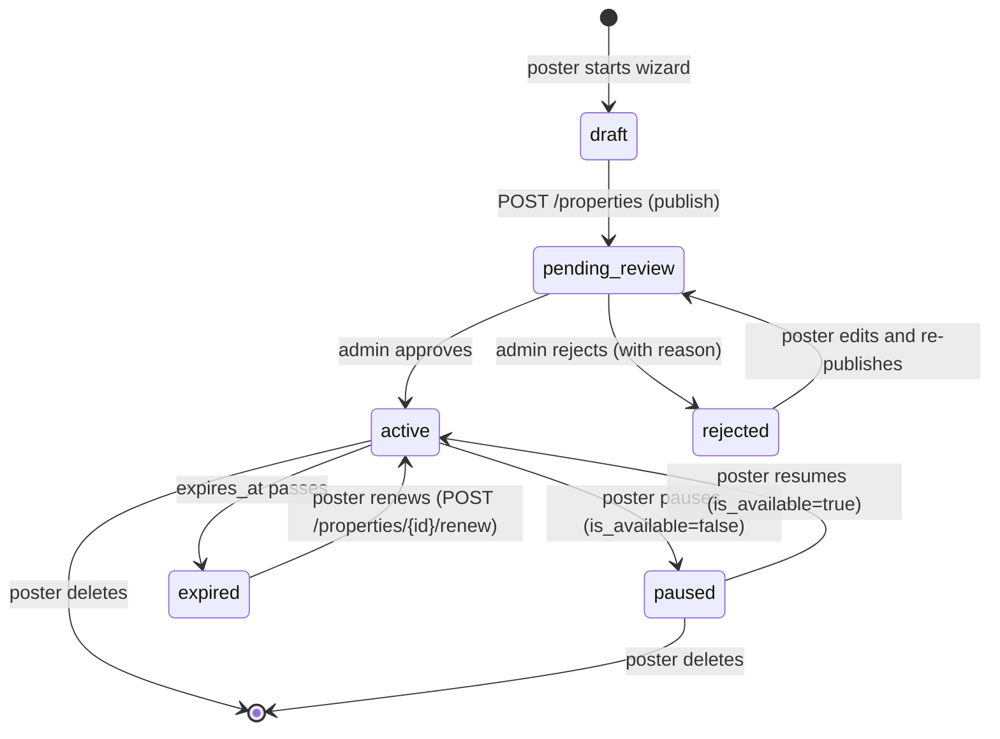

# Listing management

Active contributors: Saksham

A room poster's journey on 360 Flatmates is post, review, manage, edit. They walk an eight-step wizard to publish a room, the listing sits behind a moderation gate until an admin approves it, and then they manage it from a dashboard of cards. This page covers the post flow, the review/publish gate, the manage list, the detail view with boost/renew/delete, the edit form, image upload, and the listing lifecycle. For how the room poster mode is selected during onboarding, see [Profile and onboarding](profile-onboarding.md). For the analytics that follow a published listing, see [Dashboard and analytics](dashboard-analytics.md). For the visits booked against a listing, see [Visits](visits.md). For the property data model and statuses, see [Listing and property model](../primitives/listing-property.md).

## The room poster surface

Room poster mode is one of three modes a user picks during onboarding (`room_poster`, `seeker`, `open_to_both`). The listing-management routes live under the authenticated app and assume the user is signed in and past the gate:

| Route | File | Purpose |
| --- | --- | --- |
| `/post` | `src/pages/app/PostPage.tsx` | Eight-step post wizard |
| `/post/review` | `src/pages/app/PostReviewPage.tsx` | "Under review" confirmation screen |
| `/manage` | `src/pages/app/ManagePage.tsx` | Grid of the user's own listings |
| `/my-listings/:id` | `src/pages/app/MyListingDetailPage.tsx` | Single listing detail with boost, renew, delete |
| `/my-listings/:id/edit` | `src/pages/app/MyListingEditPage.tsx` | Edit form (react-hook-form + Zod) |

The manage list is the home base. From there the user can post a new listing, open a listing's detail, edit it, or jump to analytics.

## The post wizard

`PostPage` is the biggest page in the app (666 lines). It wraps a shared `ListingBuilder` chrome (`src/components/organisms/ListingBuilder.tsx`) around eight steps, each rendered as a `<Card>` with the relevant fields. `ListingBuilder` provides the header (back button, logo, spacer), the `StepProgress` indicator, the scrollable content area, and a `BottomActionBar` with Back and Next buttons.

The eight steps, defined in `PostPage.tsx`:

| Step | id | Required fields | Notes |
| --- | --- | --- | --- |
| 1 | `basics` | `title`, `monthly_rent > 0` | Also collects `security_deposit` |
| 2 | `location` | `city`, `locality` | Also collects `address` |
| 3 | `property_details` | none | `description`, `bedrooms`, `bathrooms`, `area_sqft`, `available_from` |
| 4 | `room_details` | none | `sharing_type` chips, furnishing `features` chips |
| 5 | `amenities` | none | `society_amenities` and `society_vibe_tags` chip groups |
| 6 | `photos` | none | Drag-to-upload zone, preview grid, retry on failure |
| 7 | `preferences` | none | `gender_preference` chips, lifestyle `tags` chips |
| 8 | `review` | none | Read-only summary, then "Publish Listing" |

`isStepValid(step, form)` gates the Next button. Only steps 1 and 2 have hard requirements (title, rent, city, locality). All other steps are optional and Next is always enabled. When the user lands on step 8, the primary button label switches from "Next" to "Publish Listing", and clicking it calls `useCreateProperty().mutate`.

### Draft persistence

The wizard autosaves the form to `localStorage` under `flatmates:post-draft` on every `patchForm` call. On mount, `loadDraft()` rehydrates the form so a refresh mid-wizard does not lose progress. The draft is cleared only on a successful publish. This mirrors the onboarding draft pattern in [Profile and onboarding](profile-onboarding.md).

### Photo upload

Photos are converted to WebP (1600px max, 0.82 quality) client-side via `useImageUpload` (`src/hooks/useImageUpload.ts`) before being sent. Each pending image tracks an `uploaded`, `uploading`, and `preview` state. The first photo is badged "Main". A photo that fails conversion shows a "Retry" button. On publish, the property is created first, then each unuploaded photo is sent as a separate `POST /properties/{id}/images` call with `is_main: imgIndex === 0`. A background toast tells the user photos are uploading, and the user is routed to the review screen immediately.

## The review gate

After publish, `PostPage` navigates to `/post/review` with `state.listingId`. `PostReviewPage` (`src/pages/app/PostReviewPage.tsx`) renders a centered card with a three-step "Submitted, Under Review, Published" tracker, a note that review happens within 24 hours, and three explainer lines:

1. AI pre-screen checks photos, pricing, and required fields.
2. Moderation reviews the listing context.
3. Approved listings receive a 24-hour launch boost.

The card offers "Edit Listing" (deep-linking to `/my-listings/{id}/edit`) and "Back to Dashboard". The listing is now in `pending_review` moderation status and invisible to seekers until an admin approves it. See [Admin moderation](admin-moderation.md) for the queue that handles approval.

## The manage list

`ManagePage` (`src/pages/app/ManagePage.tsx`) calls `useMyProperties()` and renders the results through the shared `ListingCard` (`src/components/molecules/ListingCard.tsx`). Each card is adapted from the API `Property` shape to `ListingCardData` via `propertyToListingCardProps` in `src/lib/api/adapters.ts`. The card's CTA label is "Manage", and clicking it navigates to `/my-listings/{id}`.

The page uses `AsyncView` for loading, error, and empty states. Loading renders three `listingCard` skeletons in a 3-column grid that matches the real layout. Empty renders a card with a "Post your first listing" CTA. Error renders an inline `ErrorState` with retry inside a card, never a full-page error, per the async-state rules in [DESIGN.md](../../DESIGN.md) section 12.1.

## Listing detail and lifecycle actions

`MyListingDetailPage` (`src/pages/app/MyListingDetailPage.tsx`) fetches a single property with `useProperty(id)` and renders the card plus two management cards. The "Listing Status" card shows the moderation status (`approved` -> "Published", `pending_review` -> "Under Review", else "Draft"), the view count, and the interest count. The "Manage Listing" card exposes three actions:

| Action | Hook | Endpoint | Effect |
| --- | --- | --- | --- |
| Boost | `useBoostListing` | `POST /properties/{id}/boost` with `{ duration: "7d" }` | Promotes the listing for 7 days, invalidates `properties/{id}`, `properties/mine`, and `dashboard` |
| Renew | `useRenewListing` | `POST /properties/{id}/renew` with `{ available_from, expires_at }` | Reactivates for 30 days from today, invalidates `properties/{id}` and `properties/mine` |
| Delete | `useDeleteProperty(id)` | `DELETE /properties/{id}` | Permanently removes the listing, invalidates `properties/mine`, routes back to `/manage` |

Delete is gated behind a `<Modal>` confirmation ("This permanently removes the listing and its photos. This cannot be undone.") with a destructive error-colored confirm button. The delete button itself is a tertiary button styled with `text-error`.

### Status states

A listing carries two independent status fields, both defined in `src/lib/data/domain.ts` and surfaced in `src/lib/api/property.types.ts`:

| Field | Type | Values | Meaning |
| --- | --- | --- | --- |
| `property_status` | `PropertyModerationStatus` | `pending_review`, `approved`, `rejected` | The moderation queue state |
| `status` | `PropertyLifecycleStatus` | `draft`, `active`, `paused`, `expired` | The poster-facing lifecycle state |

The detail page reads `property_status` to label the status card. The analytics and dashboard surfaces read `status` for active-versus-paused decisions.

## The edit form

`MyListingEditPage` (`src/pages/app/MyListingEditPage.tsx`, 447 lines) is a react-hook-form form validated by a local Zod schema. Unlike the post wizard (which is a controlled state machine), the edit page uses `useForm` with `zodResolver(listingSchema)` and registers inputs directly.

The schema (`listingSchema`) enforces:

- `title` required, max 120 chars
- `city` and `locality` required
- `monthly_rent` required, min 1
- `security_deposit`, `maintenance_charges`, `area_sqft`, `bedrooms`, `bathrooms` all `min(0)` and optional
- `gender_preference`, `sharing_type`, `society_type` validated against their enum schemas from `src/lib/schemas/enums.ts`
- `video_tour_url` must be a valid URL or empty

The form populates from the fetched property on mount via `reset(defaults)` inside a `useEffect`, guarded by `!isDirty` so it does not clobber user edits. On submit, `stripEmptyFields` removes empty optional values before the `useUpdateProperty(id).mutate(payload)` call. The save button is disabled until `isDirty` is true. A successful update toasts "Listing updated" and routes back to `/manage`. A server error renders an inline error card above the form.

The edit page also supports adding a single photo at a time through the same `useUploadPropertyImage` hook, with `is_main: !(property?.image_urls?.length)` so the first photo becomes the main image.

### Schema source of truth

The canonical create schema lives in `src/lib/schemas/listing-builder.ts` as `propertyCreateSchema`. It is stricter than the edit page's local schema (for example, `monthly_rent` min 500, `title` min 5, `security_deposit` must not exceed 12 months of rent via a `.refine`). The edit page uses a relaxed local schema because it operates on an already-created listing. The full property shape is `propertySchema` in the same file.

## Mutations and cache invalidation

All listing mutations live in `src/hooks/queries/useProperties.ts`. Each mutation invalidates the minimal set of query keys on success:

| Hook | Invalidates |
| --- | --- |
| `useCreateProperty` | `properties/mine` |
| `useUpdateProperty(id)` | `properties/{id}`, `properties/mine` |
| `useDeleteProperty(id)` | `properties/mine` |
| `useUploadPropertyImage` | `properties/{propertyId}`, `properties/mine` |
| `useBoostListing` | `properties/{propertyId}`, `properties/mine`, `dashboard` |
| `useRenewListing` | `properties/{propertyId}`, `properties/mine` |

Boost is the only mutation that also invalidates the dashboard, because a boost changes the listing's boost status which the dashboard card displays.

## Listing lifecycle

The full lifecycle spans two state machines. The moderation machine is driven by admin actions (see [Admin moderation](admin-moderation.md)). The lifecycle machine is driven by the poster and by time.

## Cross-references

- [Profile and onboarding](profile-onboarding.md) for room poster mode selection.
- [Dashboard and analytics](dashboard-analytics.md) for the metrics that follow a published listing.
- [Visits](visits.md) for the visit booking flow against a listing.
- [Admin moderation](admin-moderation.md) for the queue that approves or rejects `pending_review` listings.
- [Listing and property model](../primitives/listing-property.md) for the data model and status enums.

## Key source files

| File | Purpose |
| --- | --- |
| `src/pages/app/PostPage.tsx` | Eight-step post wizard, draft persistence, photo upload, publish |
| `src/pages/app/PostReviewPage.tsx` | "Under review" confirmation screen after publish |
| `src/pages/app/ManagePage.tsx` | Grid of the user's own listings with async states |
| `src/pages/app/MyListingDetailPage.tsx` | Single listing detail, boost, renew, delete |
| `src/pages/app/MyListingEditPage.tsx` | Edit form with react-hook-form and Zod |
| `src/hooks/queries/useProperties.ts` | All listing query and mutation hooks |
| `src/lib/api/property.types.ts` | `Property`, `PropertyCreate`, `PropertyUpdate`, boost and renew payloads |
| `src/lib/schemas/listing-builder.ts` | Canonical `propertyCreateSchema` and `propertySchema` |
| `src/lib/data/domain.ts` | `PropertyLifecycleStatus` and `PropertyModerationStatus` enums |
| `src/components/organisms/ListingBuilder.tsx` | Shared wizard chrome (header, step progress, bottom bar) |
| `src/components/molecules/ListingCard.tsx` | Reusable listing card used in manage, discover, search |
| `src/hooks/useImageUpload.ts` | WebP conversion before upload |
