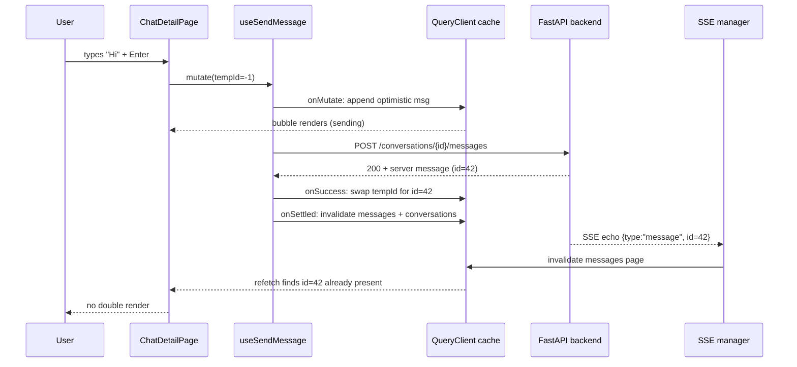

# Messaging

Active contributors: Saksham

Messaging is the conversation layer that follows a mutual match. Once two flatmates both swipe right, a conversation opens and they can chat, schedule visits against the linked property, block or report each other, and watch messages arrive live without polling. This page covers the chat list, the thread view, the optimistic send flow, the SSE-driven cache invalidation that keeps every tab in sync, and the local draft state. For the match that opens a conversation in the first place, see [Likes and matches](likes-and-matches.md). For the underlying real-time transport that pushes new messages into the cache, see [Real-time updates](real-time.md). For how a conversation connects to the compatibility engine that created the match, see [Compatibility matching](compatibility-matching/index.md).

## Two surfaces: the inbox and the thread

The messaging feature is split across two pages that share the same query keys and the same adapter layer.

`src/pages/app/ChatsPage.tsx` is the inbox. On mobile it stacks a horizontal matches bar above the conversation list. On tablet and desktop it renders a side-by-side split: a "Your Matches" panel on the left and a "Conversations" panel on the right, both inside one rounded `surface` container. The matches panel comes from `useMatches()` (see [Likes and matches](likes-and-matches.md)) and clicking a match calls `useCreateConversation()` to open (or reopen) a conversation with that peer, then navigates to the new thread. The conversations panel comes from `useConversations()` and renders one `ConversationRow` per conversation.

`src/pages/app/ChatDetailPage.tsx` is the thread. It loads one conversation with `useConversation(id)`, its messages with `useMessages(id)`, and the current user with `useMyProfile()`. It owns the send, retry, schedule-visit, block, and report mutations, and hands everything to the presentational `ChatThread` component.

## The conversation list

Each row in the inbox is a `ConversationRow` (`src/components/molecules/ConversationRow.tsx`). It is a single `button` for keyboard and screen-reader access, and it shows the peer's avatar, name, mode badge, last message preview, an optional property preview line, a relative timestamp in mono eyebrow type, and an unread count badge. The row is produced by `conversationToConversationRowProps` in `src/lib/api/adapters.ts`, which maps the `ConversationSummary` shape (defined in `src/lib/api/conversation.types.ts`) into the presentational `ConversationRowData`. The list itself is rendered through `AsyncView`, so loading shows a `conversationRow` skeleton variant, errors show a retry, and the empty state reads "No conversations yet, Start chatting with your matches!".

## The thread view

`ChatThread` (`src/components/organisms/ChatThread.tsx`) is the presentational core of the thread. It is intentionally state-light: the page owns the data and the mutations, the component owns only the draft text, the scroll position, and the modal state for scheduling, blocking, and reporting. Its layout has four regions.

1. **Header.** Peer avatar, name, optional verified dot, mode badge, compatibility score pill, a `CloudOff` icon when `disconnected` is true, and a "Conversation options" menu with Report and Block items.
2. **Context strip.** An optional `MatchContextCard` (the listing that sparked the match) and optional `QnACard` rows, both passed in as props.
3. **Message log.** A `role="log"` region with `aria-live="polite"` and `aria-relevant="additions"` so new messages are announced. It maps messages to `ChatMessageBubble` and decides per-message whether to show the peer avatar (only on a sender change, to group runs).
4. **Composer.** A privacy trust badge, an emoji button, the draft `Input` (Enter sends, Shift+Enter inserts a newline), a schedule-visit button, an attach button, and the send button which is disabled while the draft is empty or while a send is in flight.

Scroll management is deliberate. The component tracks whether the user is pinned to the bottom within a 96px threshold, and it distinguishes a prepend (older history loaded by scrolling to the top) from an append (a new message). On prepend it anchors the scroll position so the user does not jump. On append it only auto-scrolls to the new bottom if the user was already there, so an incoming peer message never yanks someone away from what they are reading.

`ChatMessageBubble` (`src/components/molecules/ChatMessageBubble.tsx`) renders three sender kinds: `me` (right-aligned, accent fill, white text), `them` (left-aligned, `paper-3` fill, ink text), and `system` (centered, ink-3 caption). Own messages carry a `status` of `sending`, `sent`, `read`, or `failed`. A `read` status shows a double-check icon, and a `failed` status renders an inline "Retry" button that calls back into the page's retry handler.

## Sending a message, optimistically

`useSendMessage` in `src/hooks/queries/useConversations.ts` is the send mutation, and it uses TanStack Query's optimistic update contract to make the user's own message appear instantly.

1. **`onMutate`.** The page mints a negative temp id (via `nextTempMessageId`, which decrements from `-1` so it can never collide with a positive backend id). The mutation cancels any in-flight `messages` queries for this conversation, snapshots the current cache, and appends an optimistic `MessageOut` tagged with `metadata: { __optimistic: true }` to every cached page. The bubble adapter then renders that message with `status: "sending"`.
2. **`onError`.** The optimistic message is intentionally left in cache. The page adds the temp id to a `failedIds` set, so the bubble re-renders as `status: "failed"` with a retry control. Removing it here would make the user's text vanish on a transient network error, which is worse than showing a retry.
3. **`onSuccess`.** The temp message is swapped in place for the authoritative server message. This matters for the SSE echo: when the `message` event arrives a moment later, the real id is already in the cache, so the user's own message never double-renders.
4. **`onSettled`.** Only on success does it invalidate the `messages` page query (to reconcile ordering and read receipts) and the `conversations` list (to refresh the preview and unread badge). On error it skips invalidation so the failed bubble survives.

Retrying a failed message reuses the same temp id (passed as `retryTempId`), clears it from the `failedIds` set, and re-runs the mutation. The `onMutate` step drops any prior copy carrying that temp id before appending the fresh optimistic bubble, so there is no duplicate.

## Real-time refresh via SSE

The thread never polls. The `useSSE` hook (`src/hooks/useSSE.ts`) holds the SSE connection on the primary tab and dispatches every event through `invalidateForEvent`. For messaging, two event types matter:

- `message` and `new_message` invalidate the `["conversations"]` list (so previews and unread counts refresh) and, when the payload carries a `conversation_id`, the `["conversations", id, "messages"]` page (so the new message appears in any open thread).
- `conversation_updated` invalidates only the `["conversations"]` list, covering status or metadata changes that do not introduce a new message.

Because the send mutation already swapped the real id into the cache on success, the SSE echo for your own message finds nothing to add and produces no flicker. For a peer's message, the invalidation triggers a refetch that supplies the authoritative row. The event payload itself is treated as a cache-invalidation signal only, never as a render source. See [Real-time updates](real-time.md) for the connection lifecycle, the BroadcastChannel dedup that relays these events to secondary tabs, and the primary-tab election.

## Local draft and UI state

`chatStore` (`src/lib/stores/chat-store.ts`) is the Zustand vanilla store that holds the per-conversation draft text, typing indicators, the active conversation id, and the info-panel toggle. It follows the project's vanilla `createStore()` pattern (no `create()` hook wrapper), so it can be read from React via `useStore(chatStore, selector)` and from non-React code alike. The store is intentionally small and client-only: server state (the messages themselves, the conversation metadata) always lives in TanStack Query, never in this store, per the project's state-management rules. Drafts are keyed by conversation id so switching threads preserves what you were typing, and `setDraftMessage` short-circuits when the value has not changed to avoid redundant renders.

## Creating a conversation

`useCreateConversation` posts to `POST /flatmates/conversations` with a `ConversationCreate` payload (`peer_user_id` required, plus optional `match_id`, `context_property_id`, and `initial_message`). On success it invalidates the `["conversations"]` list. The chats page calls this when a user taps a match, then navigates to the returned conversation id. If the peer already had a conversation open, the backend returns the existing one rather than creating a duplicate, so the user lands in the right thread.

## Source-of-truth docs

This page summarizes the chat implementation. For the page-by-page spec of the chats inbox, the thread layout, the schedule-visit modal, and the block and report flows, see [plans/ui_ux.md](../../plans/ui_ux.md). For the async-state rules that govern the skeleton, error, and empty handling on these pages, and for the bubble and row component specs, see [DESIGN.md](../../DESIGN.md) section 12.1 and section 11.3. For the SSE transport that drives the invalidations described here, see [Real-time updates](real-time.md).

## Key source files

| File | Purpose |
| --- | --- |
| `src/pages/app/ChatsPage.tsx` | Chats inbox, matches bar/list, conversations panel |
| `src/pages/app/ChatDetailPage.tsx` | Thread page, owns send/retry/schedule/block/report mutations |
| `src/components/organisms/ChatThread.tsx` | Presentational thread: header, log, composer, modals, scroll anchoring |
| `src/components/molecules/ChatMessageBubble.tsx` | Message bubble with sending/sent/read/failed status |
| `src/components/molecules/ConversationRow.tsx` | Inbox row with avatar, preview, timestamp, unread badge |
| `src/hooks/queries/useConversations.ts` | `useConversations`, `useConversation`, `useMessages`, `useSendMessage`, `useCreateConversation` |
| `src/lib/stores/chat-store.ts` | Vanilla Zustand store for drafts, typing, active conversation |
| `src/hooks/useSSE.ts` | SSE hook, `message` / `new_message` / `conversation_updated` invalidation |
| `src/lib/api/conversation.types.ts` | `ConversationSummary`, `MessageOut`, `MessageCreate`, `ConversationCreate` types |
