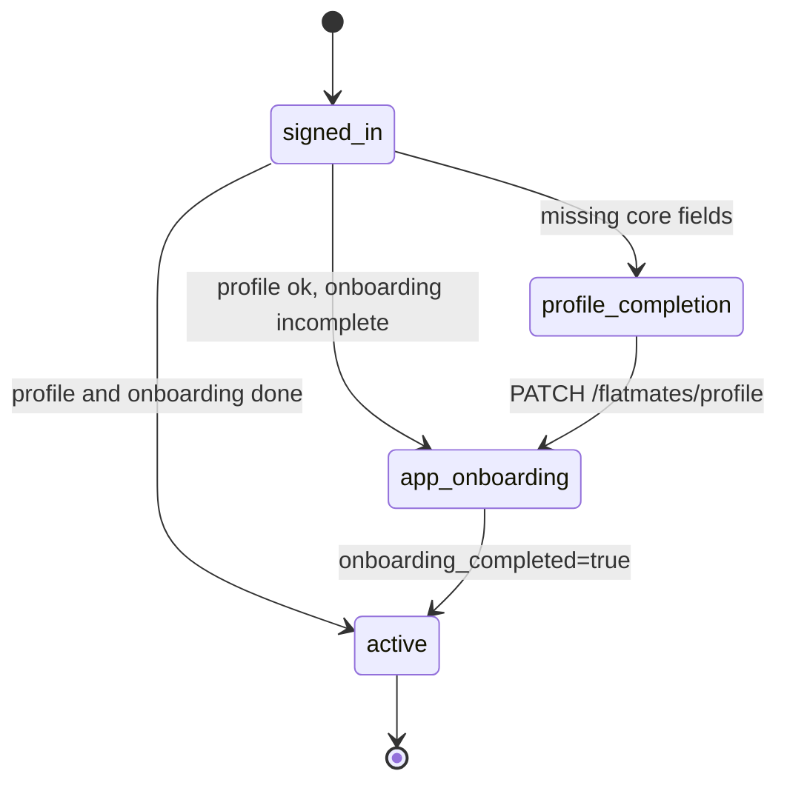

# Profile and onboarding

Active contributors: Saksham

A signed-in user is not a usable user until they have chosen a mode, filled in their profile, walked the onboarding wizard, and (optionally) verified. 360 Flatmates models that as a backend-computed gate progression: `active` then `profile_completion` then `app_onboarding` then `active`. The web app enforces it through `GateGuard` and a set of dedicated pages, and persists the onboarding draft locally so a half-finished wizard survives a refresh. This page covers the gate flow, the onboarding draft store, the profile edit form, the public profile view, and account deletion. For how the gate state is computed and fetched, see [Authentication flows](auth-flows.md). For the six-dimension compatibility engine that the profile feeds, see [Compatibility matching](compatibility-matching/index.md). For room poster mode (the `mode` field set during onboarding), see [Listing management](listing-management.md).

## The gate progression

After sign-in, `ProviderInternals` in `src/providers.tsx` fetches `GET /api/v1/users/me/auth-state?app=flatmates` and writes the `stage` into `authStore`. `GateGuard` in `src/pages/guards.tsx` reads that stage and routes the user to the right screen. The progression is linear, and each step writes back to the profile before the next gate can advance.

| Stage | What it means | Where the user lands |
| --- | --- | --- |
| `profile_completion` | Core profile fields are missing (listed in `missing_fields`) | `/complete-profile` (the `ChooseRolePage` is the entry; the full edit form is `/profile/edit`) |
| `app_onboarding` | Profile exists but `onboarding_completed` is false | `/onboarding` (the wizard) |
| `active` | Profile complete and onboarding done | The app (`/home`) |

`GateGuard` skips enforcement on the gate routes themselves (`/complete-profile`, `/onboarding`, `/add-phone`, and any `/onboarding/*` deep link) so the user is not caught in a redirect loop. It also skips enforcement during a mid-auth flow (OTP verify or set-password), since those create a session before the gate logic should run. See [Authentication flows](auth-flows.md) for the mid-auth hold.



## Choose role

`ChooseRolePage` (`src/pages/app/ChooseRolePage.tsx`) is the first profile-dependent screen. It renders a `SelectableCardGrid` of the three user modes (`room_poster`, `seeker`/`co_hunter`, `open_to_both`) with icons, pre-selects the saved `profile.mode` if one exists, and on Continue calls `updateProfile.mutateAsync({ mode: selected })` then navigates to `/home`. The mode is the single field that controls which navigation tabs and features the user sees across the app, so it is collected early and can be changed later from the profile page. The page seeds the selected value from the profile once it loads (without clobbering an in-progress choice) and lands focus on the heading for keyboard and screen-reader users.

## The onboarding wizard

The wizard is a 10-step flow driven by the `onboardingStore` (`src/lib/stores/onboarding-store.ts`). The steps are defined in `ONBOARDING_STEPS`:

```
splash, mode, location, basic_info, profile_photo, lifestyle,
smoking_guests, work_style, budget_timeline, preferences
```

Two pages render the wizard. `OnboardingPage` (`src/pages/app/OnboardingPage.tsx`) is the canonical entry at `/onboarding`: it advances through steps by mutating the store, not the URL. `OnboardingStepPage` (`src/pages/app/OnboardingStepPage.tsx`) is the deep-link entry at `/onboarding/:step`: on mount it syncs the URL step into the store, then renders from `currentStep` so the heading and nav stay in lockstep. Both render `OnboardingStepContent` (`src/components/onboarding/OnboardingStepContent.tsx`) inside a `Card` with a `StepProgress` bar.

Both pages redirect to `/home` once `profile.onboarding_completed` is true. This is a belt-and-braces check: the gate model should already have moved the user past onboarding, but a stale cache or a manual navigation should not strand them on a completed wizard.

### The onboarding draft store

`onboardingStore` is a Zustand vanilla store wrapped in the `persist` middleware, so the draft survives a page refresh or accidental close. The draft shape is validated by `onboardingDraftSchema` in `src/lib/schemas/onboarding.ts`, which permits partial fields (so the user can fill steps in any order and the schema will not reject a half-finished draft). The store exposes:

| Action | Purpose |
| --- | --- |
| `setStep(step)` | Clamp and set the current step, mirrored into `draft.current_step` |
| `nextStep()` / `previousStep()` | Move by one, clamped to `[0, ONBOARDING_STEPS.length - 1]` |
| `patchDraft(patch)` | Shallow-merge a patch into the draft, stamping `updated_at` |
| `patchLifestyle(patch)` | Merge into `draft.lifestyle` specifically (the six compatibility dimensions) |
| `clearDraft()` | Reset to the empty draft (called on wizard completion and on sign-out) |
| `hydrateDraft(candidate)` | Validate an unknown blob against `onboardingDraftSchema` and load it if valid |

`clearDraft` is called in two places: by the wizard's final step on success, and by `ProviderInternals` when the user transitions from authenticated to unauthenticated (sign-out or account deletion). This stops a previous user's draft from leaking into the next sign-in. The `partialize` option only persists `currentStep`, `draft`, and `lastSavedAt`, so no transient UI flags leak to disk.

### The step content

`OnboardingStepContent` switches on the `stepKey` and renders the right inputs. Most steps patch the draft directly (location, basic info, lifestyle chips, budget and timeline, preferences). A few details worth noting:

- **mode** uses a `SegmentedControl` over `FLATMATE_MODE_OPTIONS`.
- **location** offers a "Use my current location" button that calls `navigator.geolocation` then `useReverseGeocode` to resolve the coords to a city and locality, patching `draft.location` with `lat` and `lng`.
- **profile_photo** uploads via `useImageUpload`, stores the resulting data URL in `draft.profile_image_url`, and shows a live preview in an `Avatar`.
- **lifestyle** and **smoking_guests** render the six compatibility dimensions as `Chip` selectors. These are the values that feed the compatibility engine (see [Compatibility matching](compatibility-matching/index.md)).
- **budget_timeline** collects min and max budget plus a move-in timeline enum.

On the last step (`preferences`), the "Complete Setup" button assembles a single payload from the draft (mode, basic info, location, profile image, lifestyle, budget and timeline, gender preference) plus `onboarding_completed: true`, then calls `updateProfile` (if a profile already exists) or `createProfile` (if it does not). On success it seeds the search filters from the draft (city, locality, budget range), clears the draft, advances `authStore.authStage` to `"active"` locally so `GateGuard` does not bounce the user back, and navigates to `/home`.

## Location page

`LocationPage` (`src/pages/app/LocationPage.tsx`) is a standalone city selector used outside the wizard (for example, when a user has no city set). It seeds its field from `profile.city`, offers the same reverse-geocode "Use My Location" button, and shows popular-city chips for one-tap selection. On Continue it calls `updateProfile.mutateAsync({ city })`, seeds `searchStore` with the city so search results scope correctly, and navigates to `/home`.

## Verification

`VerifyPage` (`src/pages/app/VerifyPage.tsx`) is a three-step verification checklist: Phone Verified, ID Verification, Profile Complete. It tracks a `completed` count and renders each step with a tone-coded icon (success for completed, accent for in progress, paper for pending). When all three are done it shows a "Done" button back to `/profile`. The page is currently UI-driven (each Verify button advances the local count), and exists to surface the verified badge that builds trust across the community. The badge itself renders via `TrustBadge` on the profile and public profile pages.

## The profile page

`ProfilePage` (`src/pages/app/ProfilePage.tsx`) is the account hub. It loads the profile via `useMyProfile()` and renders:

- A header card with the avatar (editable via `useImageUpload`, which PATCHes `profile_image_url`), name, profession, mode badge, and a `TrustBadge`.
- A profile-completion banner (with a `ProgressRing`) when `onboarding_completed` is false, linking to `/onboarding`.
- Activity links (Likes, Matches).
- Preferences (Notifications, Install App when the PWA is installable or iOS).
- An inline theme toggle.
- Privacy and Safety (Blocked Users, Report a Problem).
- Account (Sign Out, Delete Account).

The page follows the project's async-state rules: a skeleton layout matching the real structure during `isLoading`, and an inline `ErrorState` (with retry) inside the header card if the profile fetch fails, rather than a full-page error that would hide the navigation chrome.

### Sign out

Sign out is a two-step flow: a confirmation modal, then `signOut()` from `useAuth` followed by a navigate to `/login`. `ProviderInternals` watches the `isAuthenticated` transition and, on the false edge, clears the entire TanStack Query cache, resets the search filters, and clears the onboarding draft. This stops any cached server state from the previous user leaking into the next session.

### Account deletion

Delete account is the destructive counterpart. The confirmation modal requires the user to type `DELETE` exactly (case-insensitive on the comparison, but the input is upper-cased before the check) before the button enables. On confirm, `deleteAccount.mutateAsync()` calls `DELETE /api/v1/users/me`. The hook (`useDeleteAccount` in `src/hooks/queries/useProfiles.ts`) clears the entire query cache on success (`queryClient.clear()`), because the whole session is gone and every cached query is now invalid. The page then best-effort calls `signOut()` (the backend has already hard-deleted the Supabase user, so the local sign-out may no-op) and navigates to `/login`. If the delete fails, a toast surfaces the error and the user stays on the page.

## Profile edit

`ProfileEditPage` (`src/pages/app/ProfileEditPage.tsx`) is a `react-hook-form` + Zod form over the full profile schema. The schema (`profileSchema` in the page) covers contact info, basic info, location and budget, and the six lifestyle preferences, with a refine that `budget_max >= budget_min`. The form populates from the profile once it loads (and only when not dirty, so an in-progress edit is not clobbered). On submit it strips empty fields, drops email and phone when already set (they are read-only on the form), normalizes a new phone to `+91XXXXXXXXXX`, and calls `updateProfile.mutate`. On success it resets the form to the submitted values (clearing `isDirty` so the unsaved-changes guard does not fire on the post-save nav), pushes a success toast, and navigates to `/profile`.

### Unsaved-changes guard

The page wires two guards so an accidental navigation never silently drops edits. A `useBlocker` from React Router intercepts in-app navigation while `isDirty && !updateProfile.isPending`, surfacing a "Discard unsaved changes?" modal with "Keep editing" and "Discard changes" buttons. A `beforeunload` listener does the same for tab close and reload, setting `e.returnValue = ""` to trigger the browser's native confirmation. The blocker is reset after a successful save (via the `reset(data, { keepValues: true })` call), so the post-save navigation is clean.

## Public profile

`PublicProfilePage` (`src/pages/app/PublicProfilePage.tsx`) is the read-only view of another user at `/profile/:id`. It loads the peer via `useProfile(id)` and the compatibility breakdown via `useCompatibility(id)`, renders a header card with the avatar, a `ProgressRing` for the match score (when > 0), a mode badge, and a `TrustBadge`, then renders `FlatmateProfileDetail` for the full specifications, about, budget and move-in, lifestyle, and preferences sections. When a compatibility breakdown exists it renders a tappable card linking to `/compatibility/:id` for the full dimension-by-dimension view. A "Start Conversation" button calls `useCreateConversation` and navigates to the new chat.

### Profile view tracking

The page records one profile-view event per visit, with dwell time measured on unmount. A `viewedRef` guards against duplicate fires across re-renders, and the cleanup function computes `duration_seconds` from the mount timestamp and calls `recordProfileView.mutate` with `source: "profile_page"`. This feeds the analytics that power match ranking and profile-quality signals.

## Profile display components

Three molecule components render profile data across the app:

| Component | File | Used by |
| --- | --- | --- |
| `FlatmateProfileDetail` | `src/components/molecules/FlatmateProfileDetail.tsx` | `PublicProfilePage` (full detail with optional listing summary) |
| `ProfileGridCard` | `src/components/molecules/ProfileGridCard.tsx` | Likes and matches grids (photo, match ring, name, location, CTA) |
| `ProfileDetailsCard` | `src/components/molecules/ProfileDetailsCard.tsx` | Deprecated wrapper around `ProfileDetailsTab` + `ProfileLifestyleTab` |

`FlatmateProfileDetail` mirrors the swipe card's expanded view: a specifications grid, an about section, budget and move-in chips, lifestyle chips, preferences (gender preference, pets, non-negotiables), and an optional listing summary (photos, flat config, rent, deposit, maintenance, amenities) when the peer has an active flatmate or PG listing. `ProfileGridCard` is the compact card used in grid surfaces, with a `ProgressRing` overlaid on the photo and a CTA button. See [Flatmate profile](../primitives/flatmate-profile.md) for the underlying data shape.

## Profile queries and mutations

All profile data flows through TanStack Query hooks in `src/hooks/queries/useProfiles.ts`:

| Hook | Endpoint | Query key | Purpose |
| --- | --- | --- | --- |
| `useMyProfile()` | `GET /flatmates/profile` | `["profile", "me"]` | The signed-in user's full profile |
| `useProfile(id)` | `GET /flatmates/profiles/{id}` | `["profiles", id]` | A peer's public profile |
| `usePeers(filters)` | `GET /flatmates/profiles` | `["profiles", "peers", filters]` | The discovery grid |
| `useUpdateProfile()` | `PATCH /flatmates/profile` | seeds + invalidates `["profile", "me"]` | Edit profile, wizard completion, mode selection |
| `useCreateProfile()` | `POST /flatmates/profile` | invalidates `["profile", "me"]` | First-profile creation from the wizard |
| `useDeleteAccount()` | `DELETE /users/me` | `queryClient.clear()` | Account deletion |

`useUpdateProfile` seeds the fresh server response straight into the cache via `setQueryData` before invalidating, so the profile re-renders without a refetch flash. The schemas backing these calls live in `src/lib/schemas/profile.ts` (`flatmatesProfileSchema`, `flatmatesProfileUpdateSchema`, `flatmatesPeerSchema`) and `src/lib/schemas/onboarding.ts` (`onboardingDraftSchema`, `completedOnboardingSchema`).

## Source-of-truth docs

For the page-by-page spec of the profile, edit, onboarding, and verification screens, see [plans/ui_ux.md](../../plans/ui_ux.md). For the profile and onboarding Zod schemas, see `src/lib/schemas/profile.ts` and `src/lib/schemas/onboarding.ts`. For the async-state rules that govern skeleton, error, and empty handling on these pages, see [DESIGN.md](../../DESIGN.md) section 12.

## Key source files

| File | Purpose |
| --- | --- |
| `src/pages/app/ProfilePage.tsx` | Profile hub: header, completion banner, activity, preferences, sign-out, delete |
| `src/pages/app/ProfileEditPage.tsx` | Full profile edit form with unsaved-changes guard |
| `src/pages/app/PublicProfilePage.tsx` | Read-only peer profile with view tracking and conversation start |
| `src/pages/app/ChooseRolePage.tsx` | Mode selection (room poster, co-hunter, open to both) |
| `src/pages/app/OnboardingPage.tsx` | Wizard host at `/onboarding` (store-driven step advance) |
| `src/pages/app/OnboardingStepPage.tsx` | Wizard deep-link host at `/onboarding/:step` |
| `src/pages/app/VerifyPage.tsx` | Three-step verification checklist |
| `src/pages/app/LocationPage.tsx` | Standalone city selector with reverse geocode |
| `src/components/onboarding/OnboardingStepContent.tsx` | Per-step inputs and the final complete-setup payload assembly |
| `src/components/molecules/FlatmateProfileDetail.tsx` | Rich read-only profile detail (specifications, lifestyle, listing summary) |
| `src/components/molecules/ProfileDetailsCard.tsx` | Deprecated detail/lifestyle tab wrapper |
| `src/components/molecules/ProfileGridCard.tsx` | Compact grid card with match ring and CTA |
| `src/lib/stores/onboarding-store.ts` | Persisted onboarding draft store with step navigation |
| `src/hooks/queries/useProfiles.ts` | `useMyProfile`, `useProfile`, `usePeers`, `useUpdateProfile`, `useCreateProfile`, `useDeleteAccount` |
| `src/lib/schemas/profile.ts` | `flatmatesProfileSchema`, `flatmatesProfileUpdateSchema`, `flatmatesPeerSchema` |
| `src/lib/schemas/onboarding.ts` | `onboardingDraftSchema`, `completedOnboardingSchema`, draft storage key |
