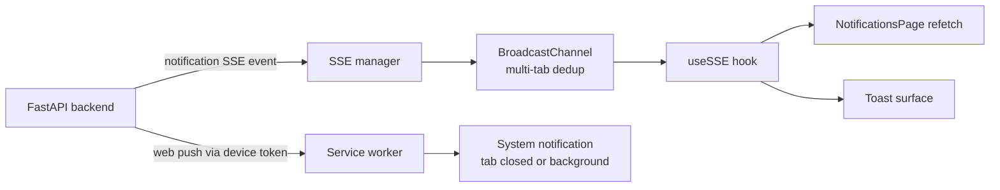

# Push notifications

Active contributors: Saksham

360 Flatmates delivers notifications through two complementary channels while the app is open and while it is not. The in-app channel is real-time Server-Sent Events (SSE), which drives the notifications inbox, the toast surface, and the cache invalidation that keeps every list fresh. The out-of-app channel is web push via the standard Web Push API (PushManager), which delivers a system-level notification when the tab is closed or in the background. This page covers the VAPID configuration, the FCM token registration, the notification preferences page, the saved-search alerts page, and how SSE and web push split the work. For the full SSE lifecycle, see [Real-time](real-time.md). For the VAPID env var and the build pipeline, see [SEO and prerendering](seo-prerendering.md) and [Configuration](../reference/configuration.md).

## Two channels, one goal

| Channel | When it fires | Transport | Requires |
| --- | --- | --- | --- |
| SSE `notification` event | App is open (any tab) | `GET /flatmates/sse` | An authenticated session |
| Web push (FCM token) | App is closed or backgrounded | Web Push API via the service worker | Notification permission + VAPID key + registered device |

SSE is the primary, always-on channel for signed-in users. Web push is the fallback for when no tab is open, and for system-level alerts that must surface even if the user has navigated away. The two never duplicate in-app: SSE events are consumed by the open app, web push is consumed by the browser. The backend decides which channel to use per notification based on the device registry (see below).

## VAPID key configuration

Web push needs a VAPID application server key to subscribe the browser. The key is read from `VITE_VAPID_PUBLIC_KEY`, validated by the env schema in `src/lib/env.ts` (where it is an optional `z.string().min(1)`), and surfaced through `getEnv().VITE_VAPID_PUBLIC_KEY`. The key is intentionally optional: if it is unset (for example, in a local dev environment without push configured), `getFcmToken` logs a warning and returns `null`, and push registration is skipped silently. The app still works; only out-of-app push is unavailable. See `.env.example` for the placeholder and [Configuration](../reference/configuration.md) for the full env var reference.

## FCM token registration

`src/lib/push/fcm.ts` is the entire push layer. It uses the standard Web Push API rather than the `firebase/messaging` SDK, so there is no Firebase runtime dependency. Three functions compose the flow:

| Function | What it does |
| --- | --- |
| `requestNotificationPermission()` | Prompts the user via the Notification API; returns the resulting permission state (or `"denied"` if the API is missing) |
| `getFcmToken()` | Subscribes the service worker's `pushManager` with the VAPID key (`userVisibleOnly: true`), reusing an existing subscription if one exists, and returns the subscription endpoint as the token |
| `registerDevice(token)` | POSTs the token to `/api/v1/notifications/devices/register` with `platform: "web"` |
| `unregisterDevice(token)` | POSTs the token to `/api/v1/notifications/devices/unregister` |

`requestAndRegisterPush()` is the convenience wrapper that runs all three steps in order: request permission, get the token, register with the backend. It returns the token on success or `null` on any failure (permission denied, no service worker, no VAPID key, network error). The token is the PushSubscription endpoint URL, which uniquely identifies this browser subscription and is what the backend stores to target this device later.

The service worker must be ready before `pushManager.subscribe` is called, so `getFcmToken` awaits `navigator.serviceWorker.ready`. If service workers are unavailable (for example, in an insecure context or an unsupported browser), the function returns `null` without throwing.

## Notification preferences

`SettingsNotificationsPage` (`src/pages/app/SettingsNotificationsPage.tsx`) is the preferences surface at `/settings/notifications`. It renders seven toggles backed by the profile's `preferences` JSON field:

| Key | Label | Default |
| --- | --- | --- |
| `push_notifications` | Push notifications | On |
| `new_matches` | New matches | On |
| `messages` | Messages | On |
| `visit_reminders` | Visit reminders | On |
| `listing_updates` | Listing updates | On |
| `promotional` | Promotional | Off |
| `quiet_hours` | Quiet hours 10 PM to 8 AM | Off |

The toggles seed from the saved profile preferences (falling back to each toggle's `defaultOn`), and edits are persisted through a 500ms debounce that calls `updateProfile.mutate({ preferences })`. A `pendingPrefs` ref holds the latest state between debounce fires, and the unmount effect flushes any pending write so a quick navigation never drops the last toggle change. The page follows the project's async-state rules: a skeleton layout matching the toggle list during `isLoading`, and an inline `ErrorState` (with retry) inside a card if the profile fetch fails.

## Search alerts

`AlertsPage` (`src/pages/app/AlertsPage.tsx`) is the saved-search alerts surface. It is distinct from the notification preferences above: alerts are user-defined saved searches that fire when new listings match, whereas preferences are global category toggles. The page lists alerts (name, frequency, channels, results sent count) with a pause/resume toggle and a delete action, plus a "Create Alert" modal that creates a new alert with `frequency: "daily"` and `channels: ["push"]`.

All alert mutations live in `src/hooks/queries/useSearch.ts` and target the `/flatmates/web/alerts` endpoints:

| Hook | Endpoint | Purpose |
| --- | --- | --- |
| `useSearchAlerts()` | `GET /flatmates/web/alerts` | List saved alerts |
| `useCreateSearchAlert()` | `POST /flatmates/web/alerts` | Create a new alert |
| `useUpdateSearchAlert()` | `PUT /flatmates/web/alerts/{id}` | Pause, resume, or edit an alert |
| `useDeleteSearchAlert()` | `DELETE /flatmates/web/alerts/{id}` | Remove an alert |

Each mutation invalidates the `["search", "alerts"]` query key on success, so the list refetches and reflects the change immediately. The page uses `AsyncView` for loading, error, empty, and populated states, with a content-shaped skeleton during `isLoading` and an `EmptyState` (with a "Create alert" action) when there are no alerts. Delete is gated by a confirmation modal that names the alert being removed.

## The in-app notifications page

`NotificationsPage` (`src/pages/app/NotificationsPage.tsx`) is the inbox at `/notifications`. It loads notifications via `useNotifications()` (from `src/hooks/queries/useNotifications.ts`, hitting `GET /flatmates/notifications`), maps each through `notificationToNotificationCardProps`, and renders a list of `NotificationCard` components with relative timestamps. Each card is interactive: tapping it marks the notification read (via `useMarkNotificationRead`, `PUT /flatmates/notifications/{id}`) and navigates to the notification's `route` if one is set. A "Mark all read" button appears when any notification is unread, calling `useMarkAllNotificationsRead` (`PUT /flatmates/notifications` with `mark_all_read: true`). Both mutations invalidate the `["notifications"]` query key.

The `NotificationCard` molecule (`src/components/molecules/NotificationCard.tsx`) renders the icon, title, description, timestamp, and an unread dot. Each notification type maps to a tone and a lucide icon: `new_match` (pink, Heart), `new_message` (blue, MessageCircle), `listing_approved` (success, CheckCircle2), `listing_rejected` (error, XCircle), `visit_scheduled` (teal, CalendarCheck), `visit_confirmed` (success, CalendarCheck), `general` (accent, Bell). Unread cards get a 3px accent left border to signal state beyond color alone.

## How SSE and push complement each other

The SSE manager (`src/hooks/useSSE.ts`, wired from `src/providers.tsx`) connects to `GET /flatmates/sse` whenever the user is authenticated. The `notification` event type carries an `SSENotificationData` payload (id, type, title, description, created_at) defined in `src/lib/sse/types.ts`. When such an event arrives, the open app consumes it: the notifications inbox refetches, a toast may fire, and any related query keys (matches, conversations, etc.) invalidate so every surface stays current. BroadcastChannel dedupes events across tabs so a multi-tab user only processes each event once.

Web push covers the case SSE cannot: the user has closed every tab. In that scenario the browser service worker receives the push, the backend has the device token on file from `registerDevice`, and the platform shows a system notification. The two channels do not race for the same open-tab delivery because the backend targets the open SSE connection first and only falls back to the device registry when no connection is alive. The notification preferences (the toggles on the settings page) gate both channels at the backend: a disabled category stops the SSE event and the web push for that category.

## Source-of-truth docs

For the notification event payload shapes, see `src/lib/sse/types.ts` and [docs/flatmates-openapi.yaml](../../docs/flatmates-openapi.yaml). For the env var reference including `VITE_VAPID_PUBLIC_KEY`, see `.env.example` and [Configuration](../reference/configuration.md). For the async-state rules that govern the notification and alert pages, see [DESIGN.md](../../DESIGN.md) section 12.

## Key source files

| File | Purpose |
| --- | --- |
| `src/lib/push/fcm.ts` | VAPID subscription, device register/unregister, `requestAndRegisterPush` |
| `src/lib/env.ts` | Env schema including optional `VITE_VAPID_PUBLIC_KEY` |
| `src/pages/app/SettingsNotificationsPage.tsx` | Notification preference toggles with debounced persist |
| `src/pages/app/AlertsPage.tsx` | Saved-search alert list with create, pause, delete |
| `src/pages/app/NotificationsPage.tsx` | In-app notifications inbox with mark-read and mark-all-read |
| `src/components/molecules/NotificationCard.tsx` | Notification card with type-to-tone icon mapping |
| `src/hooks/queries/useNotifications.ts` | `useNotifications`, `useMarkNotificationRead`, `useMarkAllNotificationsRead` |
| `src/hooks/queries/useSearch.ts` | `useSearchAlerts`, `useCreateSearchAlert`, `useUpdateSearchAlert`, `useDeleteSearchAlert` |
| `src/lib/sse/types.ts` | `SSENotificationData` and the full SSE event discriminated union |
| `src/hooks/useSSE.ts` | SSE connection manager and event dispatch (see [Real-time](real-time.md)) |
