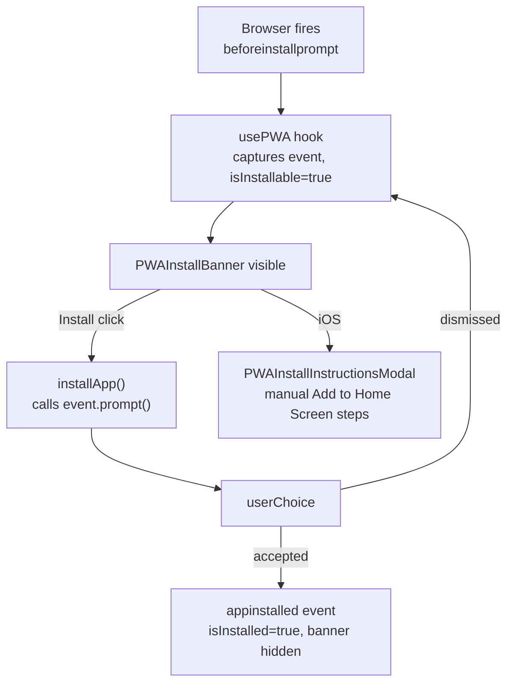

# PWA and install

Active contributors: Saksham

360 Flatmates is installable as a Progressive Web App. A user can add it to their home screen on Android, iOS, or desktop Chrome and get a standalone, full-screen, app-like experience without going through an app store. This page covers the `vite-plugin-pwa` configuration, the generated manifest, the service worker caching strategy, the custom install banner, the iOS Safari manual install guide modal, and the `usePWA` hook that wires the browser's `beforeinstallprompt` event to a React-friendly API. For the build pipeline that generates the PWA icons and prerenders the installable shell, see [SEO and prerendering](seo-prerendering.md). For the local build commands, see [Getting started](../overview/getting-started.md). For the color and typography tokens referenced by the manifest and theme color, see [DESIGN.md](../../DESIGN.md).

## The VitePWA configuration

The PWA layer is configured in `vite.config.ts` via the `VitePWA` plugin. Two settings define the update behavior:

- `registerType: "autoUpdate"`. The service worker updates silently in the background. When a new version is published, the next navigation serves it without prompting the user. This avoids stale-content bugs and the UX cost of a "new version available" toast.
- `injectRegister: "auto"`. The plugin injects the service worker registration automatically, so no manual `navigator.serviceWorker.register` call is needed in app code.

The `includeAssets` array lists every file the service worker should precache beyond the bundle itself: the favicon in three forms (svg, ico, png), the standard and maskable PWA icons, the og image, the logo, the robots and llms text files, and the sitemap. These are copied into `dist/` by Vite and precached so the installed app has them offline. The icon set that ships to users is generated at build time by `scripts/generate-pwa-icons.ts` (see below).

## The manifest

The manifest is defined inline in `vite.config.ts` under `VitePWA.manifest`:

| Field | Value | Notes |
| --- | --- | --- |
| `name` | `360 Flatmates` | Full name |
| `short_name` | `360 Flatmates` | Home screen label |
| `description` | `Find compatible flatmates and verified rooms across India.` | Used by install prompts |
| `theme_color` | `#F4F3EE` | The light `paper` token, matches `index.html` `theme-color` |
| `background_color` | `#F4F3EE` | Splash background |
| `display` | `standalone` | Hides browser chrome, full app feel |
| `orientation` | `portrait` | Preferred mobile orientation |
| `start_url` | `/` | Landing page on launch |
| `icons` | 5 entries | One svg (any), two standard PNGs (192, 512), two maskable PNGs (192, 512) |

The `theme_color` is deliberately the `paper` token (`#F4F3EE`), not the terracotta accent, so the status bar and splash match the warm off-white page background rather than the brand color. The accent (`#C96442`) is reserved for the maskable icon backgrounds and for in-app affordances.

The icon set follows the standard plus maskable split. Standard icons (`purpose: "any"`) are the logo on a transparent background. Maskable icons (`purpose: "maskable"`) are the logo composited onto a solid terracotta `#C96442` background with 15% padding, so they fill any adaptive icon shape an Android launcher applies. Both are generated from `public/favicon.svg` by the build step.

## Service worker caching

With `autoUpdate` and `injectRegister: "auto"`, `vite-plugin-pwa` generates a Workbox-powered service worker that precaches the bundle and the `includeAssets` list on install, and serves them cache-first when offline. The installed app therefore works offline for any precached route and asset, including the prerendered HTML for public routes. Runtime caching for cross-origin assets (fonts, map tiles, Nominatim) is left to the browser defaults, since those are not part of the precache manifest.

The maskable icon generation script (`scripts/generate-pwa-icons.ts`) is a build-time step that uses `sharp` to read `public/favicon.svg` and emit four PNGs:

- `public/favicon-192.png` and `public/favicon-512.png`: the logo resized to square PNGs.
- `public/favicon-192-maskable.png` and `public/favicon-512-maskable.png`: the logo composited onto a solid `#C96442` background with 15% padding, centered.

The script runs as step 2 of the build pipeline (see [SEO and prerendering](seo-prerendering.md)), before `vite build`, so the generated PNGs are present when Vite copies `public/` into `dist/`. The `generate:pwa-icons` npm script wraps it for standalone regeneration.

## The index.html shell

`index.html` is the SPA shell that every route inherits. Its head carries the installability signals:

- `<meta name="theme-color" content="#F4F3EE">`, matching the manifest and giving iOS Safari its status bar tint.
- `<link rel="icon" href="/favicon.ico" sizes="32x32">` and `<link rel="icon" href="/favicon.svg" type="image/svg+xml">` for the favicon.
- `<link rel="apple-touch-icon" href="/favicon-192.png">` for iOS home screen icons (Apple ignores the manifest icons for home screen placement).
- `<link rel="mask-icon" href="/favicon.svg" color="#C96442">` for the pinned-tab icon in Safari.

A pre-paint inline script reads the persisted theme from `localStorage` and sets `data-theme` and `data-theme` on `<html>` before first paint, so the installed app does not flash the wrong theme on launch. The `<noscript>` fallback lists the core public links so the app is at least partially usable without JavaScript.

## The usePWA hook

`usePWA` (`src/hooks/usePWA.ts`) is the bridge between the browser's install lifecycle and React. It exposes four values:

- `isInstallable`. True after the browser has fired `beforeinstallprompt` and the event has been captured. This is the signal that a native install prompt is available (Chrome, Edge, Android).
- `isInstalled`. True if the app is already running in a standalone display mode, detected via the `(display-mode: standalone)` media query, the legacy `navigator.standalone` flag, or an `android-app://` referrer. Initialized synchronously from these checks so the banner does not flash on first paint.
- `isIOS`. True on iPad, iPhone, and iPod (excluding legacy `MSStream` user agents). iOS never fires `beforeinstallprompt`, so this flag routes the iOS user to the manual install instructions instead.
- `installApp()`. An async function that calls the captured `beforeinstallprompt` event's `prompt()`, awaits the user's `userChoice`, and returns `true` only if the outcome was `accepted`.

The hook attaches `beforeinstallprompt` and `appinstalled` listeners in a `useEffect` and tears them down on unmount. On `appinstalled`, it flips `isInstalled` to true and clears the captured prompt event so the banner never reappears for an installed user.

## The install banner and instructions modal

Two components consume `usePWA` to drive the install UX.

`PWAInstallBanner` (`src/components/molecules/PWAInstallBanner.tsx`) is the in-app banner. It is wired into the authenticated app shell by `AppLayout` (`src/pages/app/AppLayout.tsx`), which renders `<PWAInstallBanner className="mb-5" />` above the page outlet. The banner is visible only when the app is not yet installed and either `isInstallable` (Chrome, Edge, Android) or `isIOS` is true, and only until the user dismisses it (a `sessionStorage` flag, so it comes back next session). The Install button calls `installApp()` when installable, or opens the instructions modal when on iOS.

`PWAInstallInstructionsModal` (`src/components/organisms/PWAInstallInstructionsModal.tsx`) is the iOS Safari manual install guide. Because iOS does not fire `beforeinstallprompt`, the only path to install is the Safari share sheet. The modal walks the user through three numbered steps (tap the Share button, select Add to Home Screen, confirm) with lucide icons for each affordance. It is reused from two entry points: the install banner, and the profile page, which offers a standalone "Install app" affordance via its own `usePWA` instance.

## Source-of-truth docs

For the canonical color tokens (`paper` `#F4F3EE`, accent `#C96442`) referenced by the manifest and theme color, see [DESIGN.md](../../DESIGN.md) section 3. For the build pipeline that generates the icons and precaches the shell, see [SEO and prerendering](seo-prerendering.md). For the local build and dev commands, see [Getting started](../overview/getting-started.md).

## Key source files

| File | Purpose |
| --- | --- |
| `vite.config.ts` | `VitePWA` config: `autoUpdate`, `injectRegister`, `includeAssets`, inline manifest |
| `src/hooks/usePWA.ts` | `usePWA` hook: `isInstallable`, `isInstalled`, `isIOS`, `installApp` |
| `src/components/molecules/PWAInstallBanner.tsx` | In-app install banner with dismiss and iOS routing |
| `src/components/organisms/PWAInstallInstructionsModal.tsx` | iOS Safari manual Add to Home Screen guide |
| `src/pages/app/AppLayout.tsx` | Wires `PWAInstallBanner` above the authenticated page outlet |
| `src/pages/app/ProfilePage.tsx` | Second `usePWA` entry point with standalone install affordance |
| `scripts/generate-pwa-icons.ts` | `sharp` script that emits standard and maskable PNGs from `favicon.svg` |
| `index.html` | SPA shell with `theme-color`, apple-touch-icon, mask-icon, pre-paint theme script |
| `public/llms.txt` | LLM-facing site summary, precached as an included asset |
