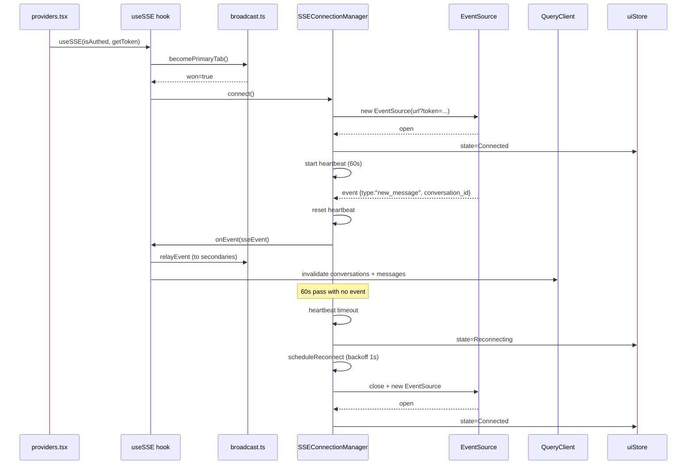

# Real-time updates

Active contributors: Saksham

Real-time updates are how every list, thread, and detail view in the app stays current without polling. A single Server-Sent Events connection per browser pushes twelve event types from the FastAPI backend into the TanStack Query cache, a BroadcastChannel deduplicates events across tabs so only one tab holds the connection, and an exponential-backoff reconnect with a heartbeat timeout keeps the stream alive on flaky networks. This page covers the connection manager, the multi-tab negotiation, the React binding, and the event-to-cache dispatch. For how messages consume this transport, see [Messaging](messaging.md). For how visits consume it, see [Visits](visits.md). For the auth token handling that the connection depends on, see the API client documentation.

## The three layers

The real-time stack is intentionally split into three layers, each in its own file under `src/lib/sse/`:

1. **`SSEConnectionManager`** (`src/lib/sse/connection.ts`) is a pure TypeScript class with no React dependency. It owns the `EventSource`, the backoff timers, and the heartbeat. It is a singleton (via `getSSEManager` and `resetSSEManager`) so only one connection ever exists per tab.
2. **BroadcastChannel dedup** (`src/lib/sse/broadcast.ts`) handles multi-tab coordination. Only the elected "primary" tab holds the SSE connection, and it relays every event to secondary tabs over a `BroadcastChannel` named `360-flatmates-sse`.
3. **React binding** (`src/hooks/useSSE.ts` and `src/hooks/useSSEStatus.ts`) wires the manager into the component tree, dispatches events into the QueryClient cache, and surfaces connection state to the UI via the Zustand `uiStore`.

The public surface is re-exported from `src/lib/sse/index.ts`, which is the import path the rest of the app uses.

## The twelve event types

`SSEEventType` in `src/lib/sse/types.ts` enumerates every event the backend can push. Each has a typed data payload, and together they form a discriminated union (`SSEEvent`) that the dispatch switch matches on:

| Event type | Invalidates | Used by |
| --- | --- | --- |
| `notification` | `["notifications"]` | Notification bell |
| `message`, `new_message` | `["conversations"]` plus the thread's messages page | [Messaging](messaging.md) |
| `visit_update` | `["visits"]` | [Visits](visits.md) |
| `swipe` | `["swipes", "deck"]` | Swipe deck |
| `property_update`, `listing_status_changed` | `["properties"]` | Listing surfaces |
| `profile_update` | `["profile", "me"]` | Profile page |
| `system` | `["bootstrap"]` | App bootstrap |
| `ping` | nothing | Keep-alive only |
| `new_match` | `["swipes", "deck"]` and `["matches"]` | Likes and matches |
| `conversation_updated` | `["conversations"]` | [Messaging](messaging.md) |

The `ping` event is special: it carries only an optional timestamp and invalidates no query. Its job is to reset the heartbeat timer (see below) so the connection is not declared dead during quiet periods.

## The connection lifecycle

`SSEConnectionManager.connect()` is the entry point. It guards against double-connects, flips state to `Connecting`, fetches an auth token, and opens an `EventSource` against `${url}?token=...`. Because the browser `EventSource` API does not support custom headers, the Supabase JWT is passed as a URL query parameter (URL-encoded). This is a known limitation of the spec, mitigated by short-lived tokens, a `Referrer-Policy: no-referrer` to prevent leakage via the Referer header, and the expectation that the server does not log the full query string in production.

Once open, the manager registers a listener for each of the twelve event types plus the `open` and `error` meta-events. On a successful open it resets the backoff to its initial value, clears the consecutive-failure counter, flips state to `Connected`, and starts the heartbeat timer. The four connection states live in the `SSEConnectionState` enum: `Connecting`, `Connected`, `Disconnected`, `Reconnecting`.

Every incoming event resets the heartbeat timer. If no event (including `ping`) arrives within 60 seconds, the manager assumes the connection is stale: it tears down the `EventSource`, flips to `Reconnecting`, and schedules a reconnect. This catches half-open TCP connections that the browser cannot detect on its own.

## Exponential backoff and reconnect

Reconnect uses exponential backoff starting at 1 second and doubling each attempt, capped at 30 seconds: 1s, 2s, 4s, 8s, 16s, 30s, 30s. A successful open resets the backoff to the 1-second floor. The backoff is tracked on the manager instance and only reset on a clean open, so a flapping connection keeps widening its gap rather than hammering the server.

## Auth failure handling

The manager distinguishes two failure modes by checking whether the `EventSource` ever fired its `open` event before erroring:

- **Open-then-error.** The connection was established and then dropped, which is a normal network blip. The failure counter stays at zero and the manager reconnects with the existing token.
- **Error-without-open.** The connection never opened, which is treated as an auth failure (typically a 401 on the token query param). The failure counter increments.

After three consecutive auth failures, the manager calls the `onAuthFailure` callback, which in the React binding refreshes the Supabase session and updates the access token via `setAccessToken`. Whether the refresh succeeds or fails, the counter resets and the manager schedules a reconnect with the fresh (or stale) token. The max-three threshold prevents an infinite refresh loop when the session itself is unrecoverable.

## Multi-tab dedup via BroadcastChannel

Opening one SSE connection per tab would multiply the server's fan-out cost and produce duplicate cache invalidations. The broadcast layer solves both with a primary-tab election.

When `useSSE` mounts and the user is authenticated, it calls `becomePrimaryTab()`. That broadcasts a `CLAIM_PRIMARY` message on the channel and waits up to 1 second for a `PRIMARY_ALIVE` response. If an existing primary responds, this tab becomes a secondary and registers an `onRelayedEvent` callback. If no one responds, this tab wins primary, opens the SSE connection, and relays every event it receives back onto the channel via `relayEvent`. Secondaries pick those events up and run the same `invalidateForEvent` dispatch, so every tab's cache stays in sync through a single connection.

A `visibilitychange` listener (`setupVisibilityNegotiation`) re-runs the election when tabs are shown or hidden. If the primary tab goes hidden, it relinquishes its role so a visible secondary can take over, keeping the connection on the tab the user is actually looking at. The negotiation has a 1-second timeout, and the code notes that a blocked main thread could in rare cases produce a transient dual-primary, which self-heals on the next visibility cycle.

## The React binding

`useSSE(isAuthenticated, getToken)` in `src/hooks/useSSE.ts` is the single hook that drives everything. It is called once from `src/providers.tsx`, wired to the Supabase session's access token. Its responsibilities:

1. Build the manager options (URL, token getter, `onAuthFailure` that refreshes the Supabase session, `onEvent` that relays and invalidates, `onStateChange` that mirrors state into `uiStore`).
2. On mount, run the primary election and connect if this tab wins.
3. Subscribe to `onRelayedEvent` so secondary tabs invalidate on relayed events.
4. Subscribe to `onPrimaryChanged` so a tab that wins primary mid-session connects immediately.
5. On unmount, relinquish primary, reset the singleton manager, close the broadcast channel, and reset the store state.

The `handleEvent` callback does two things on every event: it sets `sseConnected: true` in `uiStore` (so connection indicators can light up), and it calls `relayEvent` (so secondaries receive it) before calling `invalidateForEvent`. Secondary tabs reach `invalidateForEvent` through their `onRelayedEvent` subscription, so both primaries and secondaries end up running the same dispatch.

`useSSEStatus` (`src/hooks/useSSEStatus.ts`) is the thin read hook components use to display a connection indicator. It selects `sseState` out of `uiStore` and returns `{ state, isConnected, reconnecting }`. The `ChatThread` header uses the `disconnected` prop (driven by this state) to show a `CloudOff` icon when messages may be delayed.

## Connect, event, and reconnect

The diagram below traces a happy-path connect, an inbound event flowing through to the cache, and a reconnect after a heartbeat timeout. It keeps the primary-tab path for clarity, the secondary-tab path simply swaps the SSE manager for the BroadcastChannel relay.

## Source-of-truth docs

This page summarizes the real-time transport. For the product rationale behind live updates and the page-level refresh expectations, see [plans/prd.md](../../plans/prd.md). For the connection-indicator visual treatment and the `CloudOff` affordance in the chat header, see [DESIGN.md](../../DESIGN.md) section 11.3 and section 12.1. For the auth token flow that the connection depends on, see the API client documentation. For the two feature surfaces that consume this transport most heavily, see [Messaging](messaging.md) and [Visits](visits.md).

## Key source files

| File | Purpose |
| --- | --- |
| `src/lib/sse/connection.ts` | `SSEConnectionManager` class, singleton, backoff, heartbeat, auth-failure handling |
| `src/lib/sse/broadcast.ts` | BroadcastChannel primary-tab election and event relay |
| `src/lib/sse/types.ts` | Twelve `SSEEventType` values, `SSEConnectionState` enum, typed payloads |
| `src/lib/sse/index.ts` | Public re-exports for the SSE module |
| `src/hooks/useSSE.ts` | React binding, primary election, `invalidateForEvent` dispatch |
| `src/hooks/useSSEStatus.ts` | Read hook exposing `state`, `isConnected`, `reconnecting` |
| `src/providers.tsx` | Wires `useSSE` to the Supabase session token |
| `src/lib/stores/ui-store.ts` | Holds `sseState`, `sseConnected`, `ssePrimaryTab` for the UI |
