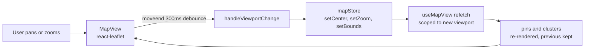
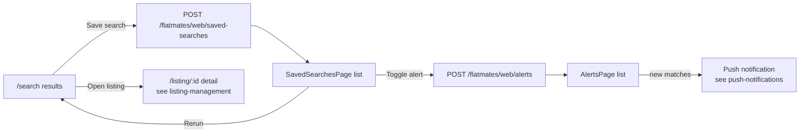

# Search and explore

Active contributors: Saksham

Search and explore are the two authenticated surfaces where a logged-in user actively hunts for a place or a flatmate. Search is the keyword and filter grid at `/search` (with its natural-language sibling at `/search/semantic`). Explore is the Leaflet map at `/explore` where pins and clusters ride over the viewport. This page covers both surfaces: the filter panel, the result grids, the map view, reverse geocoding via Nominatim, the persisted filter and viewport stores, saved searches, and search alerts. For the unauthenticated, SEO-oriented counterpart that prospective users hit before they sign up, see [Public discover](discover.md). For the listing detail page those results open into, see [Listing management](listing-management.md).

## Two surfaces, one filter vocabulary

Both surfaces talk to the same backend (`GET /properties`) through the same `SearchFilters` shape defined in `src/lib/api/search.types.ts`. The differences are how the user interacts with the filters and how the results are presented:

| Surface | Route | Page file | Result view | Filter UI |
| --- | --- | --- | --- | --- |
| Search | `/search` | `src/pages/public/SearchPage.tsx` | `ListingCard` grid with infinite scroll | Inline search bar, city and bedrooms dropdowns, amenities `BottomSheet` |
| Semantic search | `/search/semantic` | `src/pages/public/SemanticSearchPage.tsx` (wraps `src/components/page-clients/SemanticSearchClient.tsx`) | `SearchResults` organism | Must-have amenities chips |
| Explore (map) | `/explore` | `src/pages/app/ExplorePage.tsx` | Leaflet pins and clusters | `FilterPanel` inside `BottomSheet` (mobile) and right-side `Drawer` (tablet and desktop) |

The SearchPage route is technically served from `src/pages/public/SearchPage.tsx` but lives behind the `AuthGuard` in `src/App.tsx` (the route is `/search`, rendered inside `AppLayout`). It is "authenticated search": the same component could be reused publicly, but in the current routing it sits behind auth. The `SemanticSearchPage` and `SemanticSearchClient` are the natural-language variant that flips `semantic_search: true` in the filters so the backend can interpret free-text descriptions.

## The search page

`SearchPage` (`src/pages/public/SearchPage.tsx`) is the primary keyword-driven search. URL state is owned by `nuqs` through `searchPageParams` in `src/lib/schemas/search-params.ts`, so every filter change updates the query string and the page is deep-linkable (`/search?q=1BHK&city=1&bedrooms=2&amenities=WiFi,Parking&priceMin=3000&priceMax=15000&page=1`).

The page derives a `SearchFilters` object from the URL params, hands it to `useInfiniteWebSearch`, and renders results into a responsive `ListingCard` grid. Infinite scroll is driven by an `IntersectionObserver` watching a sentinel at the bottom of the list, calling `fetchNextPage` when it intersects and `hasNextPage` is true. A non-empty successful text query is recorded into `recentSearches` via `searchStore.addRecentSearch`, which surfaces as quick-relaunch chips above the grid.

The page also pushes the derived filters into `searchStore` on every change, so other surfaces (the top-bar search box in `AppShell`, the saved-searches rerun flow) can read the active filter set from a single source.

## The explore page

`ExplorePage` (`src/pages/app/ExplorePage.tsx`) is the map. It is a full-bleed layout: the map fills the available viewport, a filter button opens the `FilterPanel` in a `BottomSheet` (mobile) or `Drawer` (desktop), and selecting a pin surfaces an inline property card. The map itself is `MapView` (`src/components/organisms/MapView.tsx`), a thin React wrapper around `react-leaflet` that is lazy-loaded because Leaflet needs `window`.

The viewport (center and zoom) is persisted in `mapStore` (`src/lib/stores/map-store.ts`), so panning away to a listing detail and back keeps the user where they were. Every pan and zoom fires a debounced `moveend` handler that recomputes bounds, updates the store, and triggers a `useMapView` refetch scoped to the new viewport. Previous pins stay on screen during the refetch (`placeholderData: keepPreviousData`), so the map never flashes blank mid-pan.



Pins are custom `L.DivIcon` rent badges (for example `₹18k`) for room listings and teal "Flatmate" pills for co-hunter profiles. Clusters are sized by count and tinted by composition: pure rooms are terracotta, pure co-hunters are teal, mixed are amber. Clicking a cluster triggers a `flyTo` zoom-in (honoring `prefers-reduced-motion` by jumping instead of animating). Clicking a pin calls `onPinSelect`, which sets a `selectedPin` that drives two detail surfaces: `PropertyDetailSheet` (the bottom strip on mobile) and `PropertyDetailPanel` (the right rail on tablet and desktop). The right rail fetches the full property via `useProperty` so the user sees amenities, deposit, owner, and the full description without leaving the map.

`MapExplorer` (`src/components/organisms/MapExplorer.tsx`) is a separate, non-Leaflet fallback map surface that renders `ListingMiniCard` rows over a dotted-grid background. It is used where a real map is not available or not desired, and it shares the `MapZoomControls` molecule with the Leaflet view.

## Reverse geocoding via Nominatim

`useReverseGeocode` (`src/hooks/queries/useReverseGeocode.ts`) wraps `reverseGeocode` in `src/lib/api/nominatim.ts`, which calls the public OpenStreetMap Nominatim endpoint:

```
https://nominatim.openstreetmap.org/reverse?lat=...&lon=...&format=json
```

It returns a `{ city, locality }` pair extracted from the OSM address object (city, town, suburb, neighbourhood, quarter, in that fallback order). It is exposed as a TanStack Query mutation, so consumers get `geocode`, `geoLoading`, `geoError`, and `geoData` without managing their own loading state. The "locate me" affordance on the map uses it indirectly: `handleLocate` in `ExplorePage` reads `navigator.geolocation`, updates `mapStore` with the resulting lat/lng, and the viewport refetch picks up listings around the new center.

## Filter state and view mode

Two Zustand stores hold client-only state for the search and explore surfaces. Both use the vanilla `createStore()` pattern so they can be consumed outside React (in SSE handlers and tests) without a hook wrapper.

`searchStore` (`src/lib/stores/search-store.ts`) owns:

- `filters: SearchFilters`, the active filter set, persisted to `localStorage` under a redacted key.
- `recentSearches: string[]`, the last five non-empty text queries, capped and deduped against the head.
- `viewMode: "grid" | "list" | "map"`, the user's preferred result layout.
- `setFilter`, `setFilters`, `resetFilters`, `addRecentSearch`, `clearRecentSearches`, `getActiveFilterCount`, and `setSearchType`, which always reset `page` to 1 on any change.

`mapStore` (`src/lib/stores/map-store.ts`) owns:

- `center: { lat, lng }` (default New Delhi) and `zoom` (default 12).
- `bounds: { north, south, east, west } | null`, the last computed viewport.
- `selectedPinId`, `filters`, and setters that no-op on identical values to avoid spurious refetches.

Server state (the actual search results) is never mirrored into either store. The rule is strict: TanStack Query owns the cache, Zustand owns only UI and draft state. See [State management](../systems/state-management.md) for the full rationale.

## The filter panel and search results

`FilterPanel` (`src/components/molecules/FilterPanel.tsx`) is the shared filter chrome. It renders a `SearchBar`, a stack of `FilterSection` blocks (each a labeled group of `Chip` options), and a sticky bottom bar with Clear and Apply buttons. Sections can declare a `variant` (for example `choice` for radio semantics). The panel is layout-agnostic: the explore page mounts it inside a `BottomSheet` or `Drawer`, and the search results organism mounts it as a left sidebar on large screens.

`SearchResults` (`src/components/organisms/SearchResults.tsx`) is the result grid organism. It pairs an optional left sidebar (`FilterPanel`, hidden below `lg`) with a result column that shows a count eyebrow, a sort slot, the `ListingCard` grid, pagination controls, and a "Save this search" CTA when there is only one page. Mobile filters open via a `BottomSheet`. The organism is dumb: it calls back to the parent on filter toggle, clear, apply, save, page change, and listing open, and the parent owns the data.

## Saved searches and alerts

Two related features let a user persist a query and get notified when new matches land.

**Saved searches** are managed by `useSavedSearches`, `useCreateSavedSearch`, and `useDeleteSavedSearch` in `src/hooks/queries/useSearch.ts`. They hit `/flatmates/web/saved-searches`. The `SavedSearchesPage` (`src/pages/app/SavedSearchesPage.tsx`) lists them with their active filters as chips, shows a "new results" count when the backend reports fresh matches, and lets the user rerun (by mapping the saved filters back to `/search` query params) or delete (with a confirm modal). Deleting invalidates the `["search", "saved"]` query key so the list refreshes.

**Search alerts** are managed by `useSearchAlerts`, `useCreateSearchAlert`, `useUpdateSearchAlert`, and `useDeleteSearchAlert`, which hit `/flatmates/web/alerts`. The `AlertsPage` (`src/pages/app/AlertsPage.tsx`) lets the user create, pause or resume (via `enabled`), and delete alerts. Each alert carries a `frequency` (for example `daily`) and `channels` (for example `push`). Push delivery is wired through the notifications system, covered in [Push notifications](push-notifications.md).

Both features follow the same mutation pattern: optimistic toast on success, error toast on failure, and query-key invalidation so the list refetches from the server.



## Semantic search

`SemanticSearchClient` (`src/components/page-clients/SemanticSearchClient.tsx`) is the natural-language entry point. The user types a description like "quiet room near Koramangala under 15k with vegetarian flatmates", selects must-have amenities, and the client sets `semantic_search: true` on the `SearchFilters` before calling `useWebSearch`. The backend interprets the free text and ranks results by lifestyle fit, not just literal keyword match. Results render through the same `SearchResults` organism, so the UX is consistent with keyword search. The page is served at `/search/semantic` by `SemanticSearchPage` (`src/pages/public/SemanticSearchPage.tsx`), which only adds SEO chrome around the client.

## Key source files

| File | Purpose |
| --- | --- |
| `src/pages/public/SearchPage.tsx` | Authenticated keyword search, infinite scroll, URL-driven filters |
| `src/pages/app/ExplorePage.tsx` | Leaflet map explore, viewport-persisted, pin detail surfaces |
| `src/pages/public/SemanticSearchPage.tsx` | SEO wrapper for `/search/semantic` |
| `src/components/page-clients/SemanticSearchClient.tsx` | Natural-language search client, `semantic_search: true` |
| `src/pages/app/SavedSearchesPage.tsx` | Saved searches list, rerun, delete |
| `src/pages/app/AlertsPage.tsx` | Search alerts CRUD |
| `src/components/organisms/MapView.tsx` | `react-leaflet` wrapper, custom pin and cluster icons, theme-aware tiles |
| `src/components/organisms/MapExplorer.tsx` | Non-Leaflet fallback map with mini cards |
| `src/components/organisms/SearchResults.tsx` | Result grid organism with pagination and save CTA |
| `src/components/organisms/PropertyDetailPanel.tsx` | Right-rail pin detail on explore |
| `src/components/organisms/PropertyDetailSheet.tsx` | Mobile bottom strip pin detail on explore |
| `src/components/molecules/FilterPanel.tsx` | Shared filter chrome (search bar, sections, Clear and Apply) |
| `src/components/molecules/MapZoomControls.tsx` | Zoom in, zoom out, and locate-me buttons |
| `src/hooks/queries/useSearch.ts` | `useWebSearch`, `useInfiniteWebSearch`, saved searches, search alerts |
| `src/hooks/queries/useMapView.ts` | `useMapView`, viewport-scoped pin and cluster fetch |
| `src/hooks/queries/useReverseGeocode.ts` | Nominatim reverse geocode mutation |
| `src/lib/api/nominatim.ts` | `reverseGeocode` against the public OSM endpoint |
| `src/lib/api/search.types.ts` | `SearchFilters`, `WebSearchResponse`, `SavedSearch`, `SearchAlert`, `MapPin`, `MapCluster`, `MapViewFilters` |
| `src/lib/stores/search-store.ts` | `searchStore`: filters, recent searches, view mode |
| `src/lib/stores/map-store.ts` | `mapStore`: center, zoom, bounds, selected pin |
| `src/lib/schemas/search-params.ts` | `nuqs` parsers for `/search` and `/discover` URL state |
