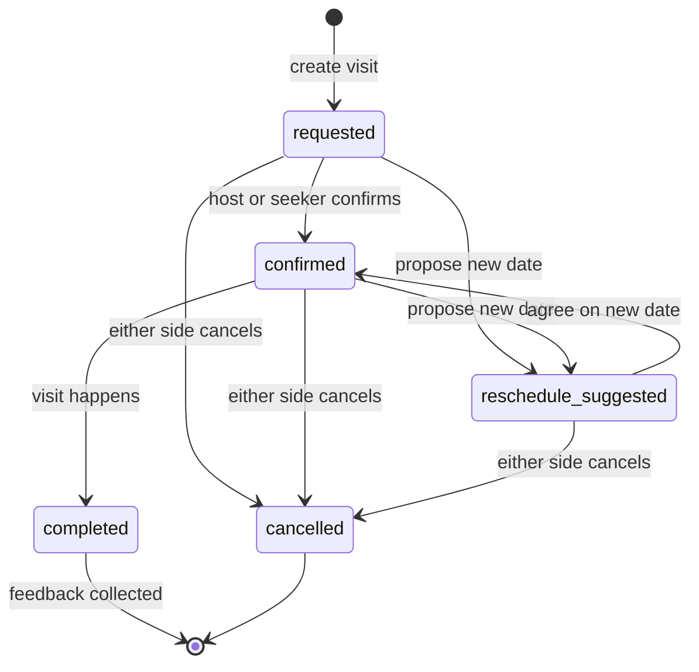

# Visits

Active contributors: Saksham

Visits are the in-person step between a match and a move-in. After two flatmates connect in chat, either side can propose a property tour or a flatmate meet, pick a date, and track the visit through confirmation, reschedule, completion, and cancellation. This page covers the visit lifecycle, the host-versus-seeker views, the create, update, and cancel flows, and how SSE keeps both parties' lists in sync. For the chat that typically produces a visit, see [Messaging](messaging.md). For the listing the visit is booked against, see the listing management surface. For the real-time transport that delivers visit updates, see [Real-time updates](real-time.md).

## Visit states and contexts

A visit moves through five statuses, defined in `src/lib/data/domain.ts` and validated by `visitStatusSchema` in `src/lib/schemas/visit.ts`:

| Status | Meaning |
| --- | --- |
| `requested` | One party proposed the visit, awaiting the other's confirmation |
| `confirmed` | Both sides agreed, the visit is on the calendar |
| `reschedule_suggested` | One side asked to move the date, awaiting agreement |
| `cancelled` | Either side called it off |
| `completed` | The visit happened, feedback can be collected |

A visit also carries a `visit_context`, which is either `property_tour` or `flatmate_meet`. The schema enforces a useful invariant here: `visitCreateSchema` in `src/lib/schemas/visit.ts` refines the payload so a `flatmate_meet` context requires both a `conversation_id` and a `counterparty_user_id`. In other words, you cannot book a flatmate meet without already being in a conversation with that flatmate. A `property_tour` can stand alone against a property.

## The visits list and calendar

`src/pages/app/VisitsPage.tsx` is the landing page. It fetches all visits with `useVisits()` and offers three segmented-control tabs, Upcoming, Past, and Cancelled, that filter the same list client-side:

- **Upcoming** keeps `requested`, `confirmed`, and `reschedule_suggested` visits.
- **Past** keeps `completed` visits.
- **Cancelled** keeps `cancelled` visits.

A list-and-calendar toggle sits beside the tab bar. The list view renders one `VisitCard` per visit and is always available. The calendar view (`CalendarView`) is a month grid that shows a count badge on any day with visits, supports Prev/Next month navigation (also arrow-key accessible), highlights today, and only appears on tablet and desktop. On mobile the calendar falls back to the list view so small screens never show an empty grid. Loading, error, and empty states all use `AsyncView` with the `visitCard` skeleton variant and tab-specific empty copy.

## The visit card

`VisitCard` (`src/components/molecules/VisitCard.tsx`) is the shared row used in both the list and the detail page. It shows a property thumbnail (via `NetworkImage`, which degrades gracefully if the image fails), the property title, a type badge (`property_tour` maps to teal, `flatmate_meet` to purple), a formatted date-time line with a calendar icon, and a status badge. Inline action buttons appear conditionally based on status:

- `pending` plus `canConfirm` shows a Confirm button.
- `pending` or `confirmed` shows Reschedule and Cancel buttons.
- `completed` shows a Rate button.

All inline actions respect a `busy` prop that disables the buttons while a mutation is in flight, so a user cannot double-confirm. The card is produced by `visitToVisitCardProps` in `src/lib/api/adapters.ts`, which maps the `Visit` type onto the presentational `VisitCardData` (collapsing the five backend statuses into the four card statuses).

## The detail page

`src/pages/app/VisitDetailPage.tsx` is the single-visit view. It loads one visit with `useVisit(id)` and wires three mutations: `useUpdateVisit(id)` for confirm, reschedule, and feedback, and `useCancelVisit(id)` for cancellation. The page renders the visit card, a details card showing the visit type badge, status badge, special requirements, and notes, and a row of action buttons that change with the status.

- **Confirm** is only available when `status === "requested"`. It calls `updateVisit.mutate({ status: "confirmed" })`.
- **Reschedule** opens a modal with a date input (min set to today, validated against past dates) and calls `updateVisit.mutate({ scheduled_date: newDate })`.
- **Cancel** opens a confirmation modal and calls `cancelVisit.mutate()`, navigating back to the visits list on success.
- **Feedback** appears only when `status === "completed"` and feedback has not yet been submitted. A `StarRating` component (`role="radiogroup"`, one radio per star) captures a 1-5 rating, a textarea captures optional comments, and the submit maps the star count to an `interest_level` of `high` (4 or 5), `medium` (3), or `low` (1 or 2) before calling `updateVisit.mutate({ visitor_feedback, interest_level })`.

All mutations push a success or error toast via `uiStore`, and the page tracks an `isMutating` flag (true when either update or cancel is pending) to disable competing actions.

## Host versus seeker views

The same visit record is visible to both the host (the room poster who owns the listing) and the seeker (the co-hunter who requested the tour). The backend returns a single `Visit` shape to both, and the frontend does not branch the UI by role: both sides see the same card, the same status badge, and the same action set gated by status. The differentiation is in the data each side sees in their list, not in a separate component tree. A `counterparty_user_id` and optional `conversation_id` and `match_id` on the visit record tie it back to the chat and match that produced it, so navigating from a visit to the conversation (or vice versa) is a single hop.

## Create, update, cancel flows

The create flow lives in `src/pages/app/ChatDetailPage.tsx`, not on the visits page, because visits are typically proposed from within a conversation. The schedule-visit modal in `ChatThread` collects a date and optional special requirements, and the page calls `useCreateVisit()` with a payload that includes the `property_id` (from the conversation's `context_property`), the `conversation_id`, the `counterparty_user_id` (the peer), and a `visit_context` of `property_tour`. If no property is linked to the conversation, the page toasts "No property is linked to this conversation" and aborts, since a visit needs a property anchor.

`useCreateVisit` posts to `POST /visits` and, on success, invalidates the whole `["visits"]` namespace so the new visit appears in the list and the calendar. `useUpdateVisit` and `useCancelVisit` both seed the detail cache with the server response via `setQueryData(["visits", id], updated)` before invalidating the namespace, so the detail view updates instantly without waiting for the refetch while the list and calendar reconcile in the background.

## Real-time refresh via SSE

Both parties stay in sync without polling. The `useSSE` hook (`src/hooks/useSSE.ts`) handles a `visit_update` event by invalidating the `["visits"]` query key, which refetches both the list and any open detail view. When the host confirms a visit, the seeker's `visit_update` event fires, their cache invalidates, and the card flips from `pending` to `confirmed` without a manual refresh. The event payload carries the `visit_id`, `property_id`, `status`, and optional `scheduled_date`, but the UI treats it purely as an invalidation signal and refetches the authoritative record. See [Real-time updates](real-time.md) for the connection lifecycle, the BroadcastChannel dedup that relays the event to secondary tabs, and the primary-tab election.

## Source-of-truth docs

This page summarizes the visit implementation. For the page-by-page spec of the visits list, calendar, and detail page, including the feedback flow and the reschedule modal, see [plans/ui_ux.md](../../plans/ui_ux.md). For the async-state rules that govern skeleton, error, and empty handling on these pages, and for the card, badge, and modal component specs, see [DESIGN.md](../../DESIGN.md) section 12.1 and section 11.3. For the chat surface where most visits are scheduled, see [Messaging](messaging.md).

## Key source files

| File | Purpose |
| --- | --- |
| `src/pages/app/VisitsPage.tsx` | Visits list with Upcoming/Past/Cancelled tabs and list/calendar toggle |
| `src/pages/app/VisitDetailPage.tsx` | Single visit view, confirm/reschedule/cancel/feedback flows |
| `src/components/molecules/VisitCard.tsx` | Shared visit row with status-conditional action buttons |
| `src/hooks/queries/useVisits.ts` | `useVisits`, `useVisit`, `useCreateVisit`, `useUpdateVisit`, `useCancelVisit` |
| `src/lib/api/visit.types.ts` | `Visit`, `VisitCreate`, `VisitUpdate`, `VisitCancel`, `VisitFilters` types |
| `src/lib/schemas/visit.ts` | Zod schemas, flatmate-meet requires conversation and counterparty |
| `src/lib/data/domain.ts` | `VISIT_STATUS_VALUES`, `VISIT_CONTEXT_VALUES`, `INTEREST_LEVEL_VALUES` enums |
| `src/hooks/useSSE.ts` | SSE hook, `visit_update` invalidation of the visits query |
