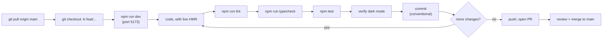

# Development workflow

Active contributors: Saksham

The branch to code to test to PR to merge cycle for the 360 Flatmates web app. For the conventions the code must follow, see [patterns and conventions](patterns-and-conventions.md). For install and commands, see [Getting started](../overview/getting-started.md). For the visual token system, see [DESIGN.md](../../DESIGN.md).

## Branching

Branch from `main` for every change. Use a short, kebab-case name that reflects intent.

| Kind | Example branch |
| --- | --- |
| Feature | `feat/swipe-deck-empty-state` |
| Fix | `fix/sse-reconnect-backoff` |
| Refactor | `refactor/api-client-401-refresh` |
| Docs | `docs/wiki-testing-page` |
| Chore | `chore/bump-deps` |

`main` is the integration branch. Keep branches small and focused so reviews stay quick and the pre-PR checklist is easy to satisfy. If a change touches multiple unrelated areas, split it into stacked PRs.

## The commit format

Conventional commits, enforced by convention rather than a tooling check. The type prefix drives the readable history and the changelog.

| Type | Use for | Example |
| --- | --- | --- |
| `feat:` | A new user-facing capability or component | `feat: add compatibility breakdown sheet on swipe card` |
| `fix:` | A bug fix | `fix: clear query cache on account deletion` |
| `refactor:` | A code change that neither adds a feature nor fixes a bug | `refactor: extract focus ring into a shared helper` |
| `docs:` | Documentation only (CLAUDE.md, AGENTS.md, wiki, DESIGN.md) | `docs: document the SSE reconnect backoff in the wiki` |
| `chore:` | Tooling, deps, build config | `chore: bump tanstack/react-query to 5.90` |

A scope is optional but encouraged when the change is scoped to one module: `feat(listings): add price range filter`. The subject line is imperative mood, lowercase, no trailing period, no em dashes (use commas, colons, or parentheses instead, per [DESIGN.md](../../DESIGN.md) section 1).

The body explains the why, not the what. Reference the issue or PRD section in the footer when relevant.

## The cycle

The dev server proxies `/api` to the configured backend (see [Getting started](../overview/getting-started.md) "Dev server proxy"), so relative API calls just work locally. Commit small, logical units as you go. The full checklist below runs before you open the PR.

## Pre-PR checklist

Run every one of these before pushing for review. A PR that fails any step is sent back.

1. **`npm run lint` is clean.** ESLint runs with `--max-warnings=0`, so warnings are failures. See [tooling](tooling.md) for the config and the ignored paths.
2. **`npm run typecheck` is clean.** This is `tsc --noEmit`. Strict mode is on; `@typescript-eslint/no-explicit-any` is an error.
3. **`npm test` passes.** Vitest unit and integration tests. See [testing](testing.md) for how to add and run tests. If you touched a query hook, the integration tests under `tests/integration/` (especially `tests/integration/query-keys.test.ts`) will catch key drift.
4. **Dark mode is verified.** Every visual change is tested in both light and dark. The toggle is `[data-theme="dark"]` on `<html>`. If you cannot run the app, at minimum confirm your new tokens resolve in both themes and your components use semantic utilities (`bg-surface`, `text-content`, `border-line`) rather than raw values.
5. **Async states are handled.** Any page that fetches data renders a content-shaped `<Skeleton>` for loading, an inline `<ErrorState>` (with `onRetry`) for errors, and an `<EmptyState>` for zero-data. Never a blank page or a bare spinner. See [patterns and conventions](patterns-and-conventions.md) "Async state".
6. **Reduced motion is honored.** Motion above a trivial hover degrades under `prefers-reduced-motion: reduce`, already enforced globally in `src/styles/globals.css`.

## PR expectations

- **Reference DESIGN.md tokens** for any visual change. List the tokens you used (for example `bg-surface`, `text-content`, `border-line`, `shadow-sm`) in the PR description. If you added a token, document it in [DESIGN.md](../../DESIGN.md) in the same PR.
- **Include light and dark screenshots** for visual PRs. A diff that changes pixels without both screenshots is incomplete.
- **Update [CLAUDE.md](../../CLAUDE.md) and [AGENTS.md](../../AGENTS.md)** when project structure, conventions, architecture, key commands, or design-system references change. These two files must stay in lockstep with the code.
- **Regenerate API types** if you changed the API contract: run `npm run generate:api-types` and commit the regenerated `src/lib/api/openapi-types.ts`.
- **One label per intent.** Do not mix CTA copy ("Join" / "Get started" / "Start swiping" for the same action).

## Definition of done

A change is done when all of the following are true:

- The pre-PR checklist passes locally.
- The PR is reviewed and merged to `main`.
- [CLAUDE.md](../../CLAUDE.md), [AGENTS.md](../../AGENTS.md), and [DESIGN.md](../../DESIGN.md) are updated if the change affected structure, conventions, or tokens.
- New tests cover the behavior, and existing tests still pass.
- The change is verified in dark mode and under reduced motion.

For the broader system context, see [Architecture](../overview/architecture.md). For the full conventions text, see [patterns and conventions](patterns-and-conventions.md).

## Key source files

| File | Why it matters |
| --- | --- |
| `package.json` | The `scripts` block defines every command in the cycle (`dev`, `build`, `lint`, `typecheck`, `test`, generators). |
| `CLAUDE.md` | Coding conventions, async-state rules, commit and PR guidelines. |
| `AGENTS.md` | Mirrors CLAUDE.md, with the project structure and architecture overview. |
| `DESIGN.md` | The single source of truth for tokens, components, motion, and voice. |
| `.gitignore` | Lists `node_modules/`, `dist/`, `.env*`, `.auth/`, `playwright-report/`, `test-results/`, `.factory/`, `.claude/`. |
| `vite.config.ts` | The dev server proxy (`/api` to backend, rewriting to `/app/v1`) and the `@/` alias. |
