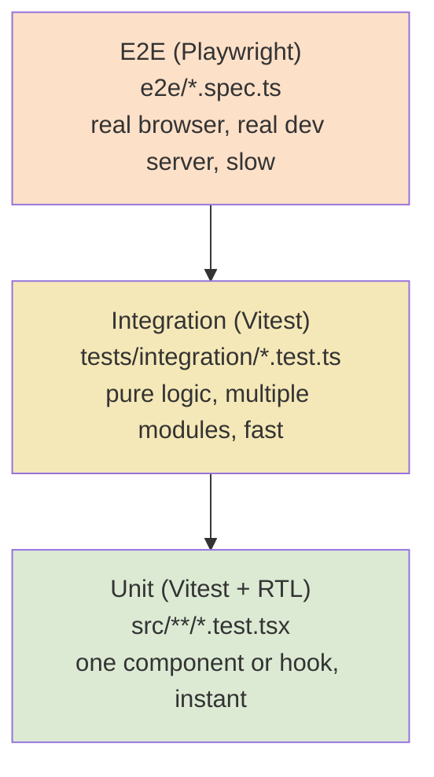

# Testing

Active contributors: Saksham

How tests are written and run in the 360 Flatmates web app. Two layers: Vitest plus React Testing Library for unit and integration tests, and Playwright for end-to-end flows. For the conventions your code must follow, see [patterns and conventions](patterns-and-conventions.md). For setup and commands, see [Getting started](../overview/getting-started.md).

## The test pyramid



Most coverage lives at the unit and integration layers. E2E is reserved for flows that must be proven in a real browser (login form structure, route protection, public page rendering). The split mirrors the [state management split](../systems/state-management.md): unit tests cover hooks and components, integration tests cover the compatibility engine and the TanStack Query key contract, and E2E covers user-visible flows.

## Unit and integration (Vitest + RTL)

Configured in `vitest.config.ts` and `vitest.setup.ts`. The environment is `jsdom`, globals are enabled, and the only setup file pulls in `@testing-library/jest-dom/vitest` for the custom matchers (`toBeInTheDocument`, `toHaveAttribute`, and friends).

The `@` alias resolves to `src/`, matching the app. The config also aliases `framer-motion` to a hand-written mock at `src/__mocks__/framer-motion.tsx`, so tests never wait on real animation frames. The mock is a `Proxy` that returns a `forwardRef` component for any motion element and strips framer props (`initial`, `animate`, `whileHover`, `whileTap`, `variants`, `transition`, `layout`, `layoutId`, and friends) before rendering the underlying DOM tag.

The test files are picked up by glob:

| Glob | What it covers |
| --- | --- |
| `src/**/*.test.ts(x)` | Co-located component and util tests |
| `src/**/__tests__/**/*.test.ts(x)` | Co-located hook and module tests |
| `tests/integration/**/*.test.ts(x)` | Cross-module integration tests |

### The render helper

`src/test-utils.tsx` exports `render`, `screen`, and `fireEvent`. The custom `render` wraps the component under test in `QueryClientProvider` (with a fresh `QueryClient` that has `retry: false` and `staleTime: 0`) and `MemoryRouter`. Use it instead of the raw RTL `render` so hooks that depend on a QueryClient or router work out of the box.

```tsx
import { render, screen } from "@/test-utils";

it("renders the heading", () => {
  render(<MyComponent />);
  expect(screen.getByRole("heading", { name: /flatmates/i })).toBeInTheDocument();
});
```

For hook tests, build a local wrapper with `QueryClientProvider` (see `src/hooks/__tests__/useProfiles.test.tsx` for the canonical pattern) and use `renderHook` plus `waitFor` from RTL.

### Integration tests

The integration tests live under `tests/integration/` and exercise pure logic across modules, with no DOM:

| File | What it verifies |
| --- | --- |
| `tests/integration/compatibility-engine.test.ts` | The six-dimension compatibility math, the DESIGN.md thresholds (70 green, 40 amber, 39 red), and `rankPeersByCompatibility` does not mutate input order. |
| `tests/integration/query-keys.test.ts` | Every query hook uses a consistent query-key structure, and every mutation invalidates the correct keys. It walks each module's function bodies with regex to extract `queryKey:` and `invalidateQueries` literals, so a renamed key breaks the build. |
| `tests/integration/route-contracts.test.ts` | Route-level contracts derived from `src/App.tsx`. |

### Patterns

**Mocking API calls.** Mock the `apiClient` at the module boundary, not `fetch`. The canonical pattern (from `src/hooks/__tests__/useProfiles.test.tsx`):

```tsx
const mockRequest = vi.fn();
vi.mock("@/lib/api", () => ({
  apiClient: { request: (...args: unknown[]) => mockRequest(...args) },
}));
```

Then drive `mockRequest.mockResolvedValue(...)` or `mockRejectedValue(...)`. This keeps tests decoupled from the HTTP transport and the Supabase token plumbing. For the client internals (401 refresh, header building), see [API client](../systems/api-client.md).

**Mocking Supabase auth.** The auth hooks read from `authStore`, not directly from Supabase, so most tests do not need a Supabase mock. When a test does need to control auth state, set `authStore` directly via `authStore.setState({ user, session, loading })`. The `_resetAuthForTests()` export in `src/hooks/useAuth.ts` resets the singleton initializer and the store between tests.

**Testing SSE.** Mock the connection manager and the broadcast layer, then drive the captured `onEvent` and `onStateChange` callbacks. The canonical pattern is in `src/hooks/__tests__/useSSE.test.tsx`:

```tsx
const mockManager = { connect: vi.fn(), disconnect: vi.fn(), getConnectionState: vi.fn() };
vi.mock("@/lib/sse/connection", () => ({
  getSSEManager: (options) => { sseManagerOptions = options; return mockManager; },
  resetSSEManager: vi.fn(),
}));
vi.mock("@/lib/sse/broadcast", () => ({ /* stubbed broadcast fns */ }));
```

Capture the options object passed to `getSSEManager`, then invoke `sseManagerOptions.onEvent({ type: "message", data: { conversation_id: 5 } })` inside `act(...)` and assert that `queryClient.invalidateQueries` was called with the right key. This proves the event-to-invalidation wiring without a real `EventSource`. For the production wiring, see [real-time](../features/real-time.md).

**The query key conventions test.** `tests/integration/query-keys.test.ts` is the guardrail for the TanStack Query cache contract. When you add a new query hook, the test picks up its `queryKey` automatically by scanning the module. If a mutation should invalidate that key, add the invalidation and the test will verify the match. If you rename a key scope (for example `["profiles"]` to `["users"]`), update every invalidation in the same change or this test fails. See [server state](../systems/server-state.md) for the key conventions.

### Running

| Command | What it does |
| --- | --- |
| `npm test` | `vitest run`, all unit and integration tests, single pass. |
| `npm run test:integration` | `vitest run tests/integration`, only the integration layer. |
| `npx vitest path/to/file.test.tsx` | One file. |
| `npx vitest -t "uses query key"` | One test by name. |

Vitest runs in band by default; the test suite is fast enough that watch mode is rarely needed.

## E2E (Playwright)

Configured in `playwright.config.ts`. The test directory is `e2e/`, the base URL is `http://127.0.0.1:5173`, and the `webServer` block auto-starts `npm run dev` (reusing an existing server outside CI, starting fresh inside CI). You do not need to start the dev server yourself.

There are four projects, run in dependency order:

| Project | Device | Storage state | Purpose |
| --- | --- | --- | --- |
| `auth-setup` | Desktop Chrome | writes `.auth/user.json` | Runs first. Authenticates a test user and saves storage state. |
| `chromium` | Desktop Chrome | none | Unauthenticated desktop tests. Depends on `auth-setup`. |
| `mobile` | Pixel 5 | none | Unauthenticated mobile viewport tests. Depends on `auth-setup`. |
| `authenticated` | Desktop Chrome | reads `.auth/user.json` | Tests that require a logged-in session. Depends on `auth-setup`. |

### Auth setup

`e2e/auth-setup.ts` is the first project. It navigates to `/login`, attempts a best-effort OTP flow against the dev backend, sets `localStorage["flatmates-playwright-auth"] = "true"` (which the dev-only `getPlaywrightSession()` in `src/hooks/useAuth.ts` turns into a fake session), and saves the browser storage state to `.auth/user.json`. If the real backend is unavailable, it injects a minimal Supabase auth cookie so the authenticated project can at least reach the guarded routes.

The `.auth/` directory is gitignored (see `.gitignore`). If you see auth-state errors in the `authenticated` project, delete `.auth/user.json` and re-run `auth-setup`. See [debugging](debugging.md) for this and other common failures.

### Running

| Command | What it does |
| --- | --- |
| `npm run test:e2e` | `playwright test`, all projects. Starts its own dev server. |
| `npx playwright test e2e/auth-flow.spec.ts` | One spec file. |
| `npx playwright test --project=mobile` | One project. |
| `npx playwright show-report` | Open the HTML report from the last run. |

E2E tests are slower than unit tests by design. Keep them focused on flows a user would actually perform. For the full flows covered today, see the specs in `e2e/` (auth, public pages, search, explore, chat, compatibility, visits, critical paths).

For common test failures and their fixes, see [debugging](debugging.md). For the server-state conventions the tests rely on, see [server state](../systems/server-state.md) and [state management](../systems/state-management.md).

## Key source files

| File | Why it matters |
| --- | --- |
| `vitest.config.ts` | jsdom environment, globals, the setup file, the `@` and `framer-motion` aliases, and the test globs. |
| `vitest.setup.ts` | Pulls in `@testing-library/jest-dom/vitest`. |
| `src/test-utils.tsx` | The `render` helper that wraps components in `QueryClientProvider` and `MemoryRouter`. |
| `src/__mocks__/framer-motion.tsx` | The Proxy mock that strips framer props and renders plain DOM. |
| `src/hooks/__tests__/useSSE.test.tsx` | Canonical SSE test pattern: mock the manager, drive `onEvent`. |
| `src/hooks/__tests__/useProfiles.test.tsx` | Canonical API mock pattern and hook test layout. |
| `tests/integration/query-keys.test.ts` | The query-key contract guardrail. |
| `tests/integration/compatibility-engine.test.ts` | The compatibility math and threshold contract. |
| `playwright.config.ts` | The four projects, the `webServer` auto-start, the base URL. |
| `e2e/auth-setup.ts` | The auth-setup project that writes `.auth/user.json`. |
| `e2e/auth-flow.spec.ts` | Login page structure and route-protection tests. |
