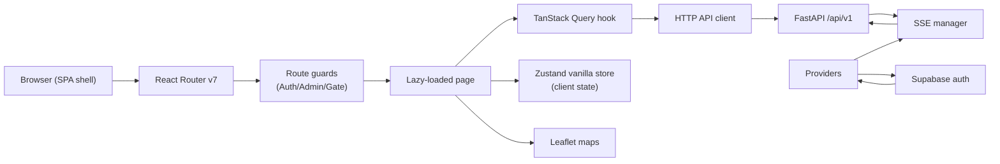
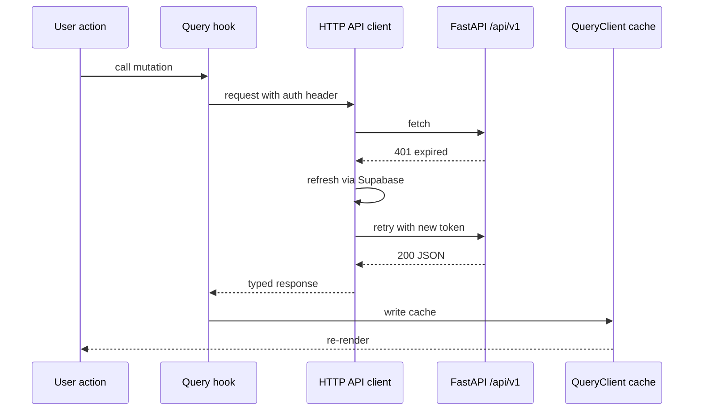

# Architecture

360 Flatmates is a single-page application. The browser loads one HTML document, React Router takes over, and every subsequent navigation is client-side. There is no server-side rendering. The only server-rendered HTML is produced at **build time** by the prerendering script (`scripts/prerender.ts`), which launches headless Chromium against the built bundle and writes the rendered output to `dist/<route>/index.html` for a fixed set of public routes.

## Entry points

| File | Purpose |
| --- | --- |
| `index.html` | Document shell, font links, flash-prevention theme script, PWA manifest link |
| `src/entry.tsx` | Validates env, mounts `<App />` into `#root`, registers the service worker |
| `src/App.tsx` | Declares the `<Routes>` tree with lazy-loaded pages and four layouts |
| `src/providers.tsx` | Wraps the app in QueryClientProvider, NuqsAdapter, auth/SSE/theme wiring |

`src/App.tsx` is the canonical map of every route in the app. It declares four layout wrappers:

- `PublicLayout` for marketing, discover, cities, blog, comparison, legal pages.
- `AuthLayout` for login, forgot-password, auth callback, add-phone.
- `AppLayout` for the authenticated app (wrapped in `AuthGuard` and `GateGuard`).
- `AdminLayout` for moderation and admin stats (wrapped in `AdminGuard`).

See [Routing and guards](../systems/routing-guards.md) for the guard logic.

## Runtime data flow

## State management split

The codebase enforces a hard boundary between two state stores. Mixing them is a bug.

| Store | Owns | Lives in | Example |
| --- | --- | --- | --- |
| TanStack Query | Server data (anything that comes from `/api/v1`) | `src/hooks/queries/` | `useMyProfile()`, `useSwipeDeck()` |
| Zustand vanilla stores | Client-only UI state (toggles, drafts, preferences, viewport) | `src/lib/stores/` | `uiStore.theme`, `searchStore.filters` |

Zustand stores use the `createStore()` pattern (not `create()` with a hook wrapper) so they can be consumed from non-React code: SSE handlers in `src/lib/sse/`, the provider effect in `src/providers.tsx`, and tests. React components read them with `useStore(store, selector)`. See [State management](../systems/state-management.md).

## Real-time updates

Real-time data flows over Server-Sent Events, not WebSockets. The `SSEConnectionManager` class in `src/lib/sse/connection.ts` opens an `EventSource`, listens for twelve named event types (`notification`, `message`, `visit_update`, `swipe`, `new_match`, `new_message`, and so on), and dispatches each into the QueryClient cache. A `BroadcastChannel` in `src/lib/sse/broadcast.ts` dedupes events across browser tabs so a notification opened in one tab does not re-appear in another. See [Real-time](../features/real-time.md).

## Authentication and token handling

Supabase owns the session. The `useAuth` hook in `src/hooks/useAuth.ts` initializes a singleton subscription to Supabase auth state changes and writes the session into `authStore`. The HTTP API client reads the access token through a getter injected by `providers.tsx`; on a 401 it calls the refresh handler (also injected), which calls `supabase.auth.refreshSession()`. This indirection keeps the API client Supabase-agnostic. See [API client](../systems/api-client.md) and [Auth flows](../features/auth-flows.md).

## Build pipeline

`npm run build` is a pipeline, not a single command:

1. `tsc --noEmit` - type-check the whole project.
2. `tsx scripts/generate-pwa-icons.ts` - generate standard and maskable PNG icons from `favicon.svg`.
3. `tsx scripts/generate-og-image.ts` - generate the social preview card.
4. `tsx scripts/generate-favicon-ico.ts` - generate the legacy `.ico`.
5. `tsx scripts/generate-sitemap.ts` - generate `sitemap.xml` from the route inventory and city/neighborhood catalog.
6. `vite build` - produce `dist/`.
7. `tsx scripts/prerender.ts` - launch headless Chromium, render every public route, write `dist/<route>/index.html`.

The prerender step is what makes the SPA crawlable. See [SEO and prerendering](../features/seo-prerendering.md).

## Deployment

The app is deployed on Netlify. `netlify.toml` runs `npx playwright install chromium && npm run build` and publishes `dist/`. The SPA fallback is `/* /index.html 200` in `public/_redirects`, but real prerendered files on disk take precedence. See [Deployment](../deployment.md).
