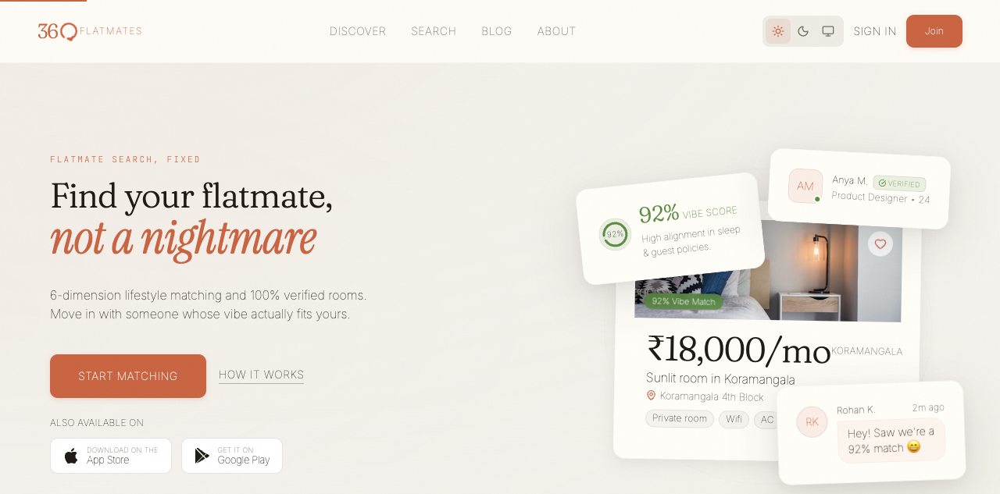

# 360 Flatmates overview

360 Flatmates is a warm-editorial web platform for finding compatible flatmates and verified rooms across India. It is the web client of the 360ghar product family, built as a client-rendered Progressive Web App that talks to a shared FastAPI backend at `/api/v1`.

The product's core differentiator is a **six-dimension lifestyle compatibility engine** (sleep schedule, cleanliness, food habits, smoking and drinking, guests policy, work style) that ranks potential flatmates by weighted fit, instead of relying on budget-only filtering. Every screen, from the swipe deck to the dashboard analytics, is built around that score.

## What it does

Three user-facing surfaces, gated by role:

- **Public surface** (marketing, SEO, discoverable listings, city and neighborhood pages, blog, comparison pages, legal docs). Auth not required; prerendered at build time so non-JS crawlers and LLM bots see real HTML.
- **Authenticated app surface** (home feed, swipe deck, likes and matches, chat, visits, listings management, dashboard, profile and onboarding). Mode-dependent navigation: room posters see listing tools, co-hunters see browse and swipe tools, "open to both" gets the full set.
- **Admin surface** (moderation queue for listings and user reports, prescreen review, platform stats). Restricted to users with `app_metadata.role === "admin"`.

## Who uses it

A 26-year-old engineer in a Bangalore co-working space at 3 PM, daylight from tall windows, half-distracted by Slack, who needs a flatmate in two weeks. The UI is designed to feel like a design-literate friend: good typography, warm surfaces, editorial craft, zero clutter. See [DESIGN.md](../../DESIGN.md) section 1 for the full physical scene and decision tenets.

## Tech stack in one paragraph

Vite plus React 19 plus React Router v7 (SPA, no SSR). TypeScript strict mode. Tailwind CSS v4 with custom design tokens defined as CSS custom properties. Zustand stores for client-only state using the vanilla `createStore()` pattern (so they can be consumed from non-React code). TanStack React Query for all server state, with hooks in `src/hooks/queries/`. Supabase for auth (phone OTP, password, Google, Apple). Server-Sent Events for real-time updates with BroadcastChannel multi-tab deduplication. Leaflet for maps. Firebase Cloud Messaging for web push. Build-time prerendering with Playwright Chromium for SEO.

## Quick links

- [Architecture](architecture.md) for the system diagram and how the pieces connect.
- [Getting started](getting-started.md) for install, env, build, test, and lint commands.
- [Glossary](glossary.md) for project-specific terms like flatmate modes and gate states.
- [By the numbers](../by-the-numbers.md) for a codebase statistics snapshot.
- [Lore](../lore.md) for the timeline of how the codebase evolved.

## Authoritative reference docs

These live outside the wiki and are the source of truth for their domains. The wiki summarizes them and links out rather than duplicating:

- [DESIGN.md](../../DESIGN.md) - all UI tokens, component specs, color, typography, motion, accessibility.
- [AGENTS.md](../../AGENTS.md) and [CLAUDE.md](../../CLAUDE.md) - coding conventions, structure, async-state rules.
- [plans/prd.md](../../plans/prd.md) - product requirements and technical architecture.
- [plans/ui_ux.md](../../plans/ui_ux.md) - page-by-page UI and interaction specs.
- [docs/flatmates-openapi.yaml](../../docs/flatmates-openapi.yaml) - the backend API contract.
- [AUDIT_REPORT.md](../../AUDIT_REPORT.md) - findings from the full-platform QA audit.
