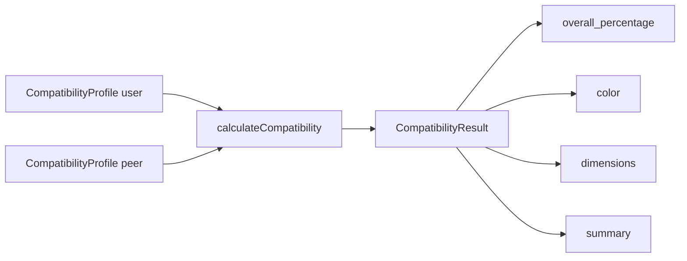

# Compatibility profile

Active contributors: Saksham

The compatibility profile is the lifestyle-only subset of a flatmate profile that the compatibility engine reads. It strips away identity, location, budget, and move-in timeline, keeping only the six lifestyle fields. Its canonical type is `CompatibilityProfile` in `src/lib/compatibility/types.ts`, and the engine that consumes it lives in `src/lib/compatibility/engine.ts`. This is the product's core differentiator: instead of filtering by budget alone, 360 Flatmates ranks potential flatmates by weighted lifestyle fit.

## The input shape

`CompatibilityProfile` is deliberately small. It is an optional `id` plus the six lifestyle fields, each optional:

```ts
interface CompatibilityProfile {
  id?: number;
  sleep_schedule?: SleepSchedule;
  cleanliness?: Cleanliness;
  food_habits?: FoodHabits;
  smoking_drinking?: SmokingDrinking;
  guests_policy?: GuestsPolicy;
  work_style?: WorkStyle;
}
```

Because a `FlatmatesProfile` (see [flatmate profile](flatmate-profile.md)) and a `FlatmatesPeer` both carry these six fields, either can be passed directly to the engine without adaptation. The fields are optional because a user mid-onboarding may not have answered all six yet, and the scorers return `0` for any missing value rather than throwing.

## The result shape

The engine returns a `CompatibilityResult`, the shape the UI renders as a match ring and a dimension breakdown:

```ts
interface CompatibilityResult {
  user_id?: number;
  peer_id?: number;
  overall_percentage: number;       // 0 to 100, rounded
  color: CompatibilityColor;        // "green" | "amber" | "red"
  dimensions: CompatibilityDimensionResult[];
  summary: string[];                // one human line per dimension
}
```

Each `CompatibilityDimensionResult` carries the dimension key, its label, its weight, the user and peer values, the raw `score` (0 to 100), a boolean `match` (true when `score >= COMPATIBILITY_MATCH_THRESHOLD`), and a human `summary` line like "Sleep Schedule: strong match".

## How the overall score is computed

`calculateCompatibility(user, peer)` in `src/lib/compatibility/engine.ts` does three things:

1. Maps over `LIFESTYLE_DIMENSIONS` (from `src/lib/data/domain.ts`), scoring each dimension with its dedicated scorer (see [lifestyle dimensions](lifestyle-dimensions.md)).
2. Sums the weighted scores: `overall = round(sum(score * weight))`. The weights live in `COMPATIBILITY_WEIGHTS` in `src/lib/compatibility/dimensions.ts` and sum to 1.0.
3. Buckets the overall into a color via `getCompatibilityColor`: `green` for 70 and above, `amber` for 40 to 69, `red` below 40.



## Helpers

The engine module also exports two utilities:

- `toApiCompatibilityBreakdown(result)` slims a `CompatibilityResult` into the shape the backend expects when the client reports a computed score, dropping the per-dimension `label` and `summary`.
- `rankPeersByCompatibility(user, peers)` takes a user profile and an array of `FlatmatesPeer`, computes each peer's `match_percentage`, and returns the array sorted descending. This is what powers the swipe deck and the people grid ordering.

## Match threshold

`COMPATIBILITY_MATCH_THRESHOLD` (set to `60` in `src/lib/compatibility/dimensions.ts`) is the per-dimension cutoff above which two values count as a "match" for that dimension. It does not gate the overall score, it gates the boolean `match` flag on each dimension result, which the UI uses to show a check or a gap per axis.

## Related pages

- [Lifestyle dimensions](lifestyle-dimensions.md) for the six axes, their options, weights, and scoring logic.
- [Flatmate profile](flatmate-profile.md) for the full profile the engine reads from.
- [Compatibility matching](../features/compatibility-matching/index.md) for how the engine plugs into the swipe deck and match list.

## Key source files

| File | Role |
| --- | --- |
| `src/lib/compatibility/types.ts` | `CompatibilityProfile`, `CompatibilityResult`, `CompatibilityDimensionResult`, `DimensionScorer` |
| `src/lib/compatibility/engine.ts` | `calculateCompatibility`, `getCompatibilityColor`, `rankPeersByCompatibility`, `toApiCompatibilityBreakdown` |
| `src/lib/compatibility/dimensions.ts` | `COMPATIBILITY_WEIGHTS`, `COMPATIBILITY_MATCH_THRESHOLD`, per-dimension scorers |
| `src/lib/data/domain.ts` | `LIFESTYLE_DIMENSIONS`, `CompatibilityColor`, the six lifestyle enum types |
