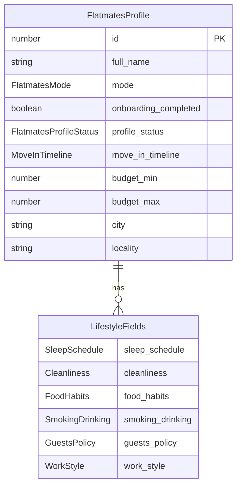

# Flatmate profile

Active contributors: Saksham

The flatmate profile is the central identity object in 360 Flatmates. It is the record a user builds during onboarding, the record the swipe deck ranks peers against, the record the chat thread resolves to a name and avatar, and the record the compatibility engine reads lifestyle fields from. Its canonical shape is `FlatmatesProfile` in `src/lib/api/user.types.ts`, validated by `flatmatesProfileSchema` in `src/lib/schemas/profile.ts`, and its enum values live in `src/lib/data/domain.ts`.

## Modes

Every profile carries a `mode` (the `FlatmatesMode` type, defined by `FLATMATE_MODE_VALUES`). The mode decides which navigation tabs the user sees and which surfaces they can reach:

| Mode | Label | What this user is doing |
| --- | --- | --- |
| `room_poster` | Room Poster | Has a room and wants to find a compatible flatmate |
| `seeker` | Room Seeker | Looking for a room in an existing flat |
| `co_hunter` | Co-Hunter | Looking for people to search for a home with |
| `open_to_both` | Open to Both | Flexible between posting a room and co-hunting |

The mode is selected on the first onboarding step and drives the rest of the flow. See [profile onboarding](../features/profile-onboarding.md) for the step-by-step.

## Status states

A profile moves through `FlatmatesProfileStatus` values, defined by `PROFILE_STATUS_VALUES`:

| Status | Meaning |
| --- | --- |
| `draft` | Profile created but not yet submitted |
| `pending_review` | Submitted, awaiting moderation |
| `active` | Live and discoverable by other users |
| `paused` | Temporarily hidden by the user |
| `rejected` | Failed moderation |

The onboarding flow and the gate-state guard (see [auth flows](../features/auth-flows.md)) read `profile_status` and `onboarding_completed` to decide whether the user can enter the app or must finish their profile first.

## Shape

The full `FlatmatesProfile` carries identity fields, location, budget, move-in timeline, and the six lifestyle fields. Required fields are `id`, `full_name`, `mode`, and `onboarding_completed`; everything else is optional because onboarding fills it in incrementally.

The six lifestyle fields (`sleep_schedule`, `cleanliness`, `food_habits`, `smoking_drinking`, `guests_policy`, `work_style`) are the input to the compatibility engine. They are documented in detail in [lifestyle dimensions](lifestyle-dimensions.md).

## Move-in timeline

`MoveInTimeline` (defined by `MOVE_IN_TIMELINE_VALUES`) captures when the user wants to move:

| Value | Label |
| --- | --- |
| `immediate` | Immediately |
| `this_month` | This month |
| `next_month` | Next month |
| `flexible` | Flexible |

## The peer subset

When a profile is shown to another user (in the swipe deck, in a match list, on a public profile), the backend returns a `FlatmatesPeer`. This is a strict subset of `FlatmatesProfile` (stripped of fields the peer should not see, like `email` and `phone`) plus a few computed fields: `match_percentage`, `non_negotiables`, `has_pets`, and `party_habit`. It can also carry a listing context (`property_id`, `property_title`, `main_image_url`, rent fields) when the peer has an active flatmate or PG listing. `flatmatesPeerSchema` in `src/lib/schemas/profile.ts` pins exactly which fields are allowed on a peer.

## Validation

`flatmatesProfileSchema` enforces the contract on the client: `full_name` is 1 to 120 characters, `bio` is capped at 500, `age` is 18 to 100, `onboarding_current_step` is 0 to 7, and `budget_min` cannot exceed `budget_max` (the refinement lives in `minMaxRefine` from `src/lib/schemas/common.ts`). The update variant, `flatmatesProfileUpdateSchema`, omits `id`, `email`, `phone`, and `last_active_at` (those are not client-editable) and partializes the rest.

## Related pages

- [Compatibility profile](compatibility-profile.md) for the lifestyle-only subset the engine reads.
- [Lifestyle dimensions](lifestyle-dimensions.md) for the six scored axes.
- [Profile onboarding](../features/profile-onboarding.md) for the step flow that builds this record.
- [Auth flows](../features/auth-flows.md) for how the gate-state guard uses `profile_status`.

## Key source files

| File | Role |
| --- | --- |
| `src/lib/api/user.types.ts` | `FlatmatesProfile`, `FlatmatesPeer`, `FlatmatesProfileUpdate` types |
| `src/lib/schemas/profile.ts` | `flatmatesProfileSchema`, `flatmatesPeerSchema` validation |
| `src/lib/data/domain.ts` | `FlatmatesMode`, `FlatmatesProfileStatus`, `MoveInTimeline`, and lifestyle enums |
| `src/lib/schemas/enums.ts` | Zod enum schemas for every profile field |
