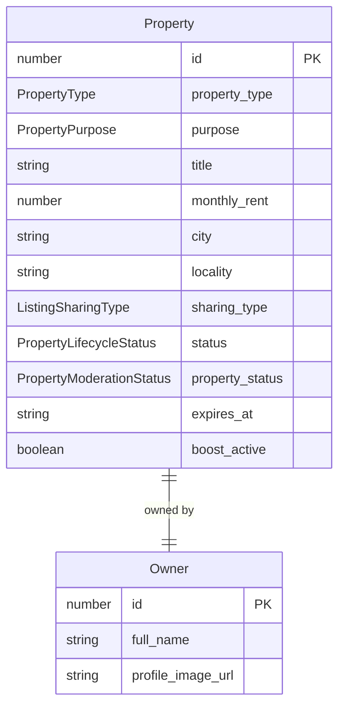

# Listing and property

Active contributors: Saksham

A listing is a room or flat posted by a room poster. In the codebase the term "property" and "listing" are used interchangeably: the canonical type is `Property` in `src/lib/api/property.types.ts`, validated by `propertySchema` in `src/lib/schemas/listing-builder.ts`, and its enum values live in `src/lib/data/domain.ts`. A listing shows up on the discover surface, in the swipe deck, on the map, in the dashboard, in a visit, and in a conversation as context. It is the second-most-cross-referenced object after the flatmate profile.

## Property type and purpose

Every listing has a `property_type` (defined by `PROPERTY_TYPE_VALUES`) and a `purpose` (defined by `PROPERTY_PURPOSE_VALUES`):

| Field | Allowed values | Notes |
| --- | --- | --- |
| `property_type` | `pg`, `flatmate` | PG is a managed co-living room; flatmate is a room in a shared flat |
| `purpose` | `rent` | Only rent is modeled today |

## Sharing type and society

A listing's room is described by `sharing_type` (defined by `LISTING_SHARING_TYPE_VALUES`): `private_room`, `shared_room`, `master_bedroom`, or `entire_flat`. The building is described by `society_type` (defined by `SOCIETY_TYPE_VALUES`): `gated`, `independent`, `co_living`, or `pg`. Society-level metadata (`society_amenities`, `society_vibe_tags`) is separate from the room-level `features` so a building can be tagged once and reused across rooms.

## Lifecycle and moderation

A listing carries two status fields, kept separate because they answer different questions:

| Field | Type | Answers |
| --- | --- | --- |
| `status` | `PropertyLifecycleStatus` (`draft`, `active`, `paused`, `expired`) | Is this listing live and visible to seekers? |
| `property_status` | `PropertyModerationStatus` (`pending_review`, `approved`, `rejected`) | Has this listing passed moderation? |

Only a listing that is both `active` and `approved` is discoverable. The lifecycle field is user-controlled (the poster can pause or let it expire); the moderation field is admin-controlled (see [admin moderation](../features/admin-moderation.md)). `expires_at` drives the expiry, and the dashboard surfaces `days_until_expiry` per listing.

## Shape

The full `Property` type also carries engagement counters (`interest_count`, `view_count`, `like_count`), the viewer's relationship to it (`liked`, `user_has_scheduled_visit`, `user_next_visit_date`), optional geo (`latitude`, `longitude`, `distance_km`), and the embedded `PropertyOwner`. The create payload, `PropertyCreate`, is a strict subset (no counters, no status fields, no owner) and is validated by `propertyCreateSchema`, which refines the payload so `security_deposit` cannot exceed twelve months of rent.

## Boost and renew

Two mutations extend a listing's reach or lifetime:

- **Boost** (`useBoostListing` in `src/hooks/queries/useProperties.ts`) posts to `POST /properties/{id}/boost` with a `BoostDuration` of `24h`, `7d`, or `30d` (defined by `BOOST_DURATION_VALUES`). The response carries a `boost_until` timestamp. Boost also invalidates the dashboard query so the active-boost flag refreshes.
- **Renew** (`useRenewListing`) posts to `POST /properties/{id}/renew` with a new `available_from` and `expires_at`, extending the listing's window. It returns the updated `Property`.

Both invalidate the `["properties", "mine"]` and the single-property caches on success so the dashboard and detail views reconcile immediately. See [dashboard analytics](../features/dashboard-analytics.md) for how `ListingAnalytics` reports on boost performance.

## Builder schema

The listing builder (`src/lib/schemas/listing-builder.ts`) splits the create flow into six step schemas that map onto the builder UI: `listingLocationStepSchema`, `listingSocietyStepSchema`, `listingRoomStepSchema`, `listingFlatStepSchema`, `listingCostsStepSchema`, and `listingAboutStepSchema`. Each is partializable so the draft can be saved at any step. The assembled draft (`listingDraftSchema`) is persisted to `localStorage` under a storage key so a user can leave and resume. See [listing management](../features/listing-management.md) for the step flow.

## Related pages

- [Listing management](../features/listing-management.md) for the builder, draft persistence, and CRUD.
- [Discover](../features/discover.md) for how seekers browse active listings.
- [Dashboard analytics](../features/dashboard-analytics.md) for the room-poster dashboard and per-listing stats.
- [Visits](../features/visits.md) for how a visit attaches to a listing.

## Key source files

| File | Role |
| --- | --- |
| `src/lib/api/property.types.ts` | `Property`, `PropertyCreate`, `PropertyUpdate`, boost and renew payloads, dashboard types |
| `src/lib/schemas/listing-builder.ts` | `propertyCreateSchema`, `propertySchema`, per-step builder schemas, `listingDraftSchema` |
| `src/lib/data/domain.ts` | `PropertyType`, `PropertyPurpose`, `ListingSharingType`, `SocietyType`, lifecycle and moderation statuses, `BoostDuration` |
| `src/hooks/queries/useProperties.ts` | `useMyProperties`, `useCreateProperty`, `useBoostListing`, `useRenewListing` |
