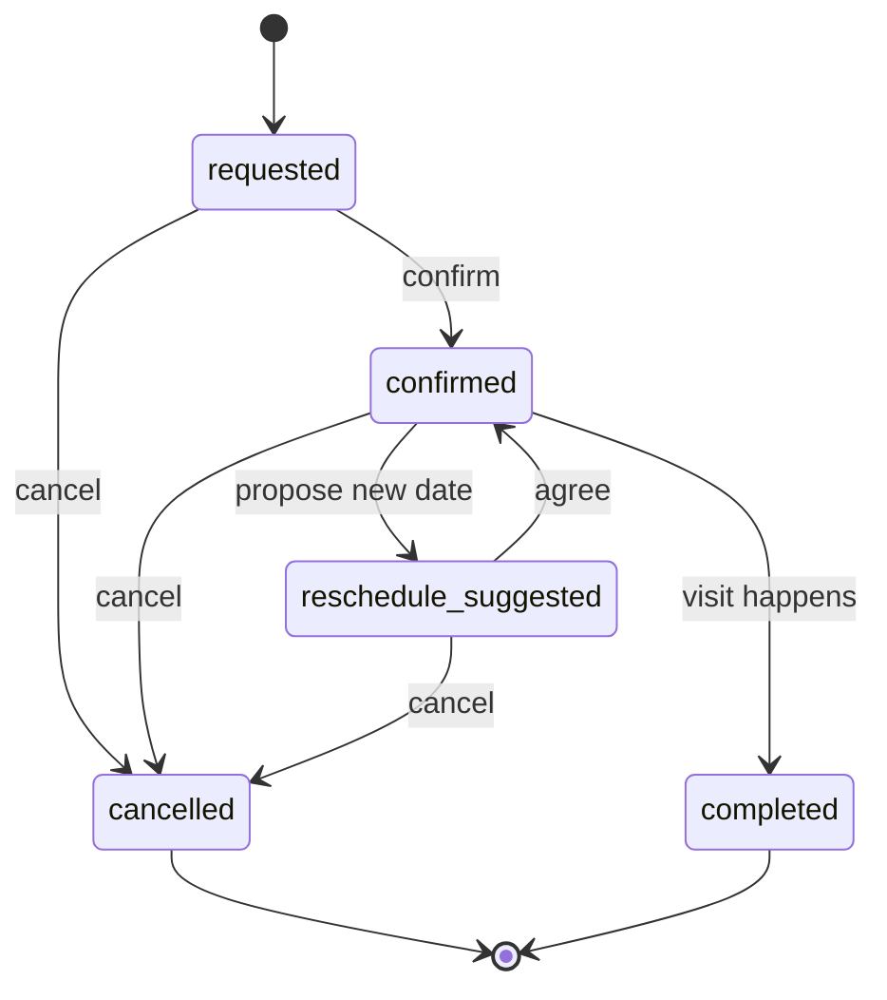

# Visit

Active contributors: Saksham

A visit is a scheduled in-person or virtual viewing of a listing, or a meet between two flatmates. It is the step between a match in chat and an actual move-in. Its canonical type is `Visit` in `src/lib/api/visit.types.ts`, validated by `visitSchema` in `src/lib/schemas/visit.ts`, and its status and context enums live in `src/lib/data/domain.ts`. A visit crosses the visits surface, the chat surface (where it is usually proposed), the listing surface (its property anchor), and the SSE layer (which pushes status updates to both parties).

## Context

Every visit has a `visit_context` (defined by `VISIT_CONTEXT_VALUES`):

| Context | Meaning |
| --- | --- |
| `property_tour` | A viewing of a specific listing, can stand alone against a property |
| `flatmate_meet` | A meet between two matched flatmates, requires a conversation and counterparty |

The schema enforces the distinction: `visitCreateSchema` in `src/lib/schemas/visit.ts` refines the payload so a `flatmate_meet` context requires both a `conversation_id` and a `counterparty_user_id`. You cannot book a flatmate meet without already being in a conversation with that flatmate. A `property_tour` can be created against just a `property_id`.

## Lifecycle

A visit moves through five statuses, defined by `VISIT_STATUS_VALUES`:

| Status | Meaning |
| --- | --- |
| `requested` | One party proposed the visit, awaiting the other's confirmation |
| `confirmed` | Both sides agreed, the visit is on the calendar |
| `reschedule_suggested` | One side asked to move the date, awaiting agreement |
| `cancelled` | Either side called it off |
| `completed` | The visit happened, feedback can be collected |



The frontend collapses these five backend statuses into four card statuses via `visitToVisitCardProps` in `src/lib/api/adapters.ts`, but the canonical lifecycle is the five-state machine above.

## Shape

`Visit` carries the property anchor, the optional conversation and match that produced it, scheduling fields, and post-visit feedback:

```ts
interface Visit {
  id: number;
  property_id: number;
  property_title?: string;
  visit_context: VisitContext;
  scheduled_date: string;
  actual_date?: string;
  status: VisitStatus;
  conversation_id?: number;
  counterparty_user_id?: number;
  match_id?: number;
  special_requirements?: string;
  visit_notes?: string;
  visitor_feedback?: string;
  interest_level?: InterestLevel;
  follow_up_required?: boolean;
  follow_up_date?: string;
  cancellation_reason?: string;
  rescheduled_from?: string;
  created_at?: string;
}
```

The create payload (`VisitCreate`) omits the feedback, follow-up, and audit fields (those are server-set or collected after completion). The update payload (`VisitUpdate`) is partial and is what the confirm, reschedule, and feedback flows send.

## Interest level and feedback

After a `completed` visit, the visitor can submit feedback. The star rating maps to an `InterestLevel` (defined by `INTEREST_LEVEL_VALUES`): 4 or 5 stars maps to `high`, 3 to `medium`, 1 or 2 to `low`. The feedback text and interest level are sent via `useUpdateVisit` and stored on the visit record.

## Mutations

The visits hooks live in `src/hooks/queries/useVisits.ts`:

- `useVisits(filters?)` lists visits, filtered by status, context, upcoming, or past.
- `useVisit(id)` loads a single visit.
- `useCreateVisit()` posts to `POST /visits` and invalidates the `["visits"]` namespace.
- `useUpdateVisit(id)` puts to `PUT /visits/{id}`, seeds the detail cache with the server response, then invalidates the namespace.
- `useCancelVisit(id)` posts to `POST /visits/{id}/cancel`, seeds the detail cache, then invalidates.

The detail-cache seeding pattern means the detail view updates instantly on confirm, reschedule, or cancel without waiting for the refetch, while the list and calendar reconcile in the background.

## Related pages

- [Visits](../features/visits.md) for the visits page, calendar, detail view, and the create-from-chat flow.
- [Messaging](../features/messaging.md) for the conversation a flatmate meet visit attaches to.
- [Listing and property](listing-property.md) for the property a visit is booked against.

## Key source files

| File | Role |
| --- | --- |
| `src/lib/api/visit.types.ts` | `Visit`, `VisitCreate`, `VisitUpdate`, `VisitReschedule`, `VisitCancel`, `VisitFilters`, `VisitList` |
| `src/lib/schemas/visit.ts` | `visitCreateSchema` (with flatmate-meet refinement), `visitUpdateSchema`, `visitSchema`, `visitListSchema` |
| `src/lib/data/domain.ts` | `VisitContext`, `VisitStatus`, `InterestLevel` |
| `src/hooks/queries/useVisits.ts` | `useVisits`, `useVisit`, `useCreateVisit`, `useUpdateVisit`, `useCancelVisit` |
