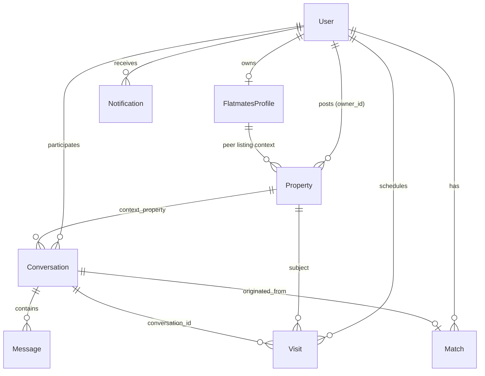

# Data models

Active contributors: Saksham

The 360 Flatmates web app talks to a FastAPI backend at `/api/v1`. The types in `src/lib/api/` describe the shapes that come back over the wire, and `src/lib/data/domain.ts` holds the enums and option catalogs (modes, statuses, lifestyle dimensions, sharing types, visit statuses, and so on) that those types reference. Together these two layers are the client's model of the world.

The canonical source of truth is the OpenAPI spec at `docs/flatmates-openapi.yaml`. The TypeScript types here mirror it, and `npm run generate:api-types` regenerates `src/lib/api/openapi-types.ts` from that spec. When the spec and the hand-written types disagree, the spec wins. This page documents the hand-written types (the ones the app actually imports), grouped by domain.

## Enum and option catalog

`src/lib/data/domain.ts` is the single home for every closed value set. Each enum is a `const` array plus a derived type, and most have a parallel `_OPTIONS` array with `{ value, label }` pairs for the UI. The lifestyle dimensions carry weights that feed the compatibility engine.

| Concept | Enum array | Type | Used by |
| --- | --- | --- | --- |
| Flatmate mode | `FLATMATE_MODE_VALUES` | `FlatmatesMode` | Profile, navigation, gate-state |
| Profile status | `PROFILE_STATUS_VALUES` | `FlatmatesProfileStatus` | Onboarding, gate-state guard |
| Move-in timeline | `MOVE_IN_TIMELINE_VALUES` | `MoveInTimeline` | Profile, search filters |
| Lifestyle dimensions | `LIFESTYLE_DIMENSIONS` | `LifestyleDimensionKey` | Compatibility engine (weighted) |
| Sleep / cleanliness / food / smoking / guests / work | `*_VALUES` | `SleepSchedule`, `Cleanliness`, `FoodHabits`, `SmokingDrinking`, `GuestsPolicy`, `WorkStyle` | Profile, peer, compatibility |
| Non-negotiables | `NON_NEGOTIABLE_VALUES` | `NonNegotiable` | Profile hard filters |
| Property type / purpose | `PROPERTY_TYPE_VALUES`, `PROPERTY_PURPOSE_VALUES` | `PropertyType`, `PropertyPurpose` | Listings |
| Listing sharing type | `LISTING_SHARING_TYPE_VALUES` | `ListingSharingType` | Listings, search, map pins |
| Society type | `SOCIETY_TYPE_VALUES` | `SocietyType` | Listings |
| Visit status / context | `VISIT_STATUS_VALUES`, `VISIT_CONTEXT_VALUES` | `VisitStatus`, `VisitContext` | Visits |
| Swipe action / target | `SWIPE_ACTION_VALUES`, `SWIPE_TARGET_TYPE_VALUES` | `SwipeAction`, `SwipeTargetType` | Swipe deck, history |
| Message type | `MESSAGE_TYPE_VALUES` | `MessageType` | Chat |
| Conversation source / status | `CONVERSATION_SOURCE_VALUES`, `CONVERSATION_STATUS_VALUES` | `ConversationSource`, `ConversationStatus` | Chat |
| Match status | `USER_MATCH_STATUS_VALUES` | `UserMatchStatus` | Likes and matches |
| Notification fields | (inline strings) | `FlatmatesNotification` | Notifications |
| Property lifecycle / moderation | `PROPERTY_LIFECYCLE_STATUS_VALUES`, `PROPERTY_MODERATION_STATUS_VALUES` | `PropertyLifecycleStatus`, `PropertyModerationStatus` | Listings, admin |
| Compatibility color | `COMPATIBILITY_COLOR_VALUES` | `CompatibilityColor` | Compatibility breakdown |
| User role | `USER_ROLE_VALUES` | `UserRole` | Auth, admin |
| Search type / sort | `SEARCH_TYPE_VALUES`, `SEARCH_SORT_VALUES` | `SearchType`, `SearchSort` | Search, explore |
| Alert frequency / channel | `ALERT_FREQUENCY_VALUES`, `ALERT_CHANNEL_VALUES` | `AlertFrequency`, `AlertChannel` | Saved searches, alerts |
| Report reason / status | `USER_REPORT_REASON_VALUES`, `USER_REPORT_STATUS_VALUES`, `REPORT_*_VALUES` | `UserReportReason`, `ReportStatus`, `ReportAction` | Reports, admin moderation |
| Moderation action | `MODERATION_ACTION_VALUES` | `ModerationAction` | Admin moderation |

The lifestyle dimensions deserve a callout: `LIFESTYLE_DIMENSIONS` lists six axes (`sleep_schedule`, `cleanliness`, `food_habits`, `smoking_drinking`, `guests_policy`, `work_style`) with weights that sum to 1.0 (0.2, 0.2, 0.15, 0.2, 0.15, 0.1). Those weights are what the compatibility engine multiplies against per-dimension scores. See [compatibility profile](../primitives/compatibility-profile.md) and [lifestyle dimensions](../primitives/lifestyle-dimensions.md).

## Core entities and relationships

The eight central domain objects are `User`, `FlatmatesProfile`, `Property`, `Conversation`, `Message`, `Visit`, `Match`, and `Notification`. The diagram below shows how they reference each other. Cardinalities read left to right (`||--o{` is one-to-many).

The key structural facts the diagram encodes: a `User` owns exactly one `FlatmatesProfile`; a `Property` is posted by a `User` (via `owner_id`); a `Conversation` always has exactly two participants and optionally a `context_property` (the listing that sparked it) and a `match_id` (if it came from a mutual like); and a `Visit` is tied to a `Property` and optionally to a `Conversation` and `Match`.

## User and profile

`User` (`src/lib/api/user.types.ts`) is the auth and account record. `FlatmatesProfile` is the lifestyle and identity record built during onboarding. A profile is a strict superset of what a peer sees: when a profile is rendered to another user, the backend returns `FlatmatesPeer`, which omits `email` and `phone` and adds computed fields (`match_percentage`, `non_negotiables`, `has_pets`, `party_habit`) plus an optional embedded listing context.

| Field | Type | Notes |
| --- | --- | --- |
| `User.id` | `number` | Primary key |
| `User.email`, `User.phone` | `string?` | At least one is set after onboarding |
| `User.role` | `UserRole?` | `user`, `admin`, or `agent` |
| `User.email_verified`, `User.phone_verified` | `boolean?` | From Supabase confirmations |
| `User.last_auth_method` | enum? | `google`, `email_password`, `phone_password`, `phone_otp`, `email_otp` |
| `FlatmatesProfile.mode` | `FlatmatesMode` | Required; drives navigation |
| `FlatmatesProfile.onboarding_completed` | `boolean` | Required; read by gate-state guard |
| `FlatmatesProfile.profile_status` | `FlatmatesProfileStatus?` | `draft` to `active` lifecycle |
| `FlatmatesProfile.{lifestyle}` | enums? | The six scored fields |
| `FlatmatesProfile.budget_min/max` | `number?` | `min <= max` enforced client-side |
| `FlatmatesPeer.match_percentage` | `number?` | Computed server-side per viewer |

See [flatmate profile](../primitives/flatmate-profile.md) for the full field list and validation rules.

## Property (listing)

`Property` (`src/lib/api/property.types.ts`) is the listing record. A `PropertyCreate` omits server-computed fields (`id`, `view_count`, `interest_count`, `distance_km`); a full `Property` carries analytics counters, moderation status, geolocation, and an embedded `PropertyOwner`. `PaginatedPropertyResponse` wraps a page of properties with `total`, `page`, `limit`, `total_pages`, and the optional `search_center` used for distance sorting.

| Field | Type | Notes |
| --- | --- | --- |
| `Property.id`, `owner_id` | `number` | PK and FK to `User` |
| `Property.property_type` | `PropertyType` | `pg` or `flatmate` |
| `Property.monthly_rent` | `number` | Required |
| `Property.sharing_type` | `ListingSharingType?` | `private_room`, `shared_room`, `master_bedroom`, `entire_flat` |
| `Property.latitude/longitude` | `number?` | For map pins and distance sort |
| `Property.status` / `property_status` | lifecycle / moderation | Two distinct status axes |
| `Property.interest_count`, `view_count`, `like_count` | `number?` | Analytics counters |
| `Property.distance_km` | `number?` | Only present on search results |
| `Property.owner` | `PropertyOwner?` | Embedded owner identity |

The admin view is `FlatmateListingAdmin`, which adds `ai_prescreen_result`, `ai_prescreen_flags`, and `ai_prescreen_reason`. See [listing and property](../primitives/listing-property.md).

## Conversation and message

`ConversationSummary` (`src/lib/api/conversation.types.ts`) is the row in the inbox: it embeds a `FlatmatesPeer`, an optional `ConversationPropertyContext`, the last message preview, unread count, and a `ConversationQnAState` (the icebreaker Q&A exchange). `MessageOut` is a single message with `message_type` (`text`, `image`, `system`, `visit_request`). See [conversation and message](../primitives/conversation-message.md).

| Field | Type | Notes |
| --- | --- | --- |
| `ConversationSummary.id` | `number` | PK |
| `ConversationSummary.source` | `ConversationSource` | `listing_interest` or `profile_match` |
| `ConversationSummary.status` | `ConversationStatus` | `active`, `archived`, `blocked`, `closed` |
| `ConversationSummary.peer` | `FlatmatesPeer` | Embedded |
| `ConversationSummary.context_property` | `ConversationPropertyContext?` | The listing that sparked it |
| `ConversationSummary.qna` | `ConversationQnAState?` | Icebreaker answers |
| `MessageOut.message_type` | `MessageType` | Drives rendering |
| `MessageOut.metadata` | `JsonObject?` | Freeform, typed per message type |

## Visit

`Visit` (`src/lib/api/visit.types.ts`) ties a scheduled viewing to a `Property`, and optionally to a `Conversation` and `Match`. `visit_context` distinguishes a property tour from a flatmate meet. The lifecycle runs `requested` to `confirmed` to `completed`, with `reschedule_suggested` and `cancelled` as side branches. Post-visit fields (`visitor_feedback`, `interest_level`, `follow_up_required`) are filled after completion. See [visit](../primitives/visit.md).

## Match and compatibility

`MatchSummary` and `IncomingLikeSummary` (`src/lib/api/match.types.ts`) are the inbox rows for mutual and one-sided likes. `CompatibilityBreakdown` is the structured score: an `overall_percentage`, a `color` (`green` for >=70%, `amber` for 40-69%, `red` for <40%), and a `dimensions` array where each `CompatibilityDimension` carries its `weight`, `user_value`, `peer_value`, per-dimension `score`, and a boolean `match`. The weights come straight from `LIFESTYLE_DIMENSIONS`. See [compatibility profile](../primitives/compatibility-profile.md).

## Notification

`FlatmatesNotification` (`src/lib/api/notification.types.ts`) is a thin record: `id`, `type`, `title`, `body`, `is_read`, an optional `reference_id` and `route` (for deep-linking into the right app screen), and `created_at`. Filters (`NotificationFilters`) allow scoping by `type` and `is_read`. See [notification](../primitives/notification.md).

## Where the spec lives

The hand-written types in `src/lib/api/*.types.ts` are re-exported from `src/lib/api/types.ts` for convenience, but they are a mirror, not the source. The source is the OpenAPI spec:

- [REST endpoints](../api/rest-endpoints.md) for the endpoint map.
- [`docs/flatmates-openapi.yaml`](../../docs/flatmates-openapi.yaml) for the canonical contract. Run `npm run generate:api-types` after editing it to refresh `src/lib/api/openapi-types.ts`.

## Related pages

- [Flatmate profile](../primitives/flatmate-profile.md) for the profile and peer field-level detail.
- [Listing and property](../primitives/listing-property.md) for the property field-level detail.
- [Compatibility profile](../primitives/compatibility-profile.md) for the lifestyle-only subset the engine reads.
- [REST endpoints](../api/rest-endpoints.md) for the endpoint map.
- [`docs/flatmates-openapi.yaml`](../../docs/flatmates-openapi.yaml) for the canonical API contract.

## Key source files

| File | Role |
| --- | --- |
| `src/lib/data/domain.ts` | All enums, option catalogs, lifestyle dimension weights |
| `src/lib/api/types.ts` | Barrel re-export of all domain type files |
| `src/lib/api/common.types.ts` | `JsonObject`, `CatalogEntry`, catalog types, device and share types |
| `src/lib/api/user.types.ts` | `User`, `FlatmatesProfile`, `FlatmatesPeer`, `FlatmatesBootstrap`, reports |
| `src/lib/api/property.types.ts` | `Property`, `PropertyCreate`, `PaginatedPropertyResponse`, analytics, admin listing |
| `src/lib/api/conversation.types.ts` | `ConversationSummary`, `MessageOut`, Q&A state |
| `src/lib/api/visit.types.ts` | `Visit`, `VisitCreate`, `VisitUpdate`, reschedule/cancel/complete payloads |
| `src/lib/api/search.types.ts` | `SearchFilters`, `WebSearchResponse`, saved searches, map view, swipe deck |
| `src/lib/api/match.types.ts` | `MatchSummary`, `IncomingLikeSummary`, `CompatibilityBreakdown` |
| `src/lib/api/notification.types.ts` | `FlatmatesNotification`, mark-read payloads |
| `src/lib/api/admin.types.ts` | Admin moderation, reports, dashboard and admin stats |
| `docs/flatmates-openapi.yaml` | Canonical API contract (source of truth) |
