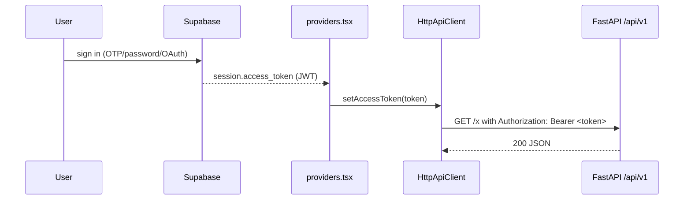

# Security

Active contributors: Saksham

360 Flatmates is a client-rendered SPA, so the security model is built around three trust boundaries (public, authenticated, admin), a Supabase-issued JWT carried in the `Authorization` header, route guards that enforce the boundaries client-side, and a deliberately small set of secrets that ever reach the browser. This page covers the boundaries, the auth token flow, the SSE token-in-URL trade-off and its mitigations, the route guards, environment variable handling, the `robots.txt` policy, and the Zod-based input validation that runs before any payload is submitted. For the end-to-end login and OAuth flows, see [Auth flows](features/auth-flows.md). For the real-time transport, see [Real-time](features/real-time.md). For the `HttpApiClient` mechanics, see [API client](systems/api-client.md).

## Trust boundaries

The app splits cleanly into three surfaces, each with its own layout and guard:

| Boundary | Layout | Guard | Example routes |
| --- | --- | --- | --- |
| Public | `PublicLayout` (`src/pages/public/PublicLayout.tsx`) | None (crawlers and signed-out visitors allowed) | `/`, `/discover`, `/cities/*`, `/blog/*`, `/compare/*`, `/about`, `/terms`, `/privacy`, `/stats` |
| Authenticated | `AppLayout` (`src/pages/app/AppLayout.tsx`) | `AuthGuard` then `GateGuard` | `/home`, `/search`, `/swipe`, `/likes`, `/matches`, `/chats/*`, `/visits`, `/listing/*`, `/post`, `/manage`, `/dashboard`, `/profile` |
| Admin | `AdminLayout` (`src/pages/admin/AdminLayout.tsx`) | `AdminGuard` | `/admin`, `/admin/moderation`, `/admin/reports` |

There is also an auth surface (`AuthLayout` wrapping `/login`, `/signup`, `/forgot-password`, `/auth/callback`, `/add-phone`) gated by `AuthRedirectGuard`, which bounces already-signed-in users away from the auth screens. See [Routing and guards](systems/routing-guards.md) for the full route tree and the guard implementations.

## Authentication: Supabase JWT

Auth is owned by Supabase (phone OTP, password, Google, Apple). The SPA never sees a password and never mints its own tokens. The flow:

1. Supabase issues a short-lived access token (JWT) and a refresh token after a successful sign-in. The session is held by the Supabase browser client and mirrored into the Zustand `authStore` by `src/hooks/useAuth.ts`.
2. `src/providers.tsx` watches `session?.access_token` in an effect and pushes the live value into the API client via `setAccessToken(token)`. The client reads the current token on every request without being re-created, so a refreshed token is picked up immediately.
3. The `HttpApiClient` attaches `Authorization: Bearer <token>` to every authenticated request via `buildHeaders`. Public requests (marked `auth: false` on the `ApiRequest`) skip the header entirely.



## The 401 refresh single-flight

Access tokens are short-lived. When one expires, the backend returns `401`, and the client attempts exactly one refresh-and-retry cycle before giving up. The whole flow is single-flight: a concurrent burst of 401s shares one refresh promise, so a page loading ten queries at once triggers at most one refresh.

The mechanics, implemented in `src/lib/api/client.ts`:

- The first 401 sets `this.refreshing = this.onAuthFailure()` and clears it in a `finally` block.
- Any 401 that arrives while `this.refreshing` is non-null awaits the same promise rather than starting a second refresh.
- `onAuthFailure` is wired in `src/providers.tsx` to call `getSupabaseBrowserClient().auth.refreshSession()`, update `_accessToken` on success, and itself use a module-level `refreshPromise` for a second layer of single-flight dedup.
- If the refresh resolves to a token, the original request is retried once with the new token. If it resolves to `null` (refresh failed or no session), the 401 surfaces as an `ApiClientError` of type `auth`.
- A non-401 failure never triggers a refresh.

The `QueryClient` retry policy in `providers.tsx` reads `appError.type === "auth"` to decide whether a failed query is worth retrying (one retry, then stop). See [API client](systems/api-client.md) for the full sequence diagram and [Server state](systems/server-state.md) for the retry policy.

## The SSE token-in-URL trade-off

The real-time channel is a single Server-Sent Events connection per browser, owned by `SSEConnectionManager` in `src/lib/sse/connection.ts`. The browser `EventSource` API does not support custom headers, so the auth token cannot travel in an `Authorization` header the way REST requests do. Instead it is passed as a URL query parameter:

```ts
const url = `${this.url}?token=${encodeURIComponent(token)}`;
const es = new EventSource(url);
```

This is a known limitation of the `EventSource` specification, and the code documents it explicitly with a `SECURITY NOTE`. The trade-off is accepted because the alternative (a custom `fetch` + `ReadableStream` SSE parser with an `Authorization` header) is materially more complex and re-implements what the browser gives for free. The mitigations, all in place:

- **Short-lived token.** The token is a Supabase JWT with refresh rotation, so a leaked query-string token has a short window of validity. The SSE manager also calls `onAuthFailure` after repeated auth failures, which triggers the same refresh flow as the REST client.
- **URL-encoding.** `encodeURIComponent(token)` prevents injection into the URL.
- **Referrer-Policy.** A `Referrer-Policy: no-referrer` (or equivalent) on the document prevents the token from leaking via the `Referer` header if the SSE response or any linked resource navigates off-origin.
- **Server-side query-string hygiene.** The server is expected not to log the full query string in production, so the token does not end up in access logs.

See [Real-time](features/real-time.md) for the connection lifecycle, the BroadcastChannel multi-tab dedup, and the twelve event types.

## Route guards

All guards live in `src/pages/guards.tsx` and render `<PageSpinner />` while `useAuth().loading` is true, then make a single redirect decision and otherwise render `<Outlet />`.

| Guard | Protects | Behavior |
| --- | --- | --- |
| `AuthGuard` | The authenticated app and the post-Google add-phone flow | No user after loading: redirect to `/login?redirect=<encoded current path + search>`. |
| `AdminGuard` | `/admin/*` | No user: redirect to `/login`. User present but `user.app_metadata?.role !== "admin"`: redirect to `/home`. |
| `AuthRedirectGuard` | `/login`, `/signup`, `/forgot-password`, `/auth/callback` | Already signed in and not mid-auth-flow: bounce to the resolved `?redirect=` target (default `/home`). The `midAuthFlow` exception is critical, because OTP verification signs the user in before the set-password step finishes. |
| `GateGuard` | Sits between `AuthGuard` and `AppLayout` | Reads the backend-computed auth stage from `authStore.authStage` (fetched once per session via `getAuthState`). Redirects to `/complete-profile` for `profile_completion`, or `/onboarding` for `app_onboarding`. Skips enforcement for unauthenticated users, mid-auth flows, and when already on a gate route. |

The `?redirect=` value is sanitized by `resolveRedirect` in `src/pages/guards.tsx`: it accepts only same-origin absolute paths (must start with a single `/`, must not start with `//` which would be protocol-relative to another host). Anything else, including a missing value, falls back to `/home`. This closes the open-redirect hole where a crafted link could send a freshly signed-in user to an attacker-controlled site. See [Routing and guards](systems/routing-guards.md) for the full route tree.

## Environment variable handling

Vite only exposes variables prefixed with `VITE_` to the client bundle, and it inlines them at build time. Anything else in the build environment (database URLs, service-role keys, secrets) is stripped from the bundle and never reaches the browser. `src/lib/env.ts` enforces this with a Zod schema:

```ts
const envSchema = z.object({
  VITE_API_BASE_URL: z.string().url(),
  VITE_SUPABASE_URL: z.string().url(),
  VITE_SUPABASE_PUBLISHABLE_KEY: z.string().min(1),
  VITE_VAPID_PUBLIC_KEY: z.string().min(1).optional(),
});
```

The Supabase key that ships to the client is the publishable (anon) key, which is safe to expose: row-level security on the Supabase project gates every write. The service-role key, if one exists for backend operations, is never referenced from this repo. `src/entry.tsx` calls `validateEnv()` before mounting the app, so a missing or malformed required variable fails the deploy loudly with a configuration-error screen instead of shipping a broken bundle. See [Configuration](reference/configuration.md) for the full variable reference.

## `robots.txt` policy

`public/robots.txt` encodes the trust boundaries for crawlers. The default group (`User-agent: *`) and an explicit AI/LLM crawler group (GPTBot, ChatGPT-User, OAI-SearchBot, Google-Extended, ClaudeBot, Applebot, Meta-ExternalAgent, and roughly twenty others) share the same rules:

- **Allowed** (public, indexable): `/`, `/discover`, `/discover/`, `/cities/`, `/blog`, `/blog/`, `/compare/`, `/stats`, `/about`, `/terms`, `/privacy`.
- **Disallowed** (authenticated or private): `/search`, `/explore`, `/listing/`, `/profile/`, `/post`, `/manage`, `/dashboard`, `/swipe`, `/likes`, `/matches`, `/chats`, `/visits`, `/onboarding`, `/choose-role`, `/location`, `/verify`, `/help`, `/alerts`, `/saved-searches`, `/notifications`, `/add-phone`.
- **Disallowed** (app, admin, auth shells): `/app/`, `/admin/`, `/auth/`, `/login`, `/signup`, `/forgot-password`, `/maintenance`, `/error`.

This keeps authenticated and user-generated routes out of the index while letting crawlers and LLM answer-engine bots see the marketing, discover, city, blog, and comparison surfaces. The prerender step in `scripts/prerender.ts` mirrors this list exactly: it only prerenders routes that are both under `PublicLayout` and allowed by `robots.txt`, so the sitemap and the prerendered HTML never advertise a route that should be private. See [SEO and prerendering](features/seo-prerendering.md).

## Input validation with Zod

Every form payload is validated client-side with Zod before it is sent. The schemas live in `src/lib/schemas/` and mirror the backend contract: field names use the backend's snake_case so a validated payload can be posted to `/api/v1` without a mapping layer, and enum values are imported from `src/lib/data` (the canonical string unions) and wrapped in `z.enum(...)`. The schemas feed `react-hook-form` (via `@hookform/resolvers/zod`) for form state and `nuqs` for URL state, so the same schema validates user input, persisted drafts rehydrated from `localStorage`, and the inferred TypeScript types that flow through components. See [Validation schemas](systems/validation-schemas.md) for the schema inventory.

This is defense in depth, not the only line of defense: the FastAPI backend re-validates every payload against its own Pydantic models, and the `HttpApiClient` surfaces 422 responses as `AppError` of type `validation` with field-level details parsed from the body (see [API client](systems/api-client.md)). Client-side validation is about immediate feedback and avoiding wasted round-trips; the backend remains authoritative.

## Error normalization

The client never surfaces raw `TypeError` or unknown thrown values to the UI. `src/lib/api/errors.ts` exports `toAppError(error)`, which normalizes any thrown value into a tagged `AppError` union (`network`, `auth`, `server`, `not_found`, `validation`, `rate_limit`, `conflict`, `unknown`), and `mapStatusToAppError(status, message, fields, retryAfter)`, which maps HTTP statuses exhaustively. The `QueryClient` retry policy reads `appError.type === "auth"` to decide whether to retry, so an auth failure does not loop forever, and a validation error never silently retries. See [API client](systems/api-client.md) for the full status-to-error map.

## Related pages

- [Auth flows](features/auth-flows.md) for the end-to-end login, OTP, password, and OAuth flows.
- [Real-time](features/real-time.md) for the SSE connection manager, multi-tab dedup, and event dispatch.
- [API client](systems/api-client.md) for the `HttpApiClient`, the 401 refresh-and-retry flow, and error normalization.
- [Routing and guards](systems/routing-guards.md) for the route tree, the four guards, and redirect resolution.
- [Validation schemas](systems/validation-schemas.md) for the Zod schema inventory.

## Key source files

| File | Role |
| --- | --- |
| `src/lib/sse/connection.ts` | `SSEConnectionManager`, the `SECURITY NOTE` on the token-in-URL trade-off and its mitigations |
| `src/lib/api/client.ts` | `HttpApiClient`, `buildHeaders` (auth header injection), the 401 refresh-and-retry single-flight |
| `src/lib/api/errors.ts` | `AppError` union, `ApiClientError`, `mapStatusToAppError`, `toAppError`, `isAppError` |
| `src/lib/api/auth.ts` | `checkIdentifierStatus` (public), `reportLastMethod`, `getAuthState` (gate stage) |
| `src/hooks/useAuth.ts` | Supabase session bootstrap, the auth-state subscription, `isTokenExpired` |
| `src/providers.tsx` | Pushes `session.access_token` into the client, wires the Supabase-backed refresh handler, runs the gate-state fetch |
| `src/pages/guards.tsx` | `AuthGuard`, `AdminGuard`, `AuthRedirectGuard`, `GateGuard`, `resolveRedirect` (open-redirect defense) |
| `src/lib/env.ts` | Zod-validated environment variable accessor; only `VITE_`-prefixed vars reach the client |
| `src/entry.tsx` | Calls `validateEnv()` before mount; renders the configuration-error screen on failure |
| `.env.example` | Documents the required and optional `VITE_` variables |
| `public/robots.txt` | Disallow rules for every authenticated, app, admin, and auth route; allow rules for public surfaces |
