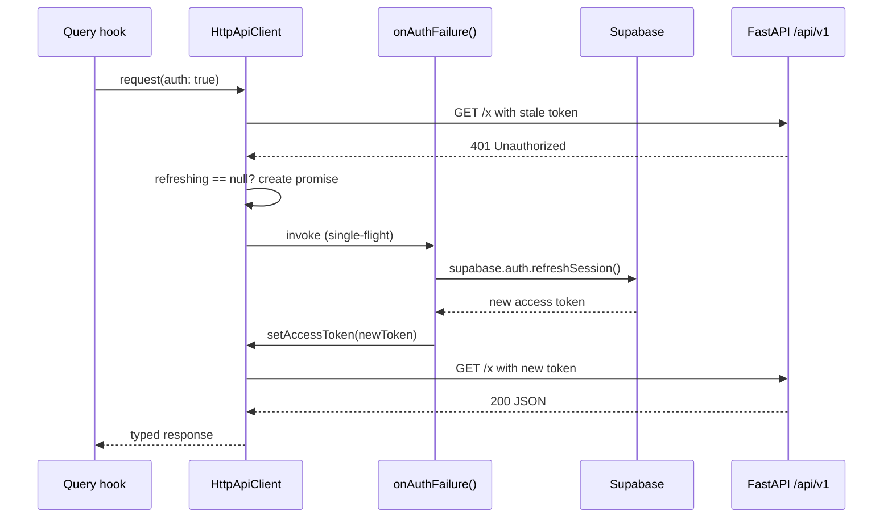

# API client

Active contributors: Saksham

The API client is the only path between the SPA and the FastAPI backend at `/api/v1`. It is a thin, typed layer that builds URLs, injects the bearer token, normalizes errors, and transparently refreshes expired sessions. Everything above it (TanStack Query hooks, SSE manager, the auth flow) calls `apiClient.request(...)`, and nothing below it knows about Supabase.

The canonical implementation lives in `src/lib/api/client.ts` (`HttpApiClient`), with error types in `src/lib/api/errors.ts`, the wiring in `src/lib/api/index.ts`, and the Supabase-side refresh handler injected from `src/providers.tsx`.

## The `ApiAdapter` abstraction

The client is consumed through a single interface so it can be swapped in tests or in a future React Server Components pass:

```ts
export interface ApiAdapter {
  request<TResponse, TBody = unknown>(request: ApiRequest<TBody>): Promise<TResponse>;
}
```

An `ApiRequest` is a small, serializable description of a call: `method`, `path`, `query`, `body`, `headers`, `signal`, and an `auth` flag (default `true`). The `auth: false` opt-out is used by public endpoints such as `GET /properties` (search) and `GET /flatmates/catalogs`, which must work for signed-out visitors and crawlers.

The concrete implementation is `HttpApiClient`, built through `createApiClient(options)` and exported from `src/lib/api/index.ts` as the singleton `apiClient`. Adapters that map API shapes into component props live alongside it in `src/lib/api/adapters.ts` (for example `propertyToListingCardProps`, `conversationToConversationRowProps`).

## URL building

`buildApiUrl(baseUrl, path, query)` is the single function that turns a request into a fully qualified URL. It:

1. Resolves `baseUrl` from the passed option or `getEnv().VITE_API_BASE_URL`, stripping any trailing slash.
2. Prefixes `path` with `/` if missing and concatenates onto the base.
3. Serializes `query` with `URLSearchParams`, dropping `undefined`, `null`, and empty-string values, and repeating array keys so `amenities=WiFi&amenities=Parking` round-trips cleanly.

This is what every hook in `src/hooks/queries/` ultimately calls, so the query encoding rules are centralized and consistent.

## Auth header injection

`HttpApiClient` never imports Supabase. Instead it accepts two callbacks through `ApiClientOptions`:

- `getAccessToken(): Promise<string | null> | string | null`, called on every request whose `auth` flag is truthy.
- `onAuthFailure(): Promise<string | null>`, called only on a 401 (see below).

`buildHeaders` layers them: default headers, `Accept: application/json`, `Content-Type: application/json` when a body is present, any per-request overrides, and finally `Authorization: Bearer <token>` when a token was resolved. The `auth: false` requests skip the `Authorization` header entirely.

## The 401 refresh-and-retry flow

When a request comes back `401` and the request was authenticated, the client attempts exactly one refresh-and-retry cycle before giving up. The whole flow is single-flight: a concurrent burst of 401s shares one refresh promise.



The mechanics:

- The first 401 sets `this.refreshing = this.onAuthFailure()` and clears it in a `finally` block.
- Any 401 that arrives while `this.refreshing` is non-null awaits the same promise rather than starting a second refresh.
- If the refresh resolves to a token, the original request is retried once with the new token. If it resolves to `null` (refresh failed or no session), the 401 surfaces as an `ApiClientError` of type `auth`.
- A non-401 failure never triggers a refresh.

## Wiring in `providers.tsx`

The client is constructed once in `src/lib/api/index.ts` against module-level getters:

```ts
export const apiClient: ApiAdapter = createApiClient({
  getAccessToken: () => _accessToken,
  onAuthFailure: handleRefresh,
});
```

`src/providers.tsx` is the only place that knows about Supabase. It pushes the live values in through the setters:

- `setAccessToken(session?.access_token)` runs in an effect keyed on `session?.access_token`, so the client always reads the current token without being re-created.
- `setRefreshTokenHandler(...)` registers a function that calls `getSupabaseBrowserClient().auth.refreshSession()`, updates `_accessToken` on success, and itself uses a module-level `refreshPromise` for a second layer of single-flight dedup (the client already dedupes, but this protects against any other caller of the handler).

This indirection is deliberate: it keeps `client.ts` free of any Supabase import, so the same client could be reused against a different auth provider by swapping the two callbacks.

## Error normalization

Every non-2xx response is converted to an `ApiClientError` carrying a tagged `AppError`. The mapping in `mapStatusToAppError` is exhaustive:

| HTTP status | `AppError.type` | Extra |
| --- | --- | --- |
| 401, 403 | `auth` | |
| 404 | `not_found` | |
| 409 | `conflict` | |
| 400, 422 | `validation` | `fields: Record<string, string[]>` parsed from the body |
| 429 | `rate_limit` | `retryAfter` parsed from the `Retry-After` header |
| 500+ | `server` | includes the status |
| other | `unknown` | |

`readErrorBody` defensively parses the JSON body, accepting either `{ detail: string }` (FastAPI convention) or `{ message: string }`, plus an optional `{ fields: Record<string, string[]> }` for validation errors. Anything that fails to parse falls back to `response.statusText`. The result is `throw new ApiClientError(appError, status)`.

Callers can branch on `error instanceof ApiClientError && error.appError.type === "validation"` to surface field-level errors, or use `toAppError`/`isAppError` from `src/lib/api/errors.ts` to normalize any thrown value. The `QueryClient` retry policy in `providers.tsx` reads `appError.type === "auth"` to decide whether a failed query is worth retrying (see [Server state](server-state.md)).

## Auth flow helpers

`src/lib/api/auth.ts` adds three domain helpers on top of the generic client, all consumed by the auth flow described in [Auth flows](../features/auth-flows.md):

- `checkIdentifierStatus(identifier)` posts to the public `/auth/identifier-status` endpoint and returns whether the identifier exists, is verified, and whether the next step is `password` or `otp`. It powers the verified-vs-unverified login branch.
- `reportLastMethod(method)` is a best-effort `POST /auth/last-method` that never throws, so a failing bookkeeping call cannot break a successful sign-in.
- `getAuthState(app)` calls `GET /users/me/auth-state` to read the backend-computed gate stage (`identifier_verification`, `password_setup`, `profile_completion`, `app_onboarding`, `active`). The result feeds `authStore.authStage`, which the `GateGuard` reads to route users into profile completion or onboarding (see [Routing and guards](routing-guards.md)).

The same `apiClient` is also the source of the token that gets appended to the SSE URL in `src/providers.tsx`, so the real-time channel and the request channel share one refresh lifecycle (see [Real-time](../features/real-time.md)).

## Key source files

| File | Role |
| --- | --- |
| `src/lib/api/client.ts` | `HttpApiClient`, `ApiAdapter`, `ApiRequest`, `buildApiUrl`, the 401 refresh-and-retry loop |
| `src/lib/api/errors.ts` | `ApiClientError`, `AppError`, `mapStatusToAppError`, `toAppError`, `isAppError` |
| `src/lib/api/index.ts` | Module-level token/refresh singletons, `apiClient` singleton, `setAccessToken` / `setRefreshTokenHandler` |
| `src/lib/api/adapters.ts` | API-to-component-prop mappers (`propertyToListingCardProps`, `visitToVisitCardProps`, etc.) |
| `src/lib/api/auth.ts` | `checkIdentifierStatus`, `reportLastMethod`, `getAuthState`, `AuthStage` |
| `src/lib/api/nominatim.ts` | Direct `fetch` to OpenStreetMap Nominatim (bypasses the client; used only by `useReverseGeocode`) |
| `src/providers.tsx` | Injects `setAccessToken` and the Supabase-backed `setRefreshTokenHandler` |
