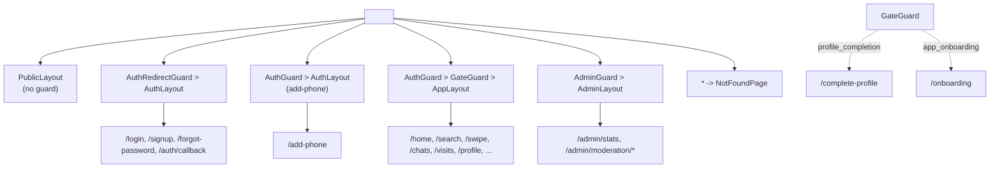

# Routing and guards

Active contributors: Saksham

The route tree is declared once in `src/App.tsx` and is the canonical map of every URL in the app. It composes four layouts with four guards to produce five route families: public, auth, authenticated-auth-flow, authenticated app, and admin. Every page component is lazy-loaded through `React.lazy` and wrapped in a single `<Suspense fallback={<PageSpinner />}>` so code-splitting is automatic.

## The four layouts

| Layout | File | Wraps | Chrome |
| --- | --- | --- | --- |
| `PublicLayout` | `src/pages/public/PublicLayout.tsx` | Marketing, discover, cities, blog, comparison, legal | Sticky header with logo, nav, theme toggle, sign-in/join; footer; scroll progress bar; mobile drawer |
| `AuthLayout` | `src/pages/auth/AuthLayout.tsx` | Login, forgot-password, auth callback, add-phone | Centered card on `bg-paper` with decorative accent blurs, logo, and a "Back to home" link |
| `AppLayout` | `src/pages/app/AppLayout.tsx` | The authenticated app (under `AuthGuard` + `GateGuard`) | `AppShell` with mode-aware sidebar/bottom nav, PWA install banner; reads `useMyProfile` for the user chip |
| `AdminLayout` | `src/pages/admin/AdminLayout.tsx` | Admin stats and moderation (under `AdminGuard`) | Fixed 240px sidebar on `xl`, top bar with compact nav on smaller screens |

`AppLayout` is the only layout that reads server state (the current user's profile) to drive the navigation mode (Room Poster, Co-Hunter, Open to Both). While `useMyProfile` loads it renders nothing rather than a mode-mismatched shell.

## The four guards

All guards live in `src/pages/guards.tsx`. Each renders `<PageSpinner />` while `useAuth().loading` is true, then makes a single redirect decision and otherwise renders `<Outlet />`.

### `AuthGuard`

Protects the authenticated app and the post-Google add-phone flow. If there is no user after loading completes, it redirects to `/login?redirect=<encoded current path + search>`. The encoded redirect is consumed by `AuthRedirectGuard` after a successful sign-in.

### `AdminGuard`

Protects `/admin/*`. Requires both a signed-in user and `user.app_metadata?.role === "admin"`. Signed-out users go to `/login`; signed-in non-admins go to `/home`.

### `AuthRedirectGuard`

Wraps the auth routes (`/login`, `/signup`, `/forgot-password`, `/auth/callback`). If a user is already signed in, it bounces them away from the auth surface to the resolved `?redirect=` target (defaulting to `/home`). The `signup` route itself is a `<Navigate to="/login">` because signup is unified into the login flow for unknown identifiers.

The `midAuthFlow` exception is critical here. OTP verification signs the user in mid-flow (before the mandatory set-password or password-reset step). Without the hold, `AuthRedirectGuard` would bounce the user to `/home` the instant OTP succeeded and the flow would never finish. The flag lives in `authStore.midAuthFlow` and is set by the auth pages themselves.

### `GateGuard`

Sits between `AuthGuard` and `AppLayout` and enforces the backend-computed gate stage. The stage is fetched once per authenticated session by `src/providers.tsx` via `getAuthState("flatmates")` and cached in `authStore.authStage` (defaulting to `"active"` so the guard does not fire until the first fetch completes). The recognized stages are `identifier_verification`, `password_setup`, `profile_completion`, `app_onboarding`, `active`.

`GateGuard` skips enforcement when:

- the user is unauthenticated (let `AuthGuard` handle it), or
- `midAuthFlow` is true (do not fight the auth pages), or
- the user is already on a gate route (`/complete-profile`, `/onboarding`, `/add-phone`, or any `/onboarding/*`).

Otherwise it redirects:

- `authStage === "profile_completion"` to `/complete-profile`,
- `authStage === "app_onboarding"` to `/onboarding`.

See [Profile and onboarding](../features/profile-onboarding.md) for what those screens do.

## Redirect resolution

`resolveRedirect(raw)` is the only function that turns a `?redirect=` value into a path. It accepts only same-origin absolute paths: the value must start with a single `/` and must not start with `//` (which would be a protocol-relative URL to a different host). Anything else, including a missing value, falls back to `/home`. This closes the open-redirect hole where a crafted link could send a freshly signed-in user to an attacker-controlled site.

## The route tree at a glance

The full list of concrete URLs is maintained in `src/lib/route-inventory.ts` and verified end-to-end by `tests/integration/route-contracts.test.ts`, which asserts that every inventory entry has a matching React Router route and vice-versa.

## Lazy loading

Every page is loaded through `React.lazy(() => import(...).then((m) => ({ default: m.X })))`. The single top-level `<Suspense fallback={<PageSpinner />}>` in `src/App.tsx` catches the first paint of every route. Layouts and guards are imported eagerly because they are needed before the first route can render. This keeps the initial bundle small (the architecture overview in [Architecture](../overview/architecture.md) notes a 200KB gzip budget) while still giving every page its own chunk.

## Where guards connect to the rest of the system

- The gate stage comes from the backend through `getAuthState` in `src/lib/api/auth.ts` (see [API client](api-client.md)).
- `authStore` and its `midAuthFlow` / `authStage` fields live in `src/lib/stores/auth-store.ts` (see [State management](state-management.md)).
- The auth pages that set `midAuthFlow` are documented in [Auth flows](../features/auth-flows.md).
- The admin routes behind `AdminGuard` drive the moderation queue described in [Admin moderation](../features/admin-moderation.md).

## Key source files

| File | Role |
| --- | --- |
| `src/App.tsx` | The `<Routes>` tree: layouts, guards, lazy pages, catch-all |
| `src/pages/guards.tsx` | `AuthGuard`, `AdminGuard`, `AuthRedirectGuard`, `GateGuard`, `resolveRedirect` |
| `src/pages/public/PublicLayout.tsx` | Public chrome (header, nav, footer, mobile drawer) |
| `src/pages/auth/AuthLayout.tsx` | Centered auth card with decorative blurs |
| `src/pages/app/AppLayout.tsx` | `AppShell` wrapper, reads profile for nav mode |
| `src/pages/admin/AdminLayout.tsx` | Admin sidebar + responsive top bar |
| `src/lib/route-inventory.ts` | Canonical list of concrete URLs (consumed by route-contracts test) |
| `src/lib/stores/auth-store.ts` | `midAuthFlow`, `authStage`, `missingProfileFields` |
| `src/lib/api/auth.ts` | `getAuthState` (the backend gate stage fetch) |
| `src/providers.tsx` | Triggers the gate-stage fetch on authentication |
