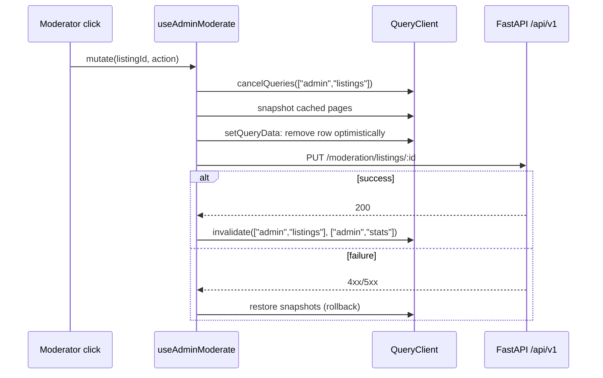

# Server state (TanStack Query)

Active contributors: Saksham

Every value whose source of truth is the FastAPI backend is owned by TanStack React Query. The hooks live in `src/hooks/queries/` and are re-exported as a flat surface from `src/hooks/queries/index.ts`. The `QueryClient` is constructed once in `src/providers.tsx` with project-specific defaults, and the cache is the only place server data is allowed to live (see [State management](state-management.md) for the other half of the boundary).

## `QueryClient` configuration

The client is created inside the `Providers` component with a single shared config:

```ts
new QueryClient({
  defaultOptions: {
    queries: {
      refetchOnWindowFocus: false,
      retry: (failureCount, error) => {
        if (error instanceof ApiClientError && error.appError.type === "auth") {
          if (failureCount === 0) return true;   // one retry after a refresh
          return false;                            // then give up
        }
        return failureCount < 1;                   // one retry for everything else
      },
      staleTime: 60_000,
    }
  }
})
```

The decisions, in plain language:

- **No refetch on window focus.** Returning to a tab does not silently refetch every query; explicit invalidation (mutations, SSE events) is the only thing that refreshes data.
- **One retry for transient errors.** A network blip or 5xx gets a single retry. Auth errors are special: the [API client](api-client.md) already attempted a refresh-and-retry inside the request, so a second 401 here means the session is truly gone and we stop.
- **60-second stale time.** Navigating between routes does not refetch data that was loaded less than a minute ago. High-churn surfaces override this per-query (`useWebSearch` and `useMapView` drop to 30s; `useCatalogs` raises to 30 minutes because the city/locality catalog is effectively static).

On sign-out, `src/providers.tsx` watches the auth state and, when it flips from authenticated to unauthenticated, calls `queryClient.clear()` plus `searchStore.resetFilters()` and `onboardingStore.clearDraft()`. `useDeleteAccount` does the same clear on successful account deletion.

## Query key conventions

Keys are arrays whose first element is a lowercase string scope naming the resource family, followed by discriminator values. The conventions are enforced by `tests/integration/query-keys.test.ts`, which statically walks every hook's source to assert that:

- every key is a non-empty array starting with a string scope,
- each module stays within its allowed scope prefix(es),
- no two modules define the same static key pattern,
- every invalidation target has a matching query prefix,
- cross-module invalidation is explicit and allow-listed.

The scopes in use:

| Scope | Module | Example key |
| --- | --- | --- |
| `profile`, `profiles` | `useProfiles` | `["profile", "me"]`, `["profiles", id]`, `["profiles", "peers", filters]` |
| `properties` | `useProperties` | `["properties", "mine"]`, `["properties", id]` |
| `search` | `useSearch` | `["search", "web", filters]`, `["search", "saved"]`, `["search", "alerts"]` |
| `swipes` | `useSwipes` | `["swipes", "deck", filters]` |
| `compatibility` | `useCompatibility` | `["compatibility", peerId]` |
| `conversations` | `useConversations` | `["conversations", id, "messages", page]` |
| `visits` | `useVisits` | `["visits", filters]`, `["visits", id]` |
| `notifications` | `useNotifications` | `["notifications", filters]` |
| `dashboard` | `useDashboard` | `["dashboard", "stats"]`, `["dashboard", "analytics", propertyId, period]` |
| `admin` | `useAdmin` | `["admin", "listings", filters]`, `["admin", "reports", filters]`, `["admin", "stats"]` |
| `catalogs` | `useCatalogs` | `["catalogs"]` |
| `blocks` | `useBlocks` | `["blocks"]` |
| `matches`, `incoming-likes` | `useMatches` | `["matches"]`, `["incoming-likes", limit, offset]` |
| `map` | `useMapView` | `["map", filters]` |
| `share-card` | `useShareCard` | `["share-card", listingId, format]` |

Because invalidation uses prefix matching, `invalidateQueries({ queryKey: ["visits"] })` refreshes both the list and every detail page, which is what you want after a status change.

## Export surface

`src/hooks/queries/index.ts` re-exports every hook and the few types callers need (`AnalyticsPeriod`, `BlockedUser`, `ReverseGeocodeResult`). The hooks fall into three shapes:

- **`useQuery` wrappers** for reads (`useMyProfile`, `useProperty`, `useWebSearch`, `useConversations`, `useVisits`, `useNotifications`, `useMatches`, `useDashboardStats`, `useAdminListings`, `useCities`, `useMapView`, `useShareCard`, `useCompatibility`).
- **`useInfiniteQuery` wrappers** for paginated feeds (`useInfiniteWebSearch`).
- **`useMutation` wrappers** for writes, which is where the interesting patterns live (next section).

Several hooks are fire-and-forget mutations that do not invalidate anything because they have no list to refresh: `useReportUserMutation`, `useRecordProfileView`, `useVoteSocietyTag`, `useReverseGeocode`.

## Optimistic updates with rollback

Two patterns are used, depending on how recoverable the failure is.

### Seed-then-invalidate (profile, visits)

After a successful `PATCH /flatmates/profile`, `useUpdateProfile` writes the server response straight into the cache with `setQueryData(["profile", "me"], updated)` and then invalidates the same key for a background revalidate. This avoids the flash of stale data you would get from invalidate-then-refetch alone. `useUpdateVisit` and `useCancelVisit` do the same against `["visits", id]` before invalidating the whole `["visits"]` namespace.

### onMutate/onError rollback (admin moderation, chat)

When the user expects the UI to update the instant they click, the mutation applies the optimistic change in `onMutate`, snapshots the previous cache, and restores it in `onError`. `useAdminModerate` and `useAdminReportAction` both do this: they cancel in-flight queries, snapshot every cached page, filter the actioned row out of the queue, and on error write the snapshots back.



The chat send path (`useSendMessage`) is a deliberate variant: on error it does **not** roll back. Instead it leaves the optimistic bubble in place tagged `{ __optimistic: true }` so the user can retry, and only invalidates on success. Removing the bubble on a network error would make the user's text vanish. See [Messaging](../features/messaging.md) for the full flow.

## SSE-driven invalidation

Real-time events arrive over Server-Sent Events and are dispatched into the same `QueryClient` cache by the SSE manager in `src/lib/sse/`. A `new_message` event writes into the relevant `["conversations", id, "messages", page]` page and invalidates `["conversations"]` so the list preview refreshes; a `visit_update` event invalidates `["visits"]`; a `swipe` or `new_match` event invalidates `["swipes", "deck"]` and `["matches"]`. Because every query key follows the scope conventions above, the SSE layer can invalidate by prefix without knowing the page parameter. See [Real-time](../features/real-time.md).

## Catalogs and other long-lived queries

`useCatalogs` is the example of a query tuned for stability: it requests `/flatmates/catalogs` with `auth: false`, catches any error to an empty array (so a missing catalog never blocks the form), sets `staleTime: 30 * 60 * 1000`, and is then sliced in-memory by `useCities`, `useLocalities`, and `useAmenities`. The single network request feeds three hooks.

## Testing the contract

`tests/integration/query-keys.test.ts` is the guardrail for everything above. It parses each hook module's source, extracts every `queryKey:` literal and every `invalidateQueries({ queryKey: ... })` call, and asserts the conventions. Add a new hook and the test will fail unless its scope is registered in `expectedScopes`. See [Testing](../how-to-contribute/testing.md).

## Key source files

| File | Role |
| --- | --- |
| `src/providers.tsx` | `QueryClient` construction, sign-out cache clear, retry policy |
| `src/hooks/queries/index.ts` | Flat re-export of every query and mutation hook |
| `src/hooks/queries/useProfiles.ts` | Profile read/update/create/delete-account (seed-then-invalidate) |
| `src/hooks/queries/useProperties.ts` | Property CRUD, image upload, boost, renew |
| `src/hooks/queries/useSearch.ts` | Web search (query + infinite), saved searches, search alerts |
| `src/hooks/queries/useSwipes.ts` | Swipe deck + swipe action |
| `src/hooks/queries/useCompatibility.ts` | Per-peer compatibility breakdown |
| `src/hooks/queries/useConversations.ts` | Conversations, messages, optimistic send with retry-aware rollback |
| `src/hooks/queries/useVisits.ts` | Visit list/detail/create/update/cancel |
| `src/hooks/queries/useNotifications.ts` | Notifications + mark-read mutations |
| `src/hooks/queries/useDashboard.ts` | Room-poster dashboard stats and per-listing analytics |
| `src/hooks/queries/useAdmin.ts` | Moderation listings/reports/stats with onMutate/onError rollback |
| `src/hooks/queries/useCatalogs.ts` | Long-lived catalog query sliced into cities/localities/amenities |
| `src/hooks/queries/useBlocks.ts` | Blocked users list + unblock |
| `src/hooks/queries/useMatches.ts` | Matches, incoming likes, unmatch (cross-invalidates conversations) |
| `src/hooks/queries/useReports.ts` | Fire-and-forget user report |
| `src/hooks/queries/useProfileViews.ts` | Fire-and-forget profile-view recording |
| `src/hooks/queries/useSocietyTags.ts` | Fire-and-forget society-tag vote |
| `src/hooks/queries/useMapView.ts` | Map pins with `keepPreviousData` and signal-based cancellation |
| `src/hooks/queries/useShareCard.ts` | Public share-card payload |
| `src/hooks/queries/useReverseGeocode.ts` | Mutation wrapper over the Nominatim client |
| `tests/integration/query-keys.test.ts` | Static query-key and invalidation contract tests |
